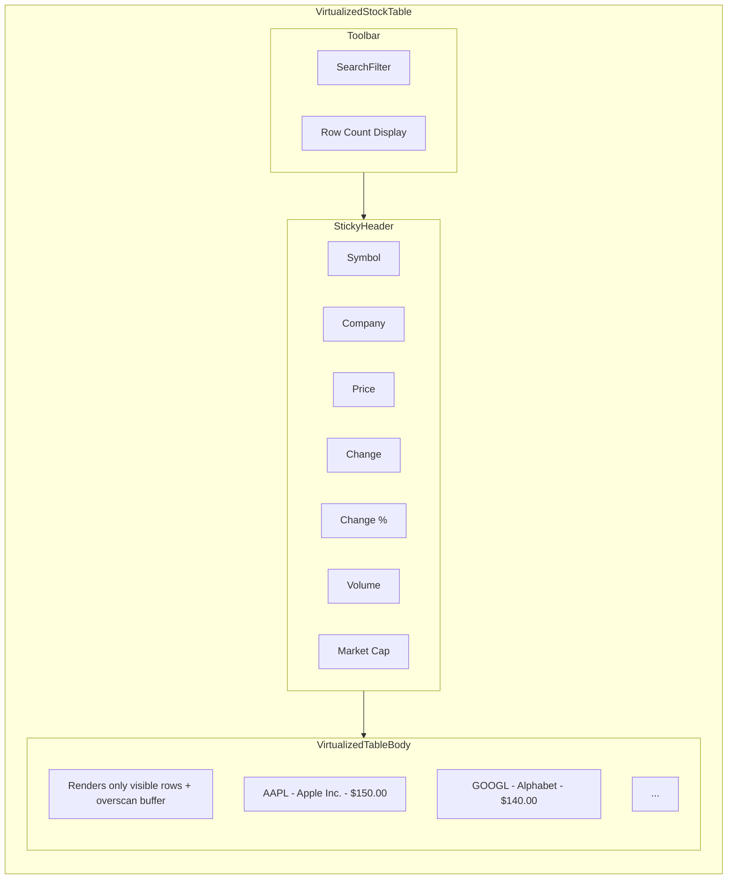
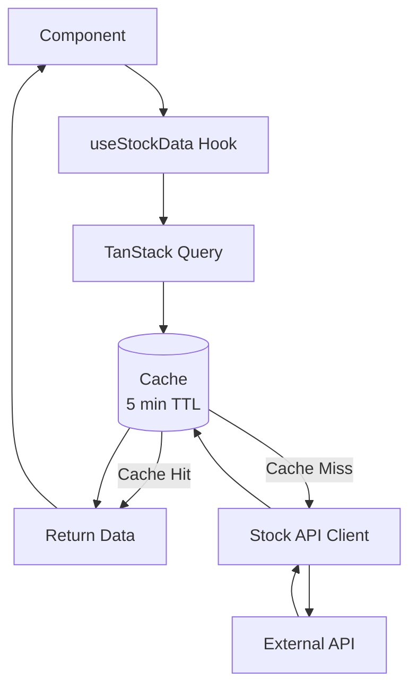
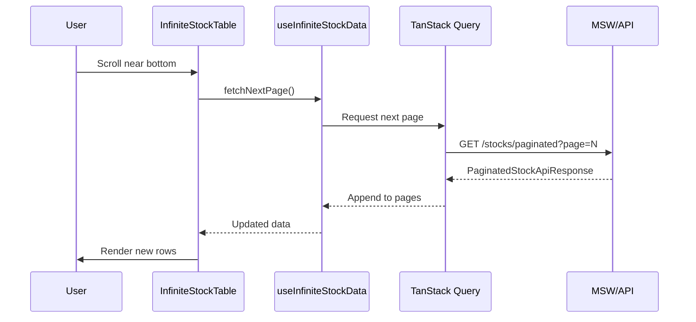

# Stock Data Table Spike

A React data table spike project demonstrating a high-performance, virtualized stock data table built with modern React patterns and TanStack libraries.

## Overview

This project implements a read-only stock data table that displays market data fetched from an external API. The table supports sorting, filtering, and handles large datasets (1000+ rows) efficiently through virtualization.

### Key Features

- **Real-time stock data display** - View stock symbols, prices, changes, volume, and market cap
- **Column sorting** - Click column headers to sort ascending/descending
- **Global search filter** - Filter stocks by symbol or company name with debounced input
- **Virtualized rendering** - Efficiently render 1000+ rows at 55+ FPS using TanStack Virtual
- **Infinite scrolling** - Load data incrementally as you scroll with paginated API
- **Large dataset support** - 1,500 realistic stock entries with server-side pagination
- **Loading and error states** - Skeleton loading and retry functionality
- **Keyboard accessible** - Full keyboard navigation support
- **Responsive design** - Works on desktop and mobile devices

### Available Routes

| Route | Component | Description |
|-------|-----------|-------------|
| `/` | HomePage | Navigation hub with links to table variants |
| `/stocks-read-only` | StockTable | Basic virtualized table with all data loaded at once |
| `/stocks-infinite` | InfiniteStockTable | Paginated infinite scroll with 1,500 stocks |

## Tech Stack

| Category | Technology |
|----------|------------|
| Framework | React 19 |
| Language | TypeScript |
| Build Tool | Vite (rolldown-vite) |
| Table | TanStack Table |
| Data Fetching | TanStack Query |
| Virtualization | TanStack Virtual |
| Styling | Tailwind CSS |
| Testing | Vitest, Testing Library, Playwright |
| BDD | Cucumber |
| API Mocking | MSW (Mock Service Worker) |

## Getting Started

### Prerequisites

- Node.js 18+
- npm 9+

### Installation

```bash
npm install
```

### Development

```bash
npm run dev
```

This starts the development server with HMR at `http://localhost:5173`.

### Build

```bash
npm run build
```

### Preview Production Build

```bash
npm run preview
```

## Scripts

| Command | Description |
|---------|-------------|
| `npm run dev` | Start development server with HMR |
| `npm run build` | Type-check and build for production |
| `npm run lint` | Run ESLint |
| `npm run format` | Format code with Prettier |
| `npm run test` | Run unit tests in watch mode |
| `npm run test:run` | Run unit tests once |
| `npm run test:coverage` | Run tests with coverage report |
| `npm run test:acceptance` | Run Cucumber acceptance tests |
| `npm run test:acceptance:html` | Generate HTML acceptance test report |

## Architecture

### Project Structure

```
src/
├── api/                    # API client and error handling
│   ├── stockApi.ts         # Stock API functions (includes paginated fetch)
│   └── errors.ts           # Custom error classes
├── components/
│   └── StockTable/         # Table components
│       ├── StockTable.tsx          # Standard table
│       ├── VirtualizedStockTable.tsx # Virtualized table
│       ├── InfiniteStockTable.tsx  # Infinite scroll table
│       ├── VirtualizedTableBody.tsx  # Virtual row rendering
│       ├── StickyHeader.tsx          # Fixed header
│       ├── SearchFilter.tsx          # Debounced search
│       ├── TableHeader.tsx           # Sortable headers
│       ├── TableBody.tsx             # Row rendering
│       ├── columns.tsx               # Column definitions
│       ├── LoadingState.tsx          # Loading skeleton
│       ├── ErrorState.tsx            # Error display
│       └── PerformanceOverlay.tsx    # Debug metrics
├── config/
│   └── api.ts              # API configuration
├── hooks/                  # Custom React hooks
│   ├── useStockData.ts     # Stock list data hook
│   ├── useInfiniteStockData.ts # Infinite query hook for pagination
│   ├── useStock.ts         # Single stock hook
│   ├── usePrefetchStocks.ts # Data prefetching
│   ├── useStockCache.ts    # Cache manipulation
│   └── useVirtualizationMetrics.ts # Performance tracking
├── lib/
│   ├── queryClient.ts      # TanStack Query configuration
│   └── queryKeys.ts        # Type-safe query keys
├── mocks/                  # MSW API mocks
│   ├── handlers.ts         # Request handlers (supports pagination)
│   ├── stockDataGenerator.ts # Large dataset generator (1,500 stocks)
│   ├── data.ts             # Legacy mock stock data
│   └── browser.ts          # Browser worker setup
├── providers/
│   └── QueryProvider.tsx   # Query client provider
├── test/                   # Test utilities
│   └── queryTestUtils.tsx  # Query testing helpers
└── types/
    └── stock.ts            # TypeScript interfaces (includes pagination types)
```

### Component Architecture



### Data Flow



## Data Model

### Stock Interface

```typescript
interface Stock {
  symbol: string;        // Stock ticker symbol (e.g., "AAPL")
  companyName: string;   // Company name (e.g., "Apple Inc.")
  price: number;         // Current stock price
  change: number;        // Price change (absolute)
  changePercent: number; // Price change (percentage)
  volume: number;        // Trading volume
  marketCap: number;     // Market capitalization
  high52Week: number;    // 52-week high
  low52Week: number;     // 52-week low
  lastUpdated: string;   // ISO timestamp of last update
}
```

## Configuration

### Environment Variables

Create a `.env` file in the project root:

```env
VITE_STOCK_API_URL=https://api.example.com/v1
VITE_STOCK_API_KEY=your-api-key-here
VITE_STOCK_API_TIMEOUT=10000
```

### Query Configuration

| Option | Default | Description |
|--------|---------|-------------|
| `staleTime` | 30s | Time before data is considered stale |
| `gcTime` | 5 min | Time before unused data is garbage collected |
| `refetchInterval` | 60s | Auto-refetch interval for stock data |
| `retry` | 3 | Number of retry attempts on failure |
| `refetchOnWindowFocus` | true | Refetch when window regains focus |

## Virtualization

The table uses TanStack Virtual to efficiently render large datasets:

- **Only visible rows are rendered** plus an overscan buffer
- **Constant memory usage** regardless of total row count
- **Smooth scrolling** at 55+ FPS with 10,000+ rows

### Performance Benchmarks

| Scenario | Without Virtualization | With Virtualization |
|----------|------------------------|---------------------|
| 100 rows | 16ms render | 8ms render |
| 1,000 rows | 160ms render | 10ms render |
| 10,000 rows | 1600ms+ render | 12ms render |
| Scroll FPS (1K rows) | 15-30 FPS | 55-60 FPS |
| Memory (10K rows) | 150MB+ | 20MB |

### Configuration Props

```tsx
<VirtualizedStockTable
  rowHeight={48}      // Height of each row in pixels
  overscan={10}       // Rows to render outside visible area
  tableHeight={600}   // Viewport height in pixels
/>
```

## Infinite Scrolling

The `InfiniteStockTable` component combines virtualization with paginated data fetching for optimal handling of large datasets.

### How It Works



### Features

- **Incremental loading** - Fetches 50 stocks per page as you scroll
- **Server-side filtering** - Search queries are sent to the API for efficient filtering
- **Server-side sorting** - Sort operations are handled by the API
- **Progress indicator** - Visual progress bar shows loading status
- **Debounced search** - 300ms debounce prevents excessive API calls

### Configuration Props

```tsx
<InfiniteStockTable
  rowHeight={48}      // Height of each row in pixels
  overscan={10}       // Rows to render outside visible area
  tableHeight={600}   // Viewport height in pixels
  pageSize={50}       // Number of items per page
/>
```

### Pagination API

The paginated endpoint supports the following query parameters:

| Parameter | Type | Default | Description |
|-----------|------|---------|-------------|
| `page` | number | 0 | Page number (0-indexed) |
| `pageSize` | number | 50 | Items per page (max 100) |
| `search` | string | - | Filter by symbol or company name |
| `sortBy` | string | - | Field to sort by |
| `sortOrder` | 'asc' \| 'desc' | 'desc' | Sort direction |

### Response Format

```typescript
interface PaginatedStockApiResponse {
  data: Stock[];
  meta: {
    timestamp: string;
    count: number;        // Items in current page
    totalCount: number;   // Total items matching query
    page: number;
    pageSize: number;
    totalPages: number;
    hasNextPage: boolean;
    hasPreviousPage: boolean;
  };
}
```

## Testing

### Unit Tests

```bash
# Run in watch mode
npm run test

# Run once
npm run test:run

# With coverage
npm run test:coverage
```

### Acceptance Tests

```bash
# Run Cucumber tests
npm run test:acceptance

# Generate HTML report
npm run test:acceptance:html
```

## Implementation Plans

This spike was built following these implementation plans:

1. **[IP-001: API Client Setup](documentation/implementation-plans/IP-001-api-client-setup.md)** - Stock API client with error handling, timeout support, and type definitions

2. **[IP-002: Stock Table Component](documentation/implementation-plans/IP-002-stock-table-component.md)** - TanStack Table integration with sorting, filtering, and accessibility

3. **[IP-003: Data Fetching](documentation/implementation-plans/IP-003-data-fetching.md)** - TanStack Query setup with caching, prefetching, and cache utilities

4. **[IP-004: Virtualization](documentation/implementation-plans/IP-004-virtualization.md)** - TanStack Virtual integration for large dataset performance

## Feature Specification

See [FEATURE-001: Stock Data Read-Only Table](documentation/features/FEATURE-001.md) for detailed user stories, acceptance criteria, and technical architecture diagrams.

## API Mocking

The project uses MSW (Mock Service Worker) for API mocking during development and testing. Mock handlers are defined in `src/mocks/handlers.ts`.

### Mock Dataset

The mock API serves 1,500 realistic stock entries generated by `stockDataGenerator.ts`:

- **Real companies** - Includes actual S&P 500 companies (AAPL, MSFT, GOOGL, etc.)
- **Synthetic companies** - Generated companies with realistic names and data
- **Consistent data** - Uses seeded random generation for reproducible results
- **Realistic distributions** - Market caps range from micro-cap to mega-cap

### Available Endpoints

| Endpoint | Method | Description |
|----------|--------|-------------|
| `/stocks` | GET | Returns all 1,500 stocks (legacy) |
| `/stocks/paginated` | GET | Returns paginated stocks with filtering/sorting |
| `/stocks/:symbol` | GET | Returns a single stock by symbol |

To start the development server with mocked API:

```bash
npm run dev
```

The MSW worker initializes automatically in development mode.

## License

This project is for experimental/educational purposes.
