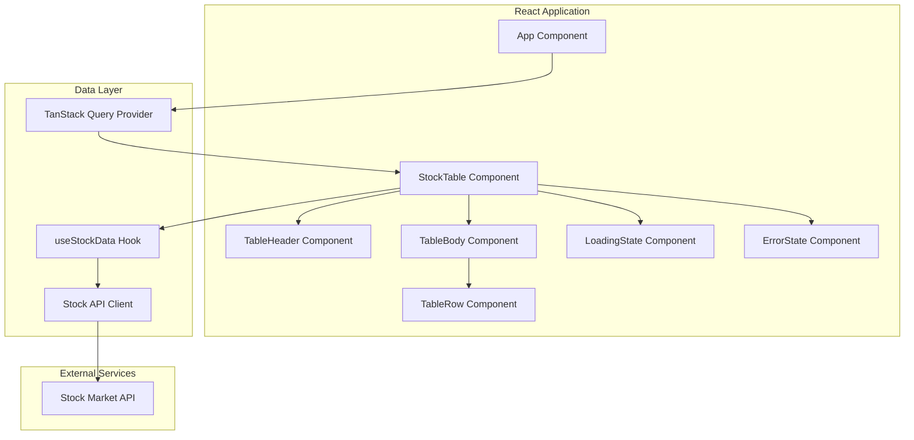
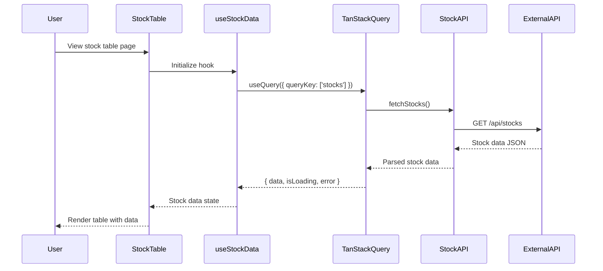
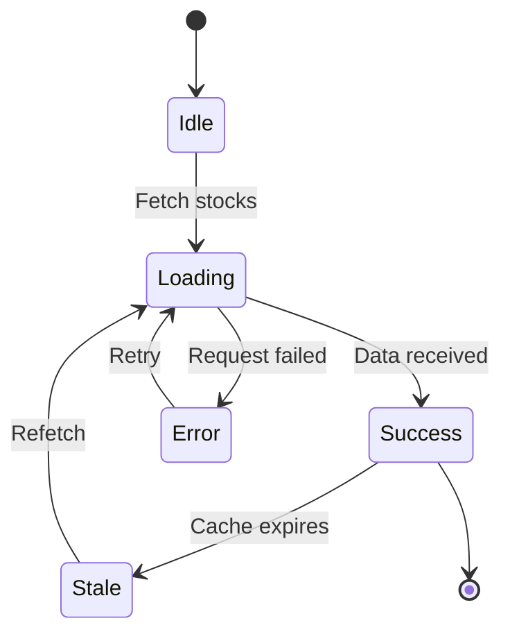

# FEATURE-001: Stock Data Read-Only Table

## Overview

This feature provides a read-only data table displaying stock market data fetched from an external API. Users can view stock information including symbols, prices, volume, and market changes in a performant, virtualized table interface.

## User Stories

- **As a user**, I want to view a list of stocks in a tabular format so that I can quickly scan market data.
- **As a user**, I want to see real-time stock prices and changes so that I can make informed decisions.
- **As a user**, I want to sort stocks by different columns so that I can organize data by my preferences.
- **As a user**, I want to filter stocks by symbol or name so that I can find specific stocks quickly.

## Technical Architecture

### Component Architecture



### Data Flow



### State Management



## Data Model

### Stock Data Interface

```typescript
interface Stock {
  symbol: string;
  companyName: string;
  price: number;
  change: number;
  changePercent: number;
  volume: number;
  marketCap: number;
  high52Week: number;
  low52Week: number;
  lastUpdated: string;
}

interface StockTableState {
  stocks: Stock[];
  isLoading: boolean;
  error: Error | null;
  sortColumn: keyof Stock | null;
  sortDirection: 'asc' | 'desc';
  filterText: string;
}
```

## Implementation Details

### Stock API Client

```typescript
// src/api/stockApi.ts
const STOCK_API_BASE_URL = import.meta.env.VITE_STOCK_API_URL;

export async function fetchStocks(): Promise<Stock[]> {
  const response = await fetch(`${STOCK_API_BASE_URL}/stocks`, {
    headers: {
      'Content-Type': 'application/json',
      'Authorization': `Bearer ${import.meta.env.VITE_STOCK_API_KEY}`,
    },
  });

  if (!response.ok) {
    throw new Error(`Failed to fetch stocks: ${response.statusText}`);
  }

  return response.json();
}
```

### Custom Hook for Stock Data

```typescript
// src/hooks/useStockData.ts
import { useQuery } from '@tanstack/react-query';
import { fetchStocks } from '../api/stockApi';

export function useStockData() {
  return useQuery({
    queryKey: ['stocks'],
    queryFn: fetchStocks,
    staleTime: 30 * 1000, // 30 seconds
    refetchInterval: 60 * 1000, // Refetch every minute
  });
}
```

### Stock Table Component

```typescript
// src/components/StockTable/StockTable.tsx
import {
  useReactTable,
  getCoreRowModel,
  getSortedRowModel,
  getFilteredRowModel,
  flexRender,
  type ColumnDef,
  type SortingState,
} from '@tanstack/react-table';
import { useState, useMemo } from 'react';
import { useStockData } from '../../hooks/useStockData';
import type { Stock } from '../../types/stock';

export function StockTable() {
  const { data: stocks, isLoading, error } = useStockData();
  const [sorting, setSorting] = useState<SortingState>([]);
  const [globalFilter, setGlobalFilter] = useState('');

  const columns = useMemo<ColumnDef<Stock>[]>(
    () => [
      {
        accessorKey: 'symbol',
        header: 'Symbol',
        cell: (info) => <strong>{info.getValue<string>()}</strong>,
      },
      {
        accessorKey: 'companyName',
        header: 'Company',
      },
      {
        accessorKey: 'price',
        header: 'Price',
        cell: (info) => `$${info.getValue<number>().toFixed(2)}`,
      },
      {
        accessorKey: 'change',
        header: 'Change',
        cell: (info) => {
          const value = info.getValue<number>();
          const className = value >= 0 ? 'positive' : 'negative';
          return <span className={className}>{value.toFixed(2)}</span>;
        },
      },
      {
        accessorKey: 'changePercent',
        header: 'Change %',
        cell: (info) => {
          const value = info.getValue<number>();
          const className = value >= 0 ? 'positive' : 'negative';
          return <span className={className}>{value.toFixed(2)}%</span>;
        },
      },
      {
        accessorKey: 'volume',
        header: 'Volume',
        cell: (info) => info.getValue<number>().toLocaleString(),
      },
    ],
    []
  );

  const table = useReactTable({
    data: stocks ?? [],
    columns,
    state: { sorting, globalFilter },
    onSortingChange: setSorting,
    onGlobalFilterChange: setGlobalFilter,
    getCoreRowModel: getCoreRowModel(),
    getSortedRowModel: getSortedRowModel(),
    getFilteredRowModel: getFilteredRowModel(),
  });

  if (isLoading) {
    return <div className="loading">Loading stock data...</div>;
  }

  if (error) {
    return <div className="error">Error: {error.message}</div>;
  }

  return (
    <div className="stock-table-container">
      <input
        type="text"
        placeholder="Search stocks..."
        value={globalFilter}
        onChange={(e) => setGlobalFilter(e.target.value)}
        className="search-input"
      />
      <table className="stock-table">
        <thead>
          {table.getHeaderGroups().map((headerGroup) => (
            <tr key={headerGroup.id}>
              {headerGroup.headers.map((header) => (
                <th
                  key={header.id}
                  onClick={header.column.getToggleSortingHandler()}
                  className={header.column.getCanSort() ? 'sortable' : ''}
                >
                  {flexRender(
                    header.column.columnDef.header,
                    header.getContext()
                  )}
                  {header.column.getIsSorted() === 'asc' && ' ↑'}
                  {header.column.getIsSorted() === 'desc' && ' ↓'}
                </th>
              ))}
            </tr>
          ))}
        </thead>
        <tbody>
          {table.getRowModel().rows.map((row) => (
            <tr key={row.id}>
              {row.getVisibleCells().map((cell) => (
                <td key={cell.id}>
                  {flexRender(cell.column.columnDef.cell, cell.getContext())}
                </td>
              ))}
            </tr>
          ))}
        </tbody>
      </table>
    </div>
  );
}
```

## Acceptance Criteria

### Functional Requirements

- [ ] **AC-001**: The table displays stock data including symbol, company name, price, change, change percentage, and volume.
- [ ] **AC-002**: Stock data is fetched from an external API on component mount.
- [ ] **AC-003**: A loading indicator is displayed while data is being fetched.
- [ ] **AC-004**: An error message is displayed if the API request fails.
- [ ] **AC-005**: Users can sort the table by clicking on column headers.
- [ ] **AC-006**: Users can filter stocks using a search input field.
- [ ] **AC-007**: Positive price changes are displayed in green; negative changes in red.
- [ ] **AC-008**: Stock data automatically refreshes at a configurable interval.
- [ ] **AC-009**: The table is read-only; users cannot edit stock data.

### Non-Functional Requirements

- [ ] **AC-010**: The table renders 1000+ rows without performance degradation using virtualization.
- [ ] **AC-011**: Initial data load completes within 3 seconds under normal network conditions.
- [ ] **AC-012**: The table is accessible via keyboard navigation.
- [ ] **AC-013**: The table is responsive and displays correctly on mobile devices.
- [ ] **AC-014**: API errors are logged for debugging purposes.

## Dependencies

- `@tanstack/react-table` - Headless table library
- `@tanstack/react-query` - Data fetching and caching
- `@tanstack/react-virtual` - Virtualization for large datasets

## Environment Variables

```env
VITE_STOCK_API_URL=https://api.example.com/v1
VITE_STOCK_API_KEY=your-api-key-here
```

## Related Implementation Plans

- [IP-001: API Client Setup](../implementation-plans/IP-001-api-client-setup.md)
- [IP-002: Stock Table Component](../implementation-plans/IP-002-stock-table-component.md)
- [IP-003: Data Fetching with TanStack Query](../implementation-plans/IP-003-data-fetching.md)
- [IP-004: Table Virtualization](../implementation-plans/IP-004-virtualization.md)
