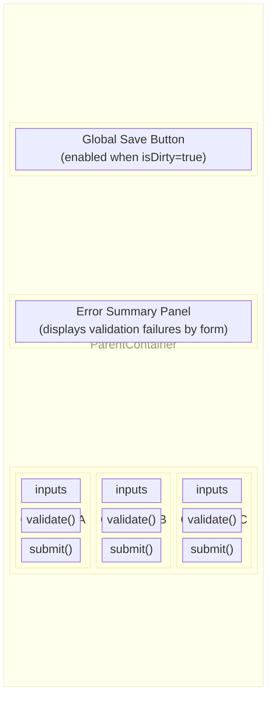
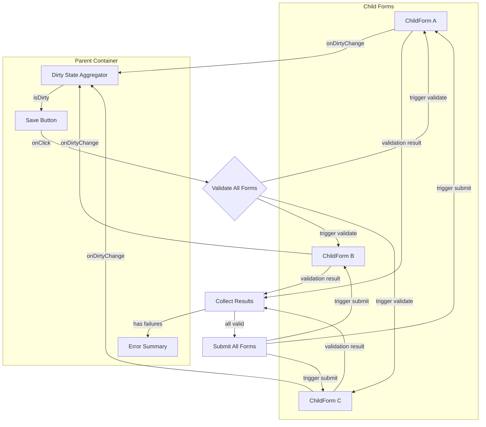
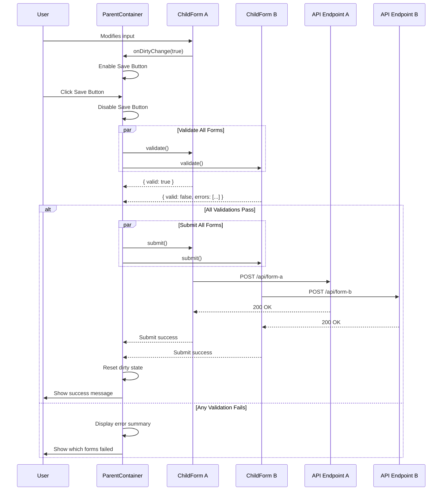
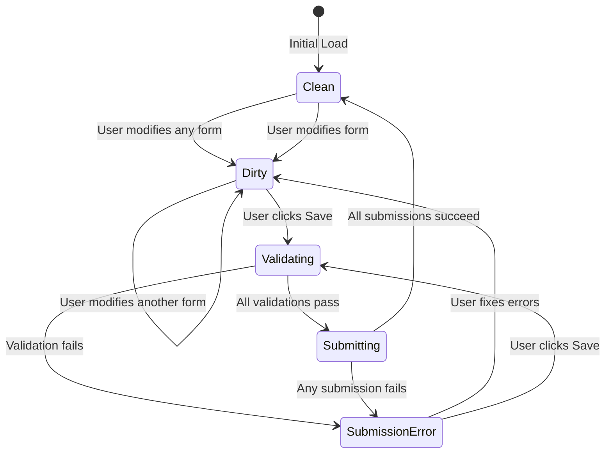

# FEATURE-001: Multi-Form Save with Coordinated Validation

## Overview

This feature implements a parent container that manages multiple child input forms with coordinated dirty state tracking, validation, and submission. The parent container provides a global save button that orchestrates validation and submission across all child forms.

## Problem Statement

When building complex forms with multiple independent sections, each section may have its own validation rules and API endpoints. Users need a unified save experience that:

- Indicates when any changes have been made
- Validates all sections before submission
- Provides clear feedback on validation failures
- Submits each section to its respective endpoint only when all validations pass

## Feature Requirements

### Dirty State Management

- Each child form tracks its own dirty state internally
- Child forms notify the parent container when their dirty state changes
- Parent container aggregates dirty state from all child forms
- Global save button is enabled only when at least one child form is dirty

### Validation Flow

- Validation is triggered when the global save button is clicked
- Each child form performs its own validation logic
- Validation results are collected by the parent container
- All child forms must pass validation before any submissions occur

### Submission Flow

- Submissions only occur after all validations pass
- Each child form submits to its own mocked API endpoint
- Submissions can occur in parallel
- Parent container displays success/error feedback

### Error Handling

- If any validation fails, no submissions occur
- Parent container displays which child form(s) failed validation
- Individual validation errors are shown within each child form

---

## Architecture

### Component Hierarchy



### Data Flow Diagram



### Validation and Submission Sequence



### State Management Flow



---

## Implementation Details

### Type Definitions

```typescript
// Types for form coordination
interface FormRef {
  validate: () => ValidationResult;
  submit: () => Promise<SubmitResult>;
  reset: () => void;
}

interface ValidationResult {
  valid: boolean;
  errors: ValidationError[];
}

interface ValidationError {
  field: string;
  message: string;
}

interface SubmitResult {
  success: boolean;
  error?: string;
}

interface FormValidationSummary {
  formId: string;
  formName: string;
  errors: ValidationError[];
}
```

### Parent Container Implementation

```tsx
import { useRef, useState, useCallback } from 'react';

interface ChildFormHandle {
  validate: () => ValidationResult;
  submit: () => Promise<SubmitResult>;
}

export function ParentContainer() {
  const [dirtyForms, setDirtyForms] = useState<Set<string>>(new Set());
  const [validationErrors, setValidationErrors] = useState<FormValidationSummary[]>([]);
  const [isSubmitting, setIsSubmitting] = useState(false);

  // Refs to child form imperative handles
  const formRefs = useRef<Record<string, ChildFormHandle | null>>({});

  const isDirty = dirtyForms.size > 0;

  const handleDirtyChange = useCallback((formId: string, dirty: boolean) => {
    setDirtyForms((prev) => {
      const next = new Set(prev);
      if (dirty) {
        next.add(formId);
      } else {
        next.delete(formId);
      }
      return next;
    });
  }, []);

  const handleSave = async () => {
    setValidationErrors([]);
    setIsSubmitting(true);

    // Step 1: Validate all forms
    const validationResults: FormValidationSummary[] = [];

    for (const [formId, ref] of Object.entries(formRefs.current)) {
      if (ref && dirtyForms.has(formId)) {
        const result = ref.validate();
        if (!result.valid) {
          validationResults.push({
            formId,
            formName: getFormDisplayName(formId),
            errors: result.errors,
          });
        }
      }
    }

    // Step 2: If any validation failed, display errors and abort
    if (validationResults.length > 0) {
      setValidationErrors(validationResults);
      setIsSubmitting(false);
      return;
    }

    // Step 3: Submit all dirty forms
    try {
      const submitPromises = Array.from(dirtyForms).map((formId) => {
        const ref = formRefs.current[formId];
        return ref?.submit();
      });

      await Promise.all(submitPromises);

      // Reset dirty state on success
      setDirtyForms(new Set());
    } catch (error) {
      console.error('Submission failed:', error);
    } finally {
      setIsSubmitting(false);
    }
  };

  return (
    <div className="parent-container">
      <header className="form-header">
        <h1>Multi-Form Editor</h1>
        <button onClick={handleSave} disabled={!isDirty || isSubmitting} className="save-button">
          {isSubmitting ? 'Saving...' : 'Save All Changes'}
        </button>
      </header>

      {validationErrors.length > 0 && <ErrorSummary errors={validationErrors} />}

      <div className="forms-container">
        <ChildFormA
          ref={(el) => (formRefs.current['formA'] = el)}
          onDirtyChange={(dirty) => handleDirtyChange('formA', dirty)}
        />
        <ChildFormB
          ref={(el) => (formRefs.current['formB'] = el)}
          onDirtyChange={(dirty) => handleDirtyChange('formB', dirty)}
        />
        <ChildFormC
          ref={(el) => (formRefs.current['formC'] = el)}
          onDirtyChange={(dirty) => handleDirtyChange('formC', dirty)}
        />
      </div>
    </div>
  );
}
```

### Child Form Implementation

```tsx
import { forwardRef, useImperativeHandle, useState, useEffect } from 'react';

interface ChildFormProps {
  onDirtyChange: (dirty: boolean) => void;
}

interface ChildFormHandle {
  validate: () => ValidationResult;
  submit: () => Promise<SubmitResult>;
}

export const ChildFormA = forwardRef<ChildFormHandle, ChildFormProps>(function ChildFormA(
  { onDirtyChange },
  ref
) {
  const [formData, setFormData] = useState({ name: '', email: '' });
  const [initialData] = useState({ name: '', email: '' });
  const [errors, setErrors] = useState<ValidationError[]>([]);

  // Track dirty state
  const isDirty = formData.name !== initialData.name || formData.email !== initialData.email;

  useEffect(() => {
    onDirtyChange(isDirty);
  }, [isDirty, onDirtyChange]);

  // Expose imperative handle to parent
  useImperativeHandle(ref, () => ({
    validate: () => {
      const validationErrors: ValidationError[] = [];

      if (!formData.name.trim()) {
        validationErrors.push({
          field: 'name',
          message: 'Name is required',
        });
      }

      if (!formData.email.includes('@')) {
        validationErrors.push({
          field: 'email',
          message: 'Valid email is required',
        });
      }

      setErrors(validationErrors);
      return {
        valid: validationErrors.length === 0,
        errors: validationErrors,
      };
    },

    submit: async () => {
      // Mock API call
      const response = await fetch('/api/mock/form-a', {
        method: 'POST',
        headers: { 'Content-Type': 'application/json' },
        body: JSON.stringify(formData),
      });

      if (!response.ok) {
        throw new Error('Submission failed');
      }

      return { success: true };
    },
  }));

  return (
    <div className="child-form">
      <h2>User Information</h2>
      <div className="form-field">
        <label htmlFor="name">Name</label>
        <input
          id="name"
          value={formData.name}
          onChange={(e) => setFormData((prev) => ({ ...prev, name: e.target.value }))}
        />
        {errors.find((e) => e.field === 'name') && (
          <span className="error">{errors.find((e) => e.field === 'name')?.message}</span>
        )}
      </div>
      <div className="form-field">
        <label htmlFor="email">Email</label>
        <input
          id="email"
          type="email"
          value={formData.email}
          onChange={(e) => setFormData((prev) => ({ ...prev, email: e.target.value }))}
        />
        {errors.find((e) => e.field === 'email') && (
          <span className="error">{errors.find((e) => e.field === 'email')?.message}</span>
        )}
      </div>
    </div>
  );
});
```

### Error Summary Component

```tsx
interface ErrorSummaryProps {
  errors: FormValidationSummary[];
}

export function ErrorSummary({ errors }: ErrorSummaryProps) {
  return (
    <div className="error-summary" role="alert">
      <h3>Please fix the following errors:</h3>
      <ul>
        {errors.map((formError) => (
          <li key={formError.formId}>
            <strong>{formError.formName}:</strong>
            <ul>
              {formError.errors.map((error, index) => (
                <li key={index}>{error.message}</li>
              ))}
            </ul>
          </li>
        ))}
      </ul>
    </div>
  );
}
```

### Mock API Service

```typescript
// services/mockApi.ts

const delay = (ms: number) => new Promise((resolve) => setTimeout(resolve, ms));

export const mockApi = {
  async submitFormA(data: Record<string, unknown>) {
    await delay(500); // Simulate network latency
    console.log('Form A submitted:', data);
    return { success: true, id: crypto.randomUUID() };
  },

  async submitFormB(data: Record<string, unknown>) {
    await delay(700);
    console.log('Form B submitted:', data);
    return { success: true, id: crypto.randomUUID() };
  },

  async submitFormC(data: Record<string, unknown>) {
    await delay(600);
    console.log('Form C submitted:', data);
    return { success: true, id: crypto.randomUUID() };
  },
};
```

---

## Acceptance Criteria

### AC1: Dirty State Tracking

- [ ] **AC1.1**: When a child form input is modified from its initial value, the form is marked as dirty
- [ ] **AC1.2**: When a child form input is reverted to its initial value, the form is no longer dirty
- [ ] **AC1.3**: The parent container correctly tracks which forms are dirty
- [ ] **AC1.4**: The global save button is disabled when no forms are dirty
- [ ] **AC1.5**: The global save button is enabled when at least one form is dirty

### AC2: Validation on Save

- [ ] **AC2.1**: Clicking the save button triggers validation on all dirty forms
- [ ] **AC2.2**: Forms that are not dirty are not validated
- [ ] **AC2.3**: Validation errors are displayed within each child form
- [ ] **AC2.4**: The parent container displays an error summary when validation fails
- [ ] **AC2.5**: The error summary identifies which form(s) failed validation
- [ ] **AC2.6**: The error summary lists specific validation errors for each form

### AC3: Conditional Submission

- [ ] **AC3.1**: If any validation fails, no API calls are made
- [ ] **AC3.2**: Only when all validations pass do submissions occur
- [ ] **AC3.3**: Each dirty form submits to its respective mock endpoint
- [ ] **AC3.4**: Forms that are not dirty are not submitted
- [ ] **AC3.5**: Submissions occur in parallel for performance

### AC4: Post-Submission Behavior

- [ ] **AC4.1**: On successful submission of all forms, the dirty state is cleared
- [ ] **AC4.2**: The save button becomes disabled after successful submission
- [ ] **AC4.3**: A success message is displayed to the user
- [ ] **AC4.4**: If any submission fails, an error is displayed

### AC5: User Experience

- [ ] **AC5.1**: The save button shows a loading state during submission
- [ ] **AC5.2**: Forms are not editable during submission (optional)
- [ ] **AC5.3**: Validation error messages are clear and actionable
- [ ] **AC5.4**: The error summary can be dismissed or auto-clears on next save attempt

---

## Testing Strategy

### Unit Tests

- Test dirty state tracking for individual child forms
- Test validation logic for each form type
- Test parent container aggregation of dirty state

### Integration Tests

- Test the complete flow from input modification to successful submission
- Test validation failure scenarios
- Test partial form dirtiness (some forms dirty, others clean)

### E2E Tests

- Test user flow of modifying multiple forms and saving
- Test error recovery after validation failures
- Test browser behavior (refresh, back button) with dirty forms

---

## Future Enhancements

- **Unsaved changes warning**: Prompt user before navigating away with dirty forms
- **Auto-save**: Periodic auto-save of dirty forms
- **Optimistic updates**: Show success state immediately, rollback on failure
- **Form-level save**: Allow saving individual forms independently
- **Undo/Redo**: Track form changes for undo capability
