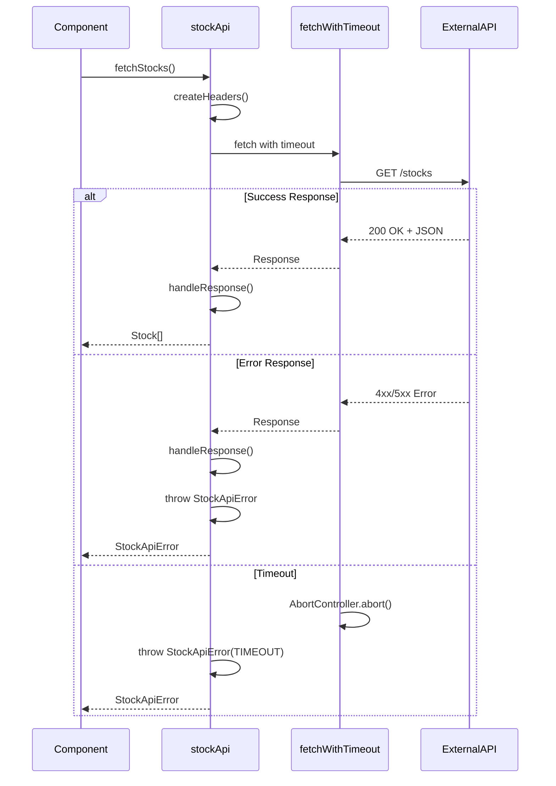

# IP-001: API Client Setup

## Overview

This implementation plan covers the setup of a robust API client for fetching stock data from an external API. The client will handle authentication, error handling, request/response transformation, and provide a clean interface for the application.

## Prerequisites

- Node.js and npm installed
- Project initialized with Vite and React
- Environment variables configured in `.env` file

## Implementation Steps

### Step 1: Create Type Definitions

Create TypeScript interfaces for stock data and API responses.

**File:** `src/types/stock.ts`

```typescript
/**
 * Represents a single stock's market data
 */
export interface Stock {
  symbol: string;
  companyName: string;
  price: number;
  change: number;
  changePercent: number;
  volume: number;
  marketCap: number;
  high52Week: number;
  low52Week: number;
  lastUpdated: string;
}

/**
 * API response wrapper for stock data
 */
export interface StockApiResponse {
  data: Stock[];
  meta: {
    timestamp: string;
    count: number;
  };
}

/**
 * Error response from the API
 */
export interface ApiError {
  code: string;
  message: string;
  details?: Record<string, unknown>;
}
```

### Step 2: Configure Environment Variables

Set up environment variables for API configuration.

**File:** `.env.example`

```env
VITE_STOCK_API_URL=https://api.example.com/v1
VITE_STOCK_API_KEY=your-api-key-here
VITE_STOCK_API_TIMEOUT=10000
```

**File:** `src/config/api.ts`

```typescript
export const API_CONFIG = {
  baseUrl: import.meta.env.VITE_STOCK_API_URL || 'https://api.example.com/v1',
  apiKey: import.meta.env.VITE_STOCK_API_KEY || '',
  timeout: Number(import.meta.env.VITE_STOCK_API_TIMEOUT) || 10000,
} as const;
```

### Step 3: Create Custom Error Class

Implement a custom error class for API-specific errors.

**File:** `src/api/errors.ts`

```typescript
export class StockApiError extends Error {
  constructor(
    message: string,
    public readonly statusCode: number,
    public readonly code?: string,
    public readonly details?: Record<string, unknown>
  ) {
    super(message);
    this.name = 'StockApiError';
  }

  static fromResponse(response: Response, body?: unknown): StockApiError {
    const errorBody = body as
      | { code?: string; message?: string; details?: Record<string, unknown> }
      | undefined;
    return new StockApiError(
      errorBody?.message || response.statusText || 'Unknown error',
      response.status,
      errorBody?.code,
      errorBody?.details
    );
  }

  get isNetworkError(): boolean {
    return this.statusCode === 0;
  }

  get isUnauthorized(): boolean {
    return this.statusCode === 401;
  }

  get isRateLimited(): boolean {
    return this.statusCode === 429;
  }
}
```

### Step 4: Implement the API Client

Create the main API client with fetch wrapper and error handling.

**File:** `src/api/stockApi.ts`

```typescript
import { API_CONFIG } from '../config/api';
import { StockApiError } from './errors';
import type { Stock, StockApiResponse } from '../types/stock';

/**
 * Creates headers for API requests
 */
function createHeaders(): HeadersInit {
  return {
    'Content-Type': 'application/json',
    Authorization: `Bearer ${API_CONFIG.apiKey}`,
  };
}

/**
 * Wrapper for fetch with timeout and error handling
 */
async function fetchWithTimeout(url: string, options: RequestInit = {}): Promise<Response> {
  const controller = new AbortController();
  const timeoutId = setTimeout(() => controller.abort(), API_CONFIG.timeout);

  try {
    const response = await fetch(url, {
      ...options,
      signal: controller.signal,
    });
    return response;
  } finally {
    clearTimeout(timeoutId);
  }
}

/**
 * Handles API response and throws on errors
 */
async function handleResponse<T>(response: Response): Promise<T> {
  if (!response.ok) {
    let errorBody: unknown;
    try {
      errorBody = await response.json();
    } catch {
      // Response body is not JSON
    }
    throw StockApiError.fromResponse(response, errorBody);
  }

  return response.json();
}

/**
 * Fetches all stocks from the API
 */
export async function fetchStocks(): Promise<Stock[]> {
  const url = `${API_CONFIG.baseUrl}/stocks`;

  try {
    const response = await fetchWithTimeout(url, {
      method: 'GET',
      headers: createHeaders(),
    });

    const data = await handleResponse<StockApiResponse>(response);
    return data.data;
  } catch (error) {
    if (error instanceof StockApiError) {
      console.error(`[StockAPI] Error fetching stocks: ${error.message}`, {
        statusCode: error.statusCode,
        code: error.code,
      });
      throw error;
    }

    if (error instanceof DOMException && error.name === 'AbortError') {
      throw new StockApiError('Request timeout', 0, 'TIMEOUT');
    }

    throw new StockApiError(
      error instanceof Error ? error.message : 'Unknown error',
      0,
      'NETWORK_ERROR'
    );
  }
}

/**
 * Fetches a single stock by symbol
 */
export async function fetchStockBySymbol(symbol: string): Promise<Stock> {
  const url = `${API_CONFIG.baseUrl}/stocks/${encodeURIComponent(symbol)}`;

  try {
    const response = await fetchWithTimeout(url, {
      method: 'GET',
      headers: createHeaders(),
    });

    return handleResponse<Stock>(response);
  } catch (error) {
    if (error instanceof StockApiError) {
      console.error(`[StockAPI] Error fetching stock ${symbol}: ${error.message}`);
      throw error;
    }

    throw new StockApiError(
      error instanceof Error ? error.message : 'Unknown error',
      0,
      'NETWORK_ERROR'
    );
  }
}
```

### Step 5: Create API Client Index

Export all API functions from a single entry point.

**File:** `src/api/index.ts`

```typescript
export { fetchStocks, fetchStockBySymbol } from './stockApi';
export { StockApiError } from './errors';
```

## File Structure

After implementation, the API client structure should look like:

```
src/
├── api/
│   ├── index.ts           # API exports
│   ├── stockApi.ts        # Stock API functions
│   └── errors.ts          # Custom error classes
├── config/
│   └── api.ts             # API configuration
└── types/
    └── stock.ts           # Type definitions
```

## Sequence Diagram



## Testing Considerations

### Unit Tests

```typescript
// src/api/__tests__/stockApi.test.ts
import { describe, it, expect, vi, beforeEach } from 'vitest';
import { fetchStocks } from '../stockApi';
import { StockApiError } from '../errors';

describe('fetchStocks', () => {
  beforeEach(() => {
    vi.resetAllMocks();
  });

  it('should fetch stocks successfully', async () => {
    const mockStocks = [{ symbol: 'AAPL', companyName: 'Apple Inc.', price: 150.0 }];

    global.fetch = vi.fn().mockResolvedValue({
      ok: true,
      json: () => Promise.resolve({ data: mockStocks, meta: { count: 1 } }),
    });

    const result = await fetchStocks();
    expect(result).toEqual(mockStocks);
  });

  it('should throw StockApiError on HTTP error', async () => {
    global.fetch = vi.fn().mockResolvedValue({
      ok: false,
      status: 401,
      statusText: 'Unauthorized',
      json: () => Promise.resolve({ code: 'AUTH_ERROR', message: 'Invalid API key' }),
    });

    await expect(fetchStocks()).rejects.toThrow(StockApiError);
  });

  it('should handle network errors', async () => {
    global.fetch = vi.fn().mockRejectedValue(new Error('Network error'));

    await expect(fetchStocks()).rejects.toThrow(StockApiError);
  });
});
```

## Acceptance Criteria

- [ ] **AC-IP001-01**: Type definitions exist for `Stock`, `StockApiResponse`, and `ApiError` interfaces.
- [ ] **AC-IP001-02**: Environment variables are configured and documented in `.env.example`.
- [ ] **AC-IP001-03**: API configuration is centralized in `src/config/api.ts`.
- [ ] **AC-IP001-04**: Custom `StockApiError` class handles HTTP and network errors.
- [ ] **AC-IP001-05**: `fetchStocks()` function retrieves stock data from the external API.
- [ ] **AC-IP001-06**: `fetchStockBySymbol()` function retrieves a single stock by symbol.
- [ ] **AC-IP001-07**: Request timeout is configurable and defaults to 10 seconds.
- [ ] **AC-IP001-08**: API errors are logged with relevant context for debugging.
- [ ] **AC-IP001-09**: All API functions are exported from `src/api/index.ts`.
- [ ] **AC-IP001-10**: Unit tests cover success, error, and timeout scenarios.

## Dependencies

- No additional npm packages required (uses native `fetch`)

## Related Documents

- [FEATURE-001: Stock Data Read-Only Table](../features/FEATURE-001.md)
- [IP-003: Data Fetching with TanStack Query](./IP-003-data-fetching.md)
