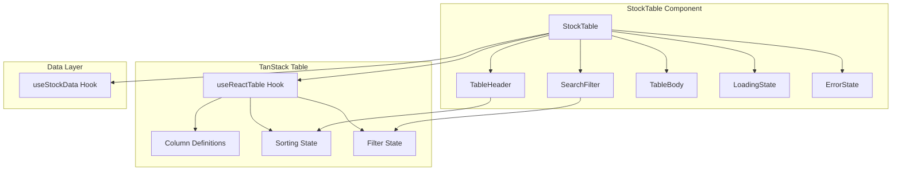

# IP-002: Stock Table Component

## Overview

This implementation plan covers the creation of the main `StockTable` component using TanStack Table. The component will display stock data in a read-only, sortable, and filterable table format with proper styling and accessibility features.

## Prerequisites

- [IP-001: API Client Setup](./IP-001-api-client-setup.md) completed
- [IP-003: Data Fetching with TanStack Query](./IP-003-data-fetching.md) completed
- TanStack Table installed (`@tanstack/react-table`)

## Implementation Steps

### Step 1: Create Column Definitions

Define the table columns with proper formatting and cell renderers.

**File:** `src/components/StockTable/columns.tsx`

```typescript
import { createColumnHelper, type ColumnDef } from '@tanstack/react-table';
import type { Stock } from '../../types/stock';

const columnHelper = createColumnHelper<Stock>();

/**
 * Formats a number as currency
 */
function formatCurrency(value: number): string {
  return new Intl.NumberFormat('en-US', {
    style: 'currency',
    currency: 'USD',
  }).format(value);
}

/**
 * Formats a number with thousand separators
 */
function formatNumber(value: number): string {
  return new Intl.NumberFormat('en-US').format(value);
}

/**
 * Formats market cap in abbreviated form (B, M, K)
 */
function formatMarketCap(value: number): string {
  if (value >= 1e12) return `$${(value / 1e12).toFixed(2)}T`;
  if (value >= 1e9) return `$${(value / 1e9).toFixed(2)}B`;
  if (value >= 1e6) return `$${(value / 1e6).toFixed(2)}M`;
  return formatCurrency(value);
}

/**
 * Stock table column definitions
 */
export const stockColumns: ColumnDef<Stock, unknown>[] = [
  columnHelper.accessor('symbol', {
    header: 'Symbol',
    cell: (info) => (
      <span className="stock-symbol">{info.getValue()}</span>
    ),
    enableSorting: true,
    size: 100,
  }),
  columnHelper.accessor('companyName', {
    header: 'Company',
    cell: (info) => (
      <span className="company-name" title={info.getValue()}>
        {info.getValue()}
      </span>
    ),
    enableSorting: true,
    size: 200,
  }),
  columnHelper.accessor('price', {
    header: 'Price',
    cell: (info) => (
      <span className="price">{formatCurrency(info.getValue())}</span>
    ),
    enableSorting: true,
    size: 100,
  }),
  columnHelper.accessor('change', {
    header: 'Change',
    cell: (info) => {
      const value = info.getValue();
      const className = value >= 0 ? 'change positive' : 'change negative';
      const prefix = value >= 0 ? '+' : '';
      return (
        <span className={className}>
          {prefix}{formatCurrency(value)}
        </span>
      );
    },
    enableSorting: true,
    size: 100,
  }),
  columnHelper.accessor('changePercent', {
    header: 'Change %',
    cell: (info) => {
      const value = info.getValue();
      const className = value >= 0 ? 'change-percent positive' : 'change-percent negative';
      const prefix = value >= 0 ? '+' : '';
      return (
        <span className={className}>
          {prefix}{value.toFixed(2)}%
        </span>
      );
    },
    enableSorting: true,
    size: 100,
  }),
  columnHelper.accessor('volume', {
    header: 'Volume',
    cell: (info) => (
      <span className="volume">{formatNumber(info.getValue())}</span>
    ),
    enableSorting: true,
    size: 120,
  }),
  columnHelper.accessor('marketCap', {
    header: 'Market Cap',
    cell: (info) => (
      <span className="market-cap">{formatMarketCap(info.getValue())}</span>
    ),
    enableSorting: true,
    size: 120,
  }),
];
```

### Step 2: Create Search Filter Component

Implement a reusable search input for filtering the table.

**File:** `src/components/StockTable/SearchFilter.tsx`

```typescript
import { useCallback, useState, useEffect } from 'react';

interface SearchFilterProps {
  value: string;
  onChange: (value: string) => void;
  placeholder?: string;
  debounceMs?: number;
}

export function SearchFilter({
  value,
  onChange,
  placeholder = 'Search stocks...',
  debounceMs = 300,
}: SearchFilterProps) {
  const [localValue, setLocalValue] = useState(value);

  useEffect(() => {
    setLocalValue(value);
  }, [value]);

  useEffect(() => {
    const timer = setTimeout(() => {
      if (localValue !== value) {
        onChange(localValue);
      }
    }, debounceMs);

    return () => clearTimeout(timer);
  }, [localValue, value, onChange, debounceMs]);

  const handleChange = useCallback(
    (e: React.ChangeEvent<HTMLInputElement>) => {
      setLocalValue(e.target.value);
    },
    []
  );

  const handleClear = useCallback(() => {
    setLocalValue('');
    onChange('');
  }, [onChange]);

  return (
    <div className="search-filter">
      <input
        type="text"
        value={localValue}
        onChange={handleChange}
        placeholder={placeholder}
        className="search-input"
        aria-label="Search stocks"
      />
      {localValue && (
        <button
          type="button"
          onClick={handleClear}
          className="search-clear"
          aria-label="Clear search"
        >
          ×
        </button>
      )}
    </div>
  );
}
```

### Step 3: Create Table Header Component

Implement the table header with sorting indicators.

**File:** `src/components/StockTable/TableHeader.tsx`

```typescript
import { flexRender, type HeaderGroup } from '@tanstack/react-table';
import type { Stock } from '../../types/stock';

interface TableHeaderProps {
  headerGroups: HeaderGroup<Stock>[];
}

export function TableHeader({ headerGroups }: TableHeaderProps) {
  return (
    <thead className="stock-table-header">
      {headerGroups.map((headerGroup) => (
        <tr key={headerGroup.id}>
          {headerGroup.headers.map((header) => {
            const canSort = header.column.getCanSort();
            const sortDirection = header.column.getIsSorted();

            return (
              <th
                key={header.id}
                className={canSort ? 'sortable' : ''}
                style={{ width: header.getSize() }}
                onClick={header.column.getToggleSortingHandler()}
                onKeyDown={(e) => {
                  if (e.key === 'Enter' || e.key === ' ') {
                    e.preventDefault();
                    header.column.getToggleSortingHandler()?.(e);
                  }
                }}
                tabIndex={canSort ? 0 : undefined}
                role={canSort ? 'button' : undefined}
                aria-sort={
                  sortDirection === 'asc'
                    ? 'ascending'
                    : sortDirection === 'desc'
                    ? 'descending'
                    : undefined
                }
              >
                <span className="header-content">
                  {header.isPlaceholder
                    ? null
                    : flexRender(
                        header.column.columnDef.header,
                        header.getContext()
                      )}
                  {canSort && (
                    <span className="sort-indicator" aria-hidden="true">
                      {sortDirection === 'asc' && ' ↑'}
                      {sortDirection === 'desc' && ' ↓'}
                      {!sortDirection && ' ↕'}
                    </span>
                  )}
                </span>
              </th>
            );
          })}
        </tr>
      ))}
    </thead>
  );
}
```

### Step 4: Create Table Body Component

Implement the table body that renders stock rows.

**File:** `src/components/StockTable/TableBody.tsx`

```typescript
import { flexRender, type Row } from '@tanstack/react-table';
import type { Stock } from '../../types/stock';

interface TableBodyProps {
  rows: Row<Stock>[];
}

export function TableBody({ rows }: TableBodyProps) {
  if (rows.length === 0) {
    return (
      <tbody className="stock-table-body">
        <tr>
          <td colSpan={100} className="no-data">
            No stocks found
          </td>
        </tr>
      </tbody>
    );
  }

  return (
    <tbody className="stock-table-body">
      {rows.map((row) => (
        <tr key={row.id} className="stock-row">
          {row.getVisibleCells().map((cell) => (
            <td
              key={cell.id}
              style={{ width: cell.column.getSize() }}
            >
              {flexRender(cell.column.columnDef.cell, cell.getContext())}
            </td>
          ))}
        </tr>
      ))}
    </tbody>
  );
}
```

### Step 5: Create Loading and Error States

Implement loading skeleton and error display components.

**File:** `src/components/StockTable/LoadingState.tsx`

```typescript
interface LoadingStateProps {
  rowCount?: number;
  columnCount?: number;
}

export function LoadingState({
  rowCount = 10,
  columnCount = 7,
}: LoadingStateProps) {
  return (
    <div className="loading-state" role="status" aria-label="Loading stock data">
      <table className="stock-table skeleton">
        <thead>
          <tr>
            {Array.from({ length: columnCount }).map((_, i) => (
              <th key={i}>
                <div className="skeleton-cell header" />
              </th>
            ))}
          </tr>
        </thead>
        <tbody>
          {Array.from({ length: rowCount }).map((_, rowIndex) => (
            <tr key={rowIndex}>
              {Array.from({ length: columnCount }).map((_, colIndex) => (
                <td key={colIndex}>
                  <div className="skeleton-cell" />
                </td>
              ))}
            </tr>
          ))}
        </tbody>
      </table>
    </div>
  );
}
```

**File:** `src/components/StockTable/ErrorState.tsx`

```typescript
interface ErrorStateProps {
  error: Error;
  onRetry?: () => void;
}

export function ErrorState({ error, onRetry }: ErrorStateProps) {
  return (
    <div className="error-state" role="alert">
      <div className="error-icon" aria-hidden="true">⚠️</div>
      <h3 className="error-title">Failed to load stock data</h3>
      <p className="error-message">{error.message}</p>
      {onRetry && (
        <button
          type="button"
          onClick={onRetry}
          className="retry-button"
        >
          Try Again
        </button>
      )}
    </div>
  );
}
```

### Step 6: Create Main StockTable Component

Assemble all components into the main table component.

**File:** `src/components/StockTable/StockTable.tsx`

```typescript
import { useState, useCallback } from 'react';
import {
  useReactTable,
  getCoreRowModel,
  getSortedRowModel,
  getFilteredRowModel,
  type SortingState,
} from '@tanstack/react-table';
import { useStockData } from '../../hooks/useStockData';
import { stockColumns } from './columns';
import { SearchFilter } from './SearchFilter';
import { TableHeader } from './TableHeader';
import { TableBody } from './TableBody';
import { LoadingState } from './LoadingState';
import { ErrorState } from './ErrorState';
import './StockTable.css';

export function StockTable() {
  const { data: stocks, isLoading, error, refetch } = useStockData();
  const [sorting, setSorting] = useState<SortingState>([]);
  const [globalFilter, setGlobalFilter] = useState('');

  const table = useReactTable({
    data: stocks ?? [],
    columns: stockColumns,
    state: {
      sorting,
      globalFilter,
    },
    onSortingChange: setSorting,
    onGlobalFilterChange: setGlobalFilter,
    getCoreRowModel: getCoreRowModel(),
    getSortedRowModel: getSortedRowModel(),
    getFilteredRowModel: getFilteredRowModel(),
    enableSorting: true,
    enableFilters: true,
  });

  const handleRetry = useCallback(() => {
    refetch();
  }, [refetch]);

  if (isLoading) {
    return <LoadingState />;
  }

  if (error) {
    return <ErrorState error={error} onRetry={handleRetry} />;
  }

  return (
    <div className="stock-table-container">
      <div className="stock-table-toolbar">
        <SearchFilter
          value={globalFilter}
          onChange={setGlobalFilter}
          placeholder="Search by symbol or company..."
        />
        <div className="stock-count">
          {table.getFilteredRowModel().rows.length} stocks
        </div>
      </div>
      <div className="stock-table-wrapper">
        <table className="stock-table">
          <TableHeader headerGroups={table.getHeaderGroups()} />
          <TableBody rows={table.getRowModel().rows} />
        </table>
      </div>
    </div>
  );
}
```

### Step 7: Add Component Styles

Create CSS styles for the table component.

**File:** `src/components/StockTable/StockTable.css`

```css
/* Container */
.stock-table-container {
  display: flex;
  flex-direction: column;
  gap: 1rem;
  width: 100%;
}

/* Toolbar */
.stock-table-toolbar {
  display: flex;
  justify-content: space-between;
  align-items: center;
  gap: 1rem;
  flex-wrap: wrap;
}

.stock-count {
  color: #6b7280;
  font-size: 0.875rem;
}

/* Search Filter */
.search-filter {
  position: relative;
  width: 100%;
  max-width: 300px;
}

.search-input {
  width: 100%;
  padding: 0.5rem 2rem 0.5rem 0.75rem;
  border: 1px solid #d1d5db;
  border-radius: 0.375rem;
  font-size: 0.875rem;
}

.search-input:focus {
  outline: none;
  border-color: #3b82f6;
  box-shadow: 0 0 0 3px rgba(59, 130, 246, 0.1);
}

.search-clear {
  position: absolute;
  right: 0.5rem;
  top: 50%;
  transform: translateY(-50%);
  background: none;
  border: none;
  font-size: 1.25rem;
  color: #9ca3af;
  cursor: pointer;
  padding: 0.25rem;
}

.search-clear:hover {
  color: #6b7280;
}

/* Table Wrapper */
.stock-table-wrapper {
  overflow-x: auto;
  border: 1px solid #e5e7eb;
  border-radius: 0.5rem;
}

/* Table */
.stock-table {
  width: 100%;
  border-collapse: collapse;
  font-size: 0.875rem;
}

/* Header */
.stock-table-header th {
  background-color: #f9fafb;
  padding: 0.75rem 1rem;
  text-align: left;
  font-weight: 600;
  color: #374151;
  border-bottom: 1px solid #e5e7eb;
  white-space: nowrap;
}

.stock-table-header th.sortable {
  cursor: pointer;
  user-select: none;
}

.stock-table-header th.sortable:hover {
  background-color: #f3f4f6;
}

.stock-table-header th.sortable:focus {
  outline: 2px solid #3b82f6;
  outline-offset: -2px;
}

.header-content {
  display: flex;
  align-items: center;
  gap: 0.25rem;
}

.sort-indicator {
  color: #9ca3af;
  font-size: 0.75rem;
}

/* Body */
.stock-table-body td {
  padding: 0.75rem 1rem;
  border-bottom: 1px solid #e5e7eb;
  color: #1f2937;
}

.stock-row:hover {
  background-color: #f9fafb;
}

.stock-row:last-child td {
  border-bottom: none;
}

/* Cell Styles */
.stock-symbol {
  font-weight: 600;
  color: #1f2937;
}

.company-name {
  max-width: 200px;
  overflow: hidden;
  text-overflow: ellipsis;
  white-space: nowrap;
  display: block;
}

.price {
  font-family: monospace;
}

.change,
.change-percent {
  font-family: monospace;
}

.positive {
  color: #059669;
}

.negative {
  color: #dc2626;
}

.volume,
.market-cap {
  font-family: monospace;
  color: #6b7280;
}

/* No Data */
.no-data {
  text-align: center;
  padding: 3rem 1rem;
  color: #6b7280;
}

/* Loading State */
.loading-state {
  width: 100%;
}

.skeleton .skeleton-cell {
  height: 1rem;
  background: linear-gradient(90deg, #f3f4f6 25%, #e5e7eb 50%, #f3f4f6 75%);
  background-size: 200% 100%;
  animation: shimmer 1.5s infinite;
  border-radius: 0.25rem;
}

.skeleton .skeleton-cell.header {
  width: 60%;
}

@keyframes shimmer {
  0% {
    background-position: 200% 0;
  }
  100% {
    background-position: -200% 0;
  }
}

/* Error State */
.error-state {
  display: flex;
  flex-direction: column;
  align-items: center;
  justify-content: center;
  padding: 3rem 1rem;
  text-align: center;
}

.error-icon {
  font-size: 3rem;
  margin-bottom: 1rem;
}

.error-title {
  font-size: 1.125rem;
  font-weight: 600;
  color: #1f2937;
  margin: 0 0 0.5rem;
}

.error-message {
  color: #6b7280;
  margin: 0 0 1rem;
}

.retry-button {
  padding: 0.5rem 1rem;
  background-color: #3b82f6;
  color: white;
  border: none;
  border-radius: 0.375rem;
  font-size: 0.875rem;
  cursor: pointer;
}

.retry-button:hover {
  background-color: #2563eb;
}

/* Responsive */
@media (max-width: 768px) {
  .stock-table-toolbar {
    flex-direction: column;
    align-items: stretch;
  }

  .search-filter {
    max-width: none;
  }

  .stock-count {
    text-align: right;
  }
}
```

### Step 8: Create Component Index

Export all components from a single entry point.

**File:** `src/components/StockTable/index.ts`

```typescript
export { StockTable } from './StockTable';
export { stockColumns } from './columns';
export { SearchFilter } from './SearchFilter';
export { TableHeader } from './TableHeader';
export { TableBody } from './TableBody';
export { LoadingState } from './LoadingState';
export { ErrorState } from './ErrorState';
```

## Component Architecture



## File Structure

```
src/components/StockTable/
├── index.ts              # Component exports
├── StockTable.tsx        # Main component
├── StockTable.css        # Styles
├── columns.tsx           # Column definitions
├── SearchFilter.tsx      # Search input component
├── TableHeader.tsx       # Header with sorting
├── TableBody.tsx         # Body with rows
├── LoadingState.tsx      # Loading skeleton
└── ErrorState.tsx        # Error display
```

## Acceptance Criteria

- [ ] **AC-IP002-01**: `StockTable` component renders stock data in a tabular format.
- [ ] **AC-IP002-02**: Column definitions include symbol, company, price, change, change %, volume, and market cap.
- [ ] **AC-IP002-03**: Positive changes display in green; negative changes display in red.
- [ ] **AC-IP002-04**: Users can sort columns by clicking on column headers.
- [ ] **AC-IP002-05**: Sort direction is indicated visually with arrows (↑ ↓).
- [ ] **AC-IP002-06**: Users can filter stocks using the search input field.
- [ ] **AC-IP002-07**: Search filter has debounced input to prevent excessive re-renders.
- [ ] **AC-IP002-08**: Loading skeleton displays while data is being fetched.
- [ ] **AC-IP002-09**: Error state displays with error message and retry button.
- [ ] **AC-IP002-10**: Table is keyboard accessible (sortable columns are focusable).
- [ ] **AC-IP002-11**: Table header includes proper ARIA attributes for accessibility.
- [ ] **AC-IP002-12**: Table is responsive and scrollable on mobile devices.
- [ ] **AC-IP002-13**: All components are exported from the index file.

## Dependencies

- `@tanstack/react-table` - Headless table library

## Related Documents

- [FEATURE-001: Stock Data Read-Only Table](../features/FEATURE-001.md)
- [IP-001: API Client Setup](./IP-001-api-client-setup.md)
- [IP-003: Data Fetching with TanStack Query](./IP-003-data-fetching.md)
