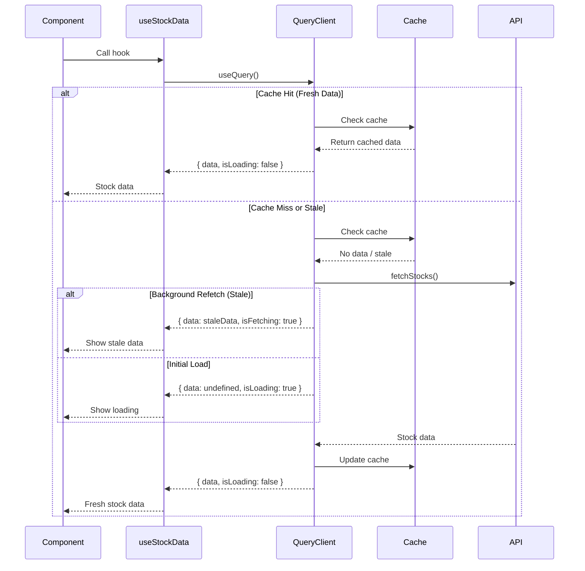
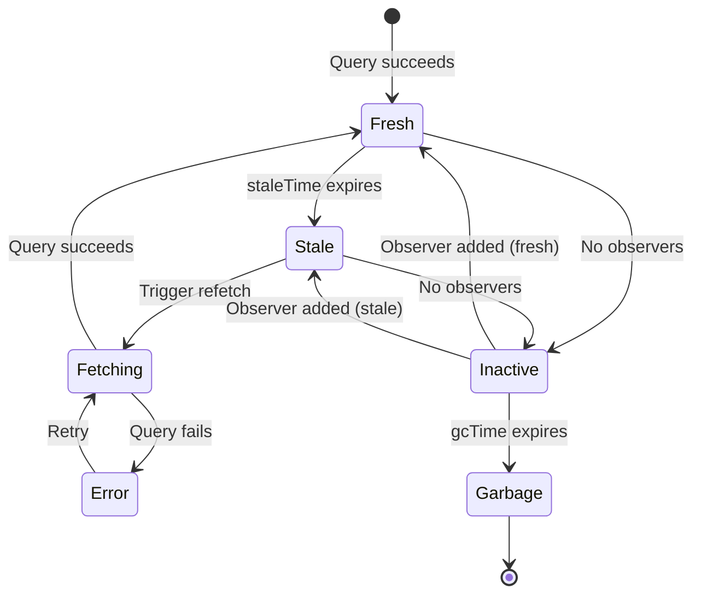

# IP-003: Data Fetching with TanStack Query

## Overview

This implementation plan covers the integration of TanStack Query (React Query) for managing server state, caching, and automatic data synchronization. This setup will provide efficient data fetching with built-in caching, background refetching, and error handling.

## Prerequisites

- [IP-001: API Client Setup](./IP-001-api-client-setup.md) completed
- TanStack Query installed (`@tanstack/react-query`)
- React Query DevTools installed (optional, for development)

## Implementation Steps

### Step 1: Configure Query Client

Create a configured Query Client with default options.

**File:** `src/lib/queryClient.ts`

```typescript
import { QueryClient } from '@tanstack/react-query';

/**
 * Default query options for the application
 */
const defaultQueryOptions = {
  queries: {
    // Data is considered fresh for 30 seconds
    staleTime: 30 * 1000,
    // Cache data for 5 minutes
    gcTime: 5 * 60 * 1000,
    // Retry failed requests 3 times
    retry: 3,
    // Exponential backoff for retries
    retryDelay: (attemptIndex: number) => Math.min(1000 * 2 ** attemptIndex, 30000),
    // Refetch on window focus
    refetchOnWindowFocus: true,
    // Don't refetch on mount if data is fresh
    refetchOnMount: true,
  },
  mutations: {
    // Retry mutations once
    retry: 1,
  },
};

/**
 * Create and configure the Query Client
 */
export function createQueryClient(): QueryClient {
  return new QueryClient({
    defaultOptions: defaultQueryOptions,
  });
}

/**
 * Singleton query client for the application
 */
export const queryClient = createQueryClient();
```

### Step 2: Create Query Key Factory

Implement a type-safe query key factory for consistent cache management.

**File:** `src/lib/queryKeys.ts`

```typescript
/**
 * Query key factory for type-safe and consistent query keys
 *
 * Usage:
 *   queryKeys.stocks.all        -> ['stocks']
 *   queryKeys.stocks.list()     -> ['stocks', 'list']
 *   queryKeys.stocks.detail(id) -> ['stocks', 'detail', id]
 */
export const queryKeys = {
  stocks: {
    all: ['stocks'] as const,
    lists: () => [...queryKeys.stocks.all, 'list'] as const,
    list: (filters?: { search?: string; sort?: string }) =>
      [...queryKeys.stocks.lists(), filters] as const,
    details: () => [...queryKeys.stocks.all, 'detail'] as const,
    detail: (symbol: string) => [...queryKeys.stocks.details(), symbol] as const,
  },
} as const;

/**
 * Type helper for query keys
 */
export type QueryKeys = typeof queryKeys;
```

### Step 3: Create Stock Data Hook

Implement the main hook for fetching stock data.

**File:** `src/hooks/useStockData.ts`

````typescript
import { useQuery, type UseQueryOptions } from '@tanstack/react-query';
import { fetchStocks } from '../api/stockApi';
import { queryKeys } from '../lib/queryKeys';
import type { Stock } from '../types/stock';

/**
 * Configuration options for useStockData hook
 */
interface UseStockDataOptions {
  /** Whether to enable automatic refetching */
  enabled?: boolean;
  /** Refetch interval in milliseconds (0 to disable) */
  refetchInterval?: number;
  /** Additional query options */
  queryOptions?: Omit<UseQueryOptions<Stock[], Error>, 'queryKey' | 'queryFn'>;
}

/**
 * Hook for fetching and managing stock data
 *
 * @example
 * ```tsx
 * const { data, isLoading, error } = useStockData();
 * ```
 *
 * @example With auto-refresh
 * ```tsx
 * const { data } = useStockData({ refetchInterval: 60000 });
 * ```
 */
export function useStockData(options: UseStockDataOptions = {}) {
  const {
    enabled = true,
    refetchInterval = 60 * 1000, // 1 minute default
    queryOptions,
  } = options;

  return useQuery({
    queryKey: queryKeys.stocks.all,
    queryFn: fetchStocks,
    enabled,
    refetchInterval: refetchInterval > 0 ? refetchInterval : false,
    ...queryOptions,
  });
}
````

### Step 4: Create Single Stock Hook

Implement a hook for fetching individual stock details.

**File:** `src/hooks/useStock.ts`

````typescript
import { useQuery, type UseQueryOptions } from '@tanstack/react-query';
import { fetchStockBySymbol } from '../api/stockApi';
import { queryKeys } from '../lib/queryKeys';
import type { Stock } from '../types/stock';

/**
 * Configuration options for useStock hook
 */
interface UseStockOptions {
  /** Whether to enable the query */
  enabled?: boolean;
  /** Additional query options */
  queryOptions?: Omit<UseQueryOptions<Stock, Error>, 'queryKey' | 'queryFn' | 'enabled'>;
}

/**
 * Hook for fetching a single stock by symbol
 *
 * @example
 * ```tsx
 * const { data: stock } = useStock('AAPL');
 * ```
 */
export function useStock(symbol: string, options: UseStockOptions = {}) {
  const { enabled = true, queryOptions } = options;

  return useQuery({
    queryKey: queryKeys.stocks.detail(symbol),
    queryFn: () => fetchStockBySymbol(symbol),
    enabled: enabled && Boolean(symbol),
    ...queryOptions,
  });
}
````

### Step 5: Create Prefetch Utilities

Implement utilities for prefetching data.

**File:** `src/hooks/usePrefetchStocks.ts`

````typescript
import { useQueryClient } from '@tanstack/react-query';
import { useCallback } from 'react';
import { fetchStocks, fetchStockBySymbol } from '../api/stockApi';
import { queryKeys } from '../lib/queryKeys';

/**
 * Hook for prefetching stock data
 *
 * @example
 * ```tsx
 * const { prefetchStocks, prefetchStock } = usePrefetchStocks();
 *
 * // Prefetch on hover
 * <button onMouseEnter={() => prefetchStock('AAPL')}>
 *   View Apple
 * </button>
 * ```
 */
export function usePrefetchStocks() {
  const queryClient = useQueryClient();

  const prefetchStocks = useCallback(async () => {
    await queryClient.prefetchQuery({
      queryKey: queryKeys.stocks.all,
      queryFn: fetchStocks,
      staleTime: 30 * 1000,
    });
  }, [queryClient]);

  const prefetchStock = useCallback(
    async (symbol: string) => {
      await queryClient.prefetchQuery({
        queryKey: queryKeys.stocks.detail(symbol),
        queryFn: () => fetchStockBySymbol(symbol),
        staleTime: 30 * 1000,
      });
    },
    [queryClient]
  );

  return { prefetchStocks, prefetchStock };
}
````

### Step 6: Create Cache Utilities

Implement utilities for cache manipulation.

**File:** `src/hooks/useStockCache.ts`

````typescript
import { useQueryClient } from '@tanstack/react-query';
import { useCallback } from 'react';
import { queryKeys } from '../lib/queryKeys';
import type { Stock } from '../types/stock';

/**
 * Hook for manipulating stock cache
 *
 * @example
 * ```tsx
 * const { invalidateStocks, updateStockInCache } = useStockCache();
 *
 * // Force refetch
 * await invalidateStocks();
 *
 * // Optimistic update
 * updateStockInCache('AAPL', { price: 155.00 });
 * ```
 */
export function useStockCache() {
  const queryClient = useQueryClient();

  /**
   * Invalidate all stock queries, triggering a refetch
   */
  const invalidateStocks = useCallback(async () => {
    await queryClient.invalidateQueries({
      queryKey: queryKeys.stocks.all,
    });
  }, [queryClient]);

  /**
   * Invalidate a single stock query
   */
  const invalidateStock = useCallback(
    async (symbol: string) => {
      await queryClient.invalidateQueries({
        queryKey: queryKeys.stocks.detail(symbol),
      });
    },
    [queryClient]
  );

  /**
   * Update a stock in the cache (optimistic update)
   */
  const updateStockInCache = useCallback(
    (symbol: string, updates: Partial<Stock>) => {
      // Update in list cache
      queryClient.setQueryData<Stock[]>(queryKeys.stocks.all, (old) => {
        if (!old) return old;
        return old.map((stock) => (stock.symbol === symbol ? { ...stock, ...updates } : stock));
      });

      // Update in detail cache
      queryClient.setQueryData<Stock>(queryKeys.stocks.detail(symbol), (old) => {
        if (!old) return old;
        return { ...old, ...updates };
      });
    },
    [queryClient]
  );

  /**
   * Get stock data from cache without triggering a fetch
   */
  const getStockFromCache = useCallback(
    (symbol: string): Stock | undefined => {
      // Try detail cache first
      const detail = queryClient.getQueryData<Stock>(queryKeys.stocks.detail(symbol));
      if (detail) return detail;

      // Fall back to list cache
      const list = queryClient.getQueryData<Stock[]>(queryKeys.stocks.all);
      return list?.find((stock) => stock.symbol === symbol);
    },
    [queryClient]
  );

  return {
    invalidateStocks,
    invalidateStock,
    updateStockInCache,
    getStockFromCache,
  };
}
````

### Step 7: Set Up Query Provider

Configure the application with the Query Provider.

**File:** `src/providers/QueryProvider.tsx`

```typescript
import { QueryClientProvider } from '@tanstack/react-query';
import { ReactQueryDevtools } from '@tanstack/react-query-devtools';
import type { ReactNode } from 'react';
import { queryClient } from '../lib/queryClient';

interface QueryProviderProps {
  children: ReactNode;
}

/**
 * Provider component for TanStack Query
 */
export function QueryProvider({ children }: QueryProviderProps) {
  return (
    <QueryClientProvider client={queryClient}>
      {children}
      {import.meta.env.DEV && (
        <ReactQueryDevtools initialIsOpen={false} />
      )}
    </QueryClientProvider>
  );
}
```

### Step 8: Update Application Entry Point

Wrap the application with the Query Provider.

**File:** `src/main.tsx`

```typescript
import { StrictMode } from 'react';
import { createRoot } from 'react-dom/client';
import { QueryProvider } from './providers/QueryProvider';
import App from './App';
import './index.css';

createRoot(document.getElementById('root')!).render(
  <StrictMode>
    <QueryProvider>
      <App />
    </QueryProvider>
  </StrictMode>
);
```

### Step 9: Create Hooks Index

Export all hooks from a single entry point.

**File:** `src/hooks/index.ts`

```typescript
export { useStockData } from './useStockData';
export { useStock } from './useStock';
export { usePrefetchStocks } from './usePrefetchStocks';
export { useStockCache } from './useStockCache';
```

## Data Flow Diagram



## Cache Lifecycle



## File Structure

```
src/
├── lib/
│   ├── queryClient.ts      # Query client configuration
│   └── queryKeys.ts        # Query key factory
├── hooks/
│   ├── index.ts            # Hook exports
│   ├── useStockData.ts     # Main stock data hook
│   ├── useStock.ts         # Single stock hook
│   ├── usePrefetchStocks.ts # Prefetch utilities
│   └── useStockCache.ts    # Cache manipulation
├── providers/
│   └── QueryProvider.tsx   # Query provider component
└── main.tsx                # App entry with provider
```

## Configuration Reference

| Option                 | Default | Description                                  |
| ---------------------- | ------- | -------------------------------------------- |
| `staleTime`            | 30s     | Time before data is considered stale         |
| `gcTime`               | 5min    | Time before unused data is garbage collected |
| `refetchInterval`      | 60s     | Auto-refetch interval for stock data         |
| `retry`                | 3       | Number of retry attempts on failure          |
| `refetchOnWindowFocus` | true    | Refetch when window regains focus            |

## Testing Considerations

### Unit Test Setup

```typescript
// src/test/setup.ts
import { QueryClient, QueryClientProvider } from '@tanstack/react-query';
import { render } from '@testing-library/react';
import type { ReactNode } from 'react';

export function createTestQueryClient() {
  return new QueryClient({
    defaultOptions: {
      queries: {
        retry: false,
        gcTime: 0,
      },
    },
  });
}

export function renderWithQuery(ui: ReactNode) {
  const queryClient = createTestQueryClient();
  return render(
    <QueryClientProvider client={queryClient}>
      {ui}
    </QueryClientProvider>
  );
}
```

### Hook Test Example

```typescript
// src/hooks/__tests__/useStockData.test.tsx
import { renderHook, waitFor } from '@testing-library/react';
import { QueryClientProvider } from '@tanstack/react-query';
import { describe, it, expect, vi } from 'vitest';
import { useStockData } from '../useStockData';
import { createTestQueryClient } from '../../test/setup';
import * as api from '../../api/stockApi';

vi.mock('../../api/stockApi');

describe('useStockData', () => {
  it('should fetch stocks successfully', async () => {
    const mockStocks = [
      { symbol: 'AAPL', companyName: 'Apple Inc.', price: 150 },
    ];
    vi.mocked(api.fetchStocks).mockResolvedValue(mockStocks);

    const queryClient = createTestQueryClient();
    const wrapper = ({ children }) => (
      <QueryClientProvider client={queryClient}>
        {children}
      </QueryClientProvider>
    );

    const { result } = renderHook(() => useStockData(), { wrapper });

    expect(result.current.isLoading).toBe(true);

    await waitFor(() => {
      expect(result.current.isLoading).toBe(false);
    });

    expect(result.current.data).toEqual(mockStocks);
  });
});
```

## Acceptance Criteria

- [ ] **AC-IP003-01**: Query client is configured with appropriate default options.
- [ ] **AC-IP003-02**: Query key factory provides type-safe, consistent cache keys.
- [ ] **AC-IP003-03**: `useStockData` hook fetches and caches stock data.
- [ ] **AC-IP003-04**: `useStock` hook fetches individual stock details.
- [ ] **AC-IP003-05**: Data automatically refetches at configurable intervals.
- [ ] **AC-IP003-06**: Stale data is shown while fresh data is being fetched.
- [ ] **AC-IP003-07**: Failed requests are automatically retried with exponential backoff.
- [ ] **AC-IP003-08**: Cache utilities allow manual invalidation and updates.
- [ ] **AC-IP003-09**: Prefetch utilities enable data preloading.
- [ ] **AC-IP003-10**: Query Provider wraps the application at the entry point.
- [ ] **AC-IP003-11**: React Query DevTools are available in development mode.
- [ ] **AC-IP003-12**: All hooks are exported from the index file.
- [ ] **AC-IP003-13**: Test utilities are provided for hook testing.

## Dependencies

- `@tanstack/react-query` - Data fetching and caching
- `@tanstack/react-query-devtools` - Development tools (dev dependency)

## Related Documents

- [FEATURE-001: Stock Data Read-Only Table](../features/FEATURE-001.md)
- [IP-001: API Client Setup](./IP-001-api-client-setup.md)
- [IP-002: Stock Table Component](./IP-002-stock-table-component.md)
