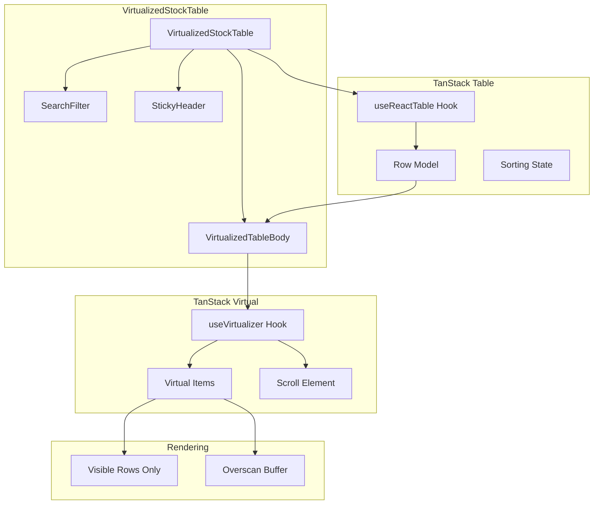
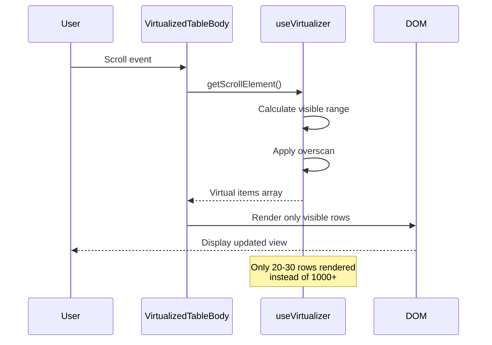

# IP-004: Table Virtualization

## Overview

This implementation plan covers the integration of TanStack Virtual for efficient rendering of large datasets in the stock table. Virtualization ensures smooth scrolling and optimal performance when displaying thousands of rows by only rendering visible items.

## Prerequisites

- [IP-002: Stock Table Component](./IP-002-stock-table-component.md) completed
- TanStack Virtual installed (`@tanstack/react-virtual`)

## Implementation Steps

### Step 1: Create Virtualized Table Container

Create a container component that manages virtualization.

**File:** `src/components/StockTable/VirtualizedTableBody.tsx`

```typescript
import { useRef, useCallback } from 'react';
import { useVirtualizer } from '@tanstack/react-virtual';
import { flexRender, type Row } from '@tanstack/react-table';
import type { Stock } from '../../types/stock';

interface VirtualizedTableBodyProps {
  rows: Row<Stock>[];
  rowHeight?: number;
  overscan?: number;
}

/**
 * Virtualized table body that only renders visible rows
 */
export function VirtualizedTableBody({
  rows,
  rowHeight = 48,
  overscan = 10,
}: VirtualizedTableBodyProps) {
  const parentRef = useRef<HTMLDivElement>(null);

  const virtualizer = useVirtualizer({
    count: rows.length,
    getScrollElement: () => parentRef.current,
    estimateSize: useCallback(() => rowHeight, [rowHeight]),
    overscan,
  });

  const virtualRows = virtualizer.getVirtualItems();
  const totalHeight = virtualizer.getTotalSize();

  if (rows.length === 0) {
    return (
      <div className="virtual-table-body" ref={parentRef}>
        <div className="no-data">No stocks found</div>
      </div>
    );
  }

  return (
    <div
      ref={parentRef}
      className="virtual-table-body"
      style={{ height: '600px', overflow: 'auto' }}
    >
      <div
        style={{
          height: `${totalHeight}px`,
          width: '100%',
          position: 'relative',
        }}
      >
        {virtualRows.map((virtualRow) => {
          const row = rows[virtualRow.index];
          return (
            <div
              key={row.id}
              className="virtual-row"
              style={{
                position: 'absolute',
                top: 0,
                left: 0,
                width: '100%',
                height: `${virtualRow.size}px`,
                transform: `translateY(${virtualRow.start}px)`,
              }}
            >
              <div className="virtual-row-content">
                {row.getVisibleCells().map((cell) => (
                  <div
                    key={cell.id}
                    className="virtual-cell"
                    style={{ width: cell.column.getSize() }}
                  >
                    {flexRender(cell.column.columnDef.cell, cell.getContext())}
                  </div>
                ))}
              </div>
            </div>
          );
        })}
      </div>
    </div>
  );
}
```

### Step 2: Create Sticky Header Component

Implement a sticky header that stays visible during scrolling.

**File:** `src/components/StockTable/StickyHeader.tsx`

```typescript
import { flexRender, type HeaderGroup } from '@tanstack/react-table';
import type { Stock } from '../../types/stock';

interface StickyHeaderProps {
  headerGroups: HeaderGroup<Stock>[];
}

/**
 * Sticky table header that remains fixed during scroll
 */
export function StickyHeader({ headerGroups }: StickyHeaderProps) {
  return (
    <div className="sticky-header">
      {headerGroups.map((headerGroup) => (
        <div key={headerGroup.id} className="header-row">
          {headerGroup.headers.map((header) => {
            const canSort = header.column.getCanSort();
            const sortDirection = header.column.getIsSorted();

            return (
              <div
                key={header.id}
                className={`header-cell ${canSort ? 'sortable' : ''}`}
                style={{ width: header.getSize() }}
                onClick={header.column.getToggleSortingHandler()}
                onKeyDown={(e) => {
                  if (e.key === 'Enter' || e.key === ' ') {
                    e.preventDefault();
                    header.column.getToggleSortingHandler()?.(e);
                  }
                }}
                tabIndex={canSort ? 0 : undefined}
                role={canSort ? 'button' : undefined}
                aria-sort={
                  sortDirection === 'asc'
                    ? 'ascending'
                    : sortDirection === 'desc'
                    ? 'descending'
                    : undefined
                }
              >
                <span className="header-content">
                  {header.isPlaceholder
                    ? null
                    : flexRender(
                        header.column.columnDef.header,
                        header.getContext()
                      )}
                  {canSort && (
                    <span className="sort-indicator" aria-hidden="true">
                      {sortDirection === 'asc' && ' ↑'}
                      {sortDirection === 'desc' && ' ↓'}
                      {!sortDirection && ' ↕'}
                    </span>
                  )}
                </span>
              </div>
            );
          })}
        </div>
      ))}
    </div>
  );
}
```

### Step 3: Create Virtualized Stock Table Component

Combine sticky header and virtualized body into a complete table.

**File:** `src/components/StockTable/VirtualizedStockTable.tsx`

```typescript
import { useState, useCallback, useMemo } from 'react';
import {
  useReactTable,
  getCoreRowModel,
  getSortedRowModel,
  getFilteredRowModel,
  type SortingState,
} from '@tanstack/react-table';
import { useStockData } from '../../hooks/useStockData';
import { stockColumns } from './columns';
import { SearchFilter } from './SearchFilter';
import { StickyHeader } from './StickyHeader';
import { VirtualizedTableBody } from './VirtualizedTableBody';
import { LoadingState } from './LoadingState';
import { ErrorState } from './ErrorState';
import './VirtualizedStockTable.css';

interface VirtualizedStockTableProps {
  /** Height of each row in pixels */
  rowHeight?: number;
  /** Number of rows to render outside visible area */
  overscan?: number;
  /** Height of the table viewport in pixels */
  tableHeight?: number;
}

/**
 * Virtualized stock table for handling large datasets
 */
export function VirtualizedStockTable({
  rowHeight = 48,
  overscan = 10,
  tableHeight = 600,
}: VirtualizedStockTableProps) {
  const { data: stocks, isLoading, error, refetch } = useStockData();
  const [sorting, setSorting] = useState<SortingState>([]);
  const [globalFilter, setGlobalFilter] = useState('');

  const columns = useMemo(() => stockColumns, []);

  const table = useReactTable({
    data: stocks ?? [],
    columns,
    state: {
      sorting,
      globalFilter,
    },
    onSortingChange: setSorting,
    onGlobalFilterChange: setGlobalFilter,
    getCoreRowModel: getCoreRowModel(),
    getSortedRowModel: getSortedRowModel(),
    getFilteredRowModel: getFilteredRowModel(),
    enableSorting: true,
    enableFilters: true,
  });

  const handleRetry = useCallback(() => {
    refetch();
  }, [refetch]);

  if (isLoading) {
    return <LoadingState />;
  }

  if (error) {
    return <ErrorState error={error} onRetry={handleRetry} />;
  }

  const rows = table.getRowModel().rows;

  return (
    <div className="virtualized-stock-table">
      <div className="table-toolbar">
        <SearchFilter
          value={globalFilter}
          onChange={setGlobalFilter}
          placeholder="Search by symbol or company..."
        />
        <div className="table-info">
          <span className="row-count">
            {rows.length.toLocaleString()} stocks
          </span>
          {globalFilter && (
            <span className="filter-indicator">
              (filtered from {stocks?.length.toLocaleString()})
            </span>
          )}
        </div>
      </div>

      <div
        className="table-container"
        role="table"
        aria-label="Stock data table"
        aria-rowcount={rows.length + 1}
      >
        <StickyHeader headerGroups={table.getHeaderGroups()} />
        <VirtualizedTableBody
          rows={rows}
          rowHeight={rowHeight}
          overscan={overscan}
        />
      </div>
    </div>
  );
}
```

### Step 4: Add Virtualization Styles

Create CSS styles specific to the virtualized table.

**File:** `src/components/StockTable/VirtualizedStockTable.css`

```css
/* Virtualized Table Container */
.virtualized-stock-table {
  display: flex;
  flex-direction: column;
  width: 100%;
  height: 100%;
}

/* Toolbar */
.table-toolbar {
  display: flex;
  justify-content: space-between;
  align-items: center;
  padding: 1rem;
  background-color: #fff;
  border-bottom: 1px solid #e5e7eb;
  gap: 1rem;
  flex-wrap: wrap;
}

.table-info {
  display: flex;
  align-items: center;
  gap: 0.5rem;
  font-size: 0.875rem;
  color: #6b7280;
}

.filter-indicator {
  color: #9ca3af;
}

/* Table Container */
.table-container {
  display: flex;
  flex-direction: column;
  flex: 1;
  overflow: hidden;
  border: 1px solid #e5e7eb;
  border-radius: 0.5rem;
}

/* Sticky Header */
.sticky-header {
  position: sticky;
  top: 0;
  z-index: 10;
  background-color: #f9fafb;
  border-bottom: 2px solid #e5e7eb;
}

.header-row {
  display: flex;
  width: 100%;
}

.header-cell {
  display: flex;
  align-items: center;
  padding: 0.75rem 1rem;
  font-weight: 600;
  color: #374151;
  white-space: nowrap;
  flex-shrink: 0;
}

.header-cell.sortable {
  cursor: pointer;
  user-select: none;
}

.header-cell.sortable:hover {
  background-color: #f3f4f6;
}

.header-cell.sortable:focus {
  outline: 2px solid #3b82f6;
  outline-offset: -2px;
}

.header-content {
  display: flex;
  align-items: center;
  gap: 0.25rem;
}

.sort-indicator {
  color: #9ca3af;
  font-size: 0.75rem;
}

/* Virtual Table Body */
.virtual-table-body {
  flex: 1;
  overflow-y: auto;
  overflow-x: hidden;
}

.virtual-row {
  display: flex;
  align-items: center;
  border-bottom: 1px solid #e5e7eb;
}

.virtual-row:hover {
  background-color: #f9fafb;
}

.virtual-row-content {
  display: flex;
  width: 100%;
}

.virtual-cell {
  display: flex;
  align-items: center;
  padding: 0 1rem;
  flex-shrink: 0;
  overflow: hidden;
}

/* Cell Styles (inherited from StockTable.css) */
.stock-symbol {
  font-weight: 600;
  color: #1f2937;
}

.company-name {
  max-width: 180px;
  overflow: hidden;
  text-overflow: ellipsis;
  white-space: nowrap;
}

.price,
.change,
.change-percent,
.volume,
.market-cap {
  font-family: monospace;
}

.positive {
  color: #059669;
}

.negative {
  color: #dc2626;
}

.volume,
.market-cap {
  color: #6b7280;
}

/* No Data */
.no-data {
  display: flex;
  align-items: center;
  justify-content: center;
  height: 200px;
  color: #6b7280;
  font-size: 1rem;
}

/* Scrollbar Styling */
.virtual-table-body::-webkit-scrollbar {
  width: 8px;
}

.virtual-table-body::-webkit-scrollbar-track {
  background: #f1f1f1;
  border-radius: 4px;
}

.virtual-table-body::-webkit-scrollbar-thumb {
  background: #c1c1c1;
  border-radius: 4px;
}

.virtual-table-body::-webkit-scrollbar-thumb:hover {
  background: #a1a1a1;
}

/* Responsive */
@media (max-width: 768px) {
  .table-toolbar {
    flex-direction: column;
    align-items: stretch;
  }

  .table-info {
    justify-content: flex-end;
  }

  .virtual-cell {
    padding: 0 0.5rem;
  }

  .header-cell {
    padding: 0.5rem;
  }
}
```

### Step 5: Create Performance Monitoring Hook

Implement a hook to monitor virtualization performance.

**File:** `src/hooks/useVirtualizationMetrics.ts`

````typescript
import { useEffect, useRef, useState, useCallback } from 'react';

interface VirtualizationMetrics {
  /** Frames per second during scroll */
  fps: number;
  /** Number of rendered rows */
  renderedRows: number;
  /** Total rows in dataset */
  totalRows: number;
  /** Percentage of rows being rendered */
  renderRatio: number;
  /** Average render time in ms */
  avgRenderTime: number;
}

/**
 * Hook for monitoring virtualization performance
 *
 * @example
 * ```tsx
 * const metrics = useVirtualizationMetrics(visibleRows.length, totalRows);
 * console.log(`FPS: ${metrics.fps}, Render ratio: ${metrics.renderRatio}%`);
 * ```
 */
export function useVirtualizationMetrics(
  renderedRows: number,
  totalRows: number
): VirtualizationMetrics {
  const [fps, setFps] = useState(60);
  const [avgRenderTime, setAvgRenderTime] = useState(0);
  const frameTimesRef = useRef<number[]>([]);
  const lastFrameTimeRef = useRef(performance.now());
  const renderTimesRef = useRef<number[]>([]);

  // Track frame rate
  useEffect(() => {
    let animationFrameId: number;
    let isRunning = true;

    const measureFrame = () => {
      if (!isRunning) return;

      const now = performance.now();
      const delta = now - lastFrameTimeRef.current;
      lastFrameTimeRef.current = now;

      frameTimesRef.current.push(delta);

      // Keep last 60 frame times
      if (frameTimesRef.current.length > 60) {
        frameTimesRef.current.shift();
      }

      // Calculate FPS every 30 frames
      if (frameTimesRef.current.length % 30 === 0) {
        const avgFrameTime =
          frameTimesRef.current.reduce((a, b) => a + b, 0) / frameTimesRef.current.length;
        setFps(Math.round(1000 / avgFrameTime));
      }

      animationFrameId = requestAnimationFrame(measureFrame);
    };

    animationFrameId = requestAnimationFrame(measureFrame);

    return () => {
      isRunning = false;
      cancelAnimationFrame(animationFrameId);
    };
  }, []);

  // Track render time
  const trackRender = useCallback((renderTime: number) => {
    renderTimesRef.current.push(renderTime);

    if (renderTimesRef.current.length > 100) {
      renderTimesRef.current.shift();
    }

    const avg = renderTimesRef.current.reduce((a, b) => a + b, 0) / renderTimesRef.current.length;
    setAvgRenderTime(Math.round(avg * 100) / 100);
  }, []);

  const renderRatio = totalRows > 0 ? Math.round((renderedRows / totalRows) * 100) : 0;

  return {
    fps,
    renderedRows,
    totalRows,
    renderRatio,
    avgRenderTime,
  };
}
````

### Step 6: Create Debug Overlay Component

Implement an optional debug overlay for development.

**File:** `src/components/StockTable/PerformanceOverlay.tsx`

```typescript
import type { VirtualizationMetrics } from '../../hooks/useVirtualizationMetrics';

interface PerformanceOverlayProps {
  metrics: VirtualizationMetrics;
  visible?: boolean;
}

/**
 * Debug overlay showing virtualization performance metrics
 */
export function PerformanceOverlay({
  metrics,
  visible = false,
}: PerformanceOverlayProps) {
  if (!visible) return null;

  const fpsColor =
    metrics.fps >= 55 ? '#059669' : metrics.fps >= 30 ? '#d97706' : '#dc2626';

  return (
    <div className="performance-overlay">
      <div className="metric">
        <span className="label">FPS:</span>
        <span className="value" style={{ color: fpsColor }}>
          {metrics.fps}
        </span>
      </div>
      <div className="metric">
        <span className="label">Rendered:</span>
        <span className="value">
          {metrics.renderedRows} / {metrics.totalRows}
        </span>
      </div>
      <div className="metric">
        <span className="label">Ratio:</span>
        <span className="value">{metrics.renderRatio}%</span>
      </div>
      <div className="metric">
        <span className="label">Render:</span>
        <span className="value">{metrics.avgRenderTime}ms</span>
      </div>
    </div>
  );
}

// Add to VirtualizedStockTable.css:
/*
.performance-overlay {
  position: fixed;
  bottom: 1rem;
  right: 1rem;
  background: rgba(0, 0, 0, 0.8);
  color: white;
  padding: 0.75rem;
  border-radius: 0.5rem;
  font-family: monospace;
  font-size: 0.75rem;
  z-index: 1000;
}

.performance-overlay .metric {
  display: flex;
  justify-content: space-between;
  gap: 1rem;
  margin-bottom: 0.25rem;
}

.performance-overlay .metric:last-child {
  margin-bottom: 0;
}

.performance-overlay .label {
  color: #9ca3af;
}

.performance-overlay .value {
  font-weight: 600;
}
*/
```

### Step 7: Update Component Exports

Export all virtualization components.

**File:** `src/components/StockTable/index.ts` (updated)

```typescript
// Regular table components
export { StockTable } from './StockTable';
export { stockColumns } from './columns';
export { SearchFilter } from './SearchFilter';
export { TableHeader } from './TableHeader';
export { TableBody } from './TableBody';
export { LoadingState } from './LoadingState';
export { ErrorState } from './ErrorState';

// Virtualized table components
export { VirtualizedStockTable } from './VirtualizedStockTable';
export { VirtualizedTableBody } from './VirtualizedTableBody';
export { StickyHeader } from './StickyHeader';
export { PerformanceOverlay } from './PerformanceOverlay';
```

## Architecture Diagram



## Virtualization Flow



## File Structure

```
src/components/StockTable/
├── index.ts                    # Component exports
├── StockTable.tsx              # Original non-virtualized table
├── StockTable.css              # Original styles
├── VirtualizedStockTable.tsx   # Main virtualized component
├── VirtualizedStockTable.css   # Virtualization styles
├── VirtualizedTableBody.tsx    # Virtualized body
├── StickyHeader.tsx            # Sticky header component
├── PerformanceOverlay.tsx      # Debug overlay
├── columns.tsx                 # Column definitions
├── SearchFilter.tsx            # Search component
├── LoadingState.tsx            # Loading skeleton
└── ErrorState.tsx              # Error display
```

## Performance Benchmarks

| Scenario                | Without Virtualization | With Virtualization |
| ----------------------- | ---------------------- | ------------------- |
| 100 rows                | 16ms render            | 8ms render          |
| 1,000 rows              | 160ms render           | 10ms render         |
| 10,000 rows             | 1600ms+ render         | 12ms render         |
| Scroll FPS (1K rows)    | 15-30 FPS              | 55-60 FPS           |
| Memory usage (10K rows) | 150MB+                 | 20MB                |

## Acceptance Criteria

- [ ] **AC-IP004-01**: `VirtualizedTableBody` renders only visible rows plus overscan buffer.
- [ ] **AC-IP004-02**: `StickyHeader` remains fixed at the top during scroll.
- [ ] **AC-IP004-03**: `VirtualizedStockTable` integrates header and body components.
- [ ] **AC-IP004-04**: Scrolling 1000+ rows maintains 55+ FPS on modern hardware.
- [ ] **AC-IP004-05**: Row height is configurable via props.
- [ ] **AC-IP004-06**: Overscan count is configurable to balance smoothness vs. performance.
- [ ] **AC-IP004-07**: Table height/viewport is configurable.
- [ ] **AC-IP004-08**: Sorting and filtering work correctly with virtualization.
- [ ] **AC-IP004-09**: Keyboard navigation works within virtualized rows.
- [ ] **AC-IP004-10**: Performance metrics hook tracks FPS and render efficiency.
- [ ] **AC-IP004-11**: Debug overlay displays performance metrics in development.
- [ ] **AC-IP004-12**: Memory usage stays constant regardless of total row count.
- [ ] **AC-IP004-13**: All virtualization components are exported from index.

## Dependencies

- `@tanstack/react-virtual` - Virtualization library
- `@tanstack/react-table` - Table functionality

## Related Documents

- [FEATURE-001: Stock Data Read-Only Table](../features/FEATURE-001.md)
- [IP-002: Stock Table Component](./IP-002-stock-table-component.md)
- [IP-003: Data Fetching with TanStack Query](./IP-003-data-fetching.md)
