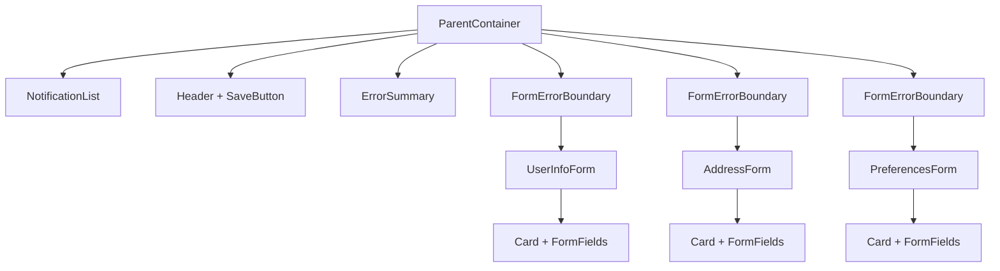
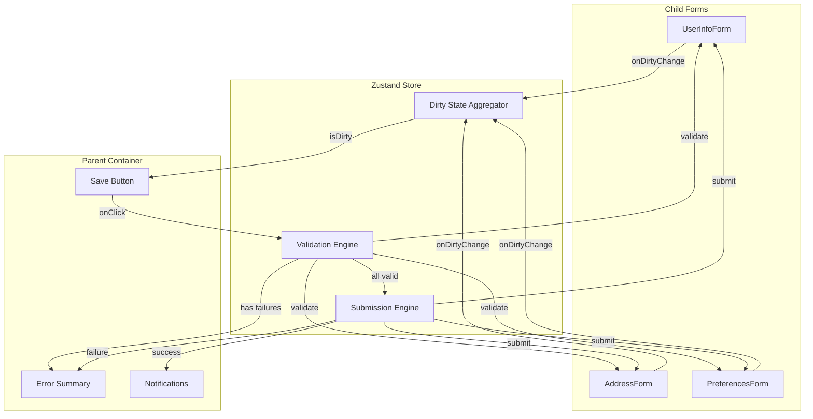
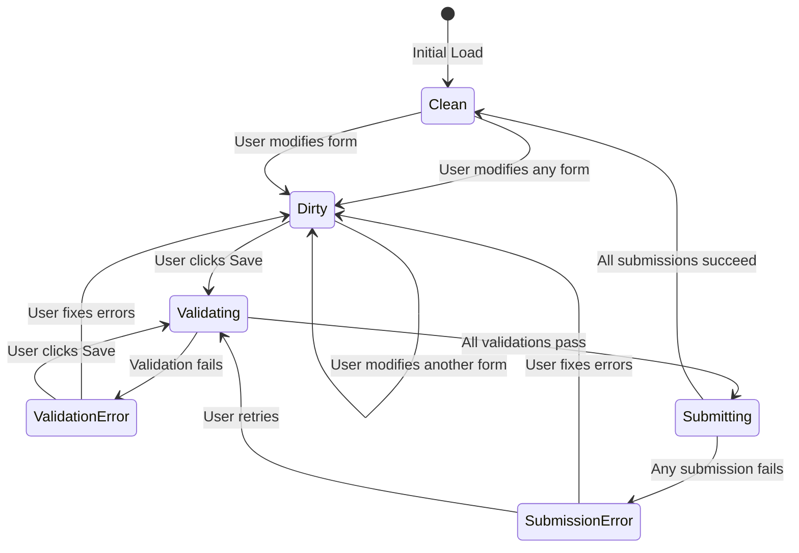
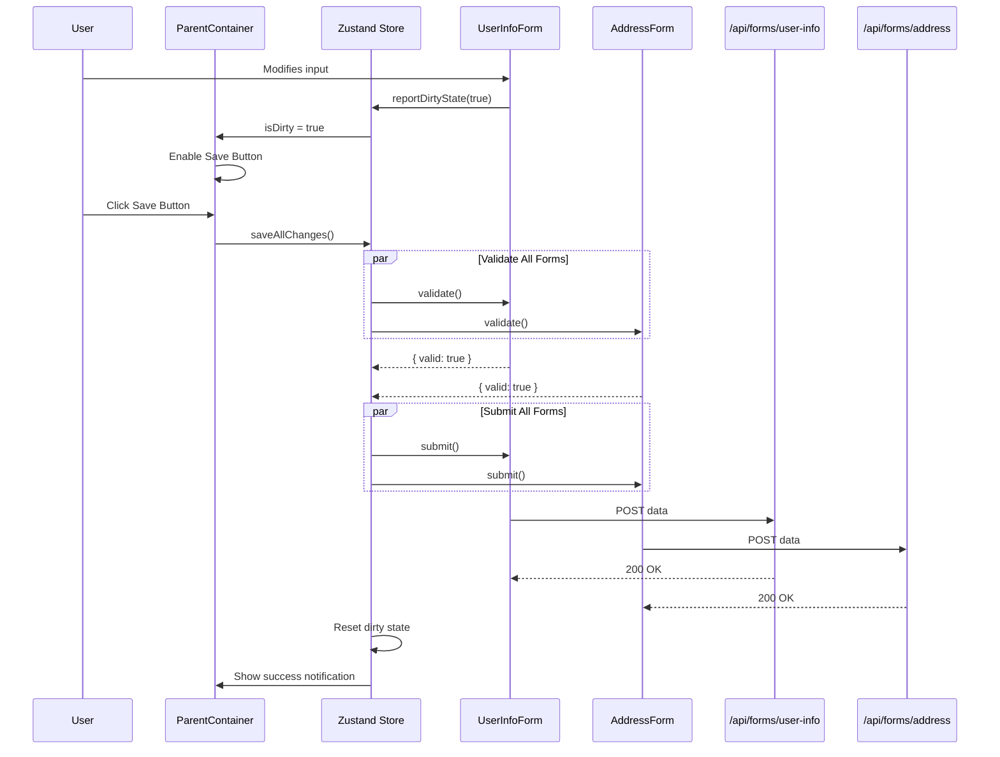

# Multi-Form Save Experiment

A React 19 experiment demonstrating coordinated multi-form validation and submission with a unified save experience.

## Problem Statement

When building complex forms with multiple independent sections, each section may have its own validation rules and API endpoints. Users need a unified save experience that:

- Indicates when any changes have been made (dirty state tracking)
- Validates all sections before submission
- Provides clear feedback on validation failures
- Submits each section to its respective endpoint only when all validations pass

## Architecture Overview

### Component Hierarchy



### Data Flow



### State Management Flow



### Validation and Submission Sequence



## Tech Stack

| Category | Technology |
|----------|------------|
| Framework | React 19 + TypeScript |
| Bundler | Vite (rolldown-vite) |
| Routing | React Router v7 |
| State Management | Zustand |
| Form Handling | React Hook Form |
| Validation | Zod + @hookform/resolvers |
| Styling | Tailwind CSS v4 |
| API Mocking | Mock Service Worker (msw) |
| Unit Testing | Vitest + Testing Library |
| E2E Testing | Cucumber.js + Playwright |

## Key Features

### 1. Dirty State Management
- Each child form tracks its own dirty state via React Hook Form
- Parent container aggregates dirty state from all forms via Zustand store
- Global save button is enabled only when at least one form is dirty
- Forms automatically clean up their dirty state on unmount

### 2. Coordinated Validation
- Validation triggers for all dirty forms when save is clicked
- Forms that are not dirty are skipped during validation
- Validation runs in parallel using `Promise.all` for performance
- React Hook Form's `trigger()` method handles field-level validation

### 3. Conditional Submission
- Submissions only occur after all validations pass
- Each form submits to its own mocked API endpoint
- Submissions run in parallel for performance
- Partial success handling: successful forms are marked clean, failed forms remain dirty

### 4. Error Handling
- Validation errors displayed in both error summary and inline on fields
- Submission errors shown with form identification
- Network errors handled with retry capability
- React Error Boundaries catch unexpected rendering errors

## Project Structure

```
src/
├── components/
│   ├── layout/
│   │   ├── Container.tsx
│   │   └── Card.tsx
│   ├── forms/
│   │   ├── FormField.tsx
│   │   ├── UserInfoForm.tsx
│   │   ├── AddressForm.tsx
│   │   └── PreferencesForm.tsx
│   ├── SaveButton.tsx
│   ├── ErrorSummary.tsx
│   ├── NotificationList.tsx
│   ├── FormErrorBoundary.tsx
│   └── ParentContainer.tsx
├── hooks/
│   ├── useDirtyTracking.ts
│   ├── useFormRegistration.ts
│   ├── useSubmittableForm.ts
│   ├── useGlobalDirtyState.ts
│   └── useErrorHandling.ts
├── stores/
│   ├── formCoordinationStore.ts
│   └── errorStore.ts
├── services/
│   └── formSubmissionService.ts
├── types/
│   ├── form-coordination.ts
│   └── errors.ts
├── utils/
│   ├── validation-schemas.ts
│   └── error-utils.ts
└── mocks/
    ├── handlers.ts
    ├── browser.ts
    └── setup.ts
```

## Getting Started

### Prerequisites

- Node.js v24.x (LTS/Krypton) - see `.nvmrc`
- npm

### Installation

```bash
npm install
```

### Development

```bash
npm run dev
```

### Build

```bash
npm run build
```

### Testing

```bash
# Unit tests
npm test

# Acceptance tests
npm run test:acceptance
```

### Linting & Formatting

```bash
npm run lint
npm run format
```

## Implementation Details

See the `/documentation` directory for detailed implementation plans:

- **FEATURE-001**: Complete feature specification with acceptance criteria
- **IMPL-001**: Dirty State Management implementation
- **IMPL-002**: Validation Flow implementation
- **IMPL-003**: Submission Flow implementation
- **IMPL-004**: Error Handling implementation
- **IMPL-005**: UI Components implementation

## Future Enhancements

- **Unsaved changes warning**: Prompt user before navigating away with dirty forms
- **Auto-save**: Periodic auto-save of dirty forms
- **Optimistic updates**: Show success state immediately, rollback on failure
- **Form-level save**: Allow saving individual forms independently
- **Undo/Redo**: Track form changes for undo capability
