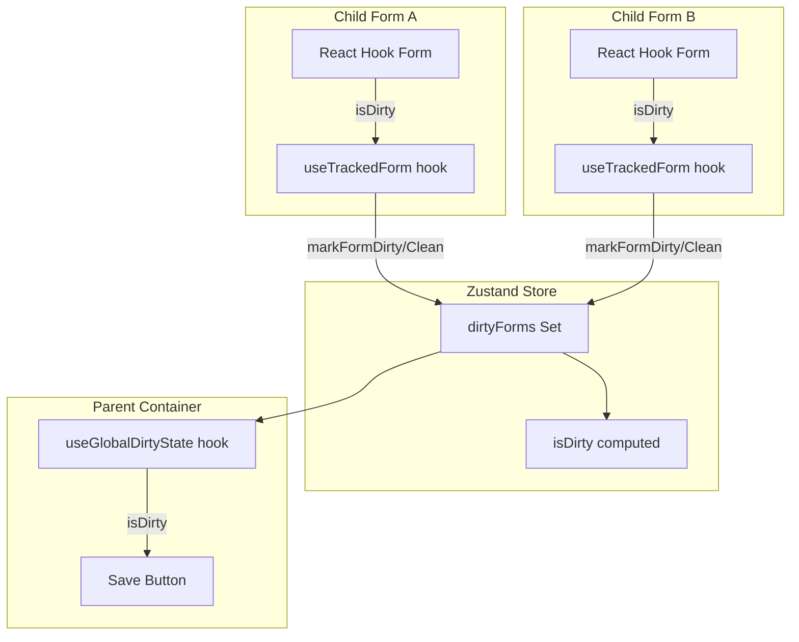

# IMPL-001: Dirty State Management

## Overview

This implementation plan covers the dirty state tracking system that enables the parent container to know when any child
form has unsaved changes. This is the foundation for enabling/disabling the global save button.

## Prerequisites

- React 19 with TypeScript configured
- Zustand installed for state management
- React Hook Form installed for form handling

## Dependencies

- None (this is the foundational implementation)

## Implementation Steps

### Step 1: Define Core Types

Create the type definitions for dirty state management.

**File: `src/types/form-coordination.ts`**

```typescript
/**
 * Represents a unique identifier for each child form
 */
export type FormId = string;

/**
 * Callback type for notifying parent of dirty state changes
 */
export type DirtyChangeCallback = (formId: FormId, isDirty: boolean) => void;

/**
 * Props interface for child forms that participate in dirty tracking
 */
export interface DirtyTrackingProps {
  formId: FormId;
  onDirtyChange: DirtyChangeCallback;
}

/**
 * State shape for the form coordination store
 */
export interface FormCoordinationState {
  dirtyForms: Set<FormId>;
  isDirty: boolean;
  markFormDirty: (formId: FormId) => void;
  markFormClean: (formId: FormId) => void;
  resetAllDirtyState: () => void;
}
```

### Step 2: Create Zustand Store for Dirty State

Create a centralized store to manage dirty state across all forms.

**File: `src/stores/formCoordinationStore.ts`**

```typescript
import { create } from 'zustand';
import type { FormId, FormCoordinationState } from '../types/form-coordination';

export const useFormCoordinationStore = create<FormCoordinationState>((set, get) => ({
  dirtyForms: new Set<FormId>(),

  get isDirty() {
    return get().dirtyForms.size > 0;
  },

  markFormDirty: (formId: FormId) => {
    set((state) => {
      const next = new Set(state.dirtyForms);
      next.add(formId);
      return { dirtyForms: next };
    });
  },

  markFormClean: (formId: FormId) => {
    set((state) => {
      const next = new Set(state.dirtyForms);
      next.delete(formId);
      return { dirtyForms: next };
    });
  },

  resetAllDirtyState: () => {
    set({ dirtyForms: new Set() });
  },
}));
```

### Step 3: Create useDirtyTracking Hook

Create a custom hook that child forms use to report their dirty state.

**File: `src/hooks/useDirtyTracking.ts`**

```typescript
import { useEffect, useCallback } from 'react';
import { useFormCoordinationStore } from '../stores/formCoordinationStore';
import type { FormId } from '../types/form-coordination';

interface UseDirtyTrackingOptions {
  formId: FormId;
}

interface UseDirtyTrackingReturn {
  reportDirtyState: (isDirty: boolean) => void;
}

/**
 * Hook for child forms to report their dirty state to the parent container.
 * Automatically cleans up when the component unmounts.
 */
export function useDirtyTracking({ formId }: UseDirtyTrackingOptions): UseDirtyTrackingReturn {
  const markFormDirty = useFormCoordinationStore((state) => state.markFormDirty);
  const markFormClean = useFormCoordinationStore((state) => state.markFormClean);

  // Cleanup on unmount - mark form as clean
  useEffect(() => {
    return () => {
      markFormClean(formId);
    };
  }, [formId, markFormClean]);

  const reportDirtyState = useCallback(
    (isDirty: boolean) => {
      if (isDirty) {
        markFormDirty(formId);
      } else {
        markFormClean(formId);
      }
    },
    [formId, markFormDirty, markFormClean]
  );

  return { reportDirtyState };
}
```

### Step 4: Integrate with React Hook Form

Create a wrapper hook that combines React Hook Form's dirty state with our tracking system.

**File: `src/hooks/useTrackedForm.ts`**

```typescript
import { useEffect } from 'react';
import { useForm, UseFormProps, UseFormReturn, FieldValues } from 'react-hook-form';
import { useDirtyTracking } from './useDirtyTracking';
import type { FormId } from '../types/form-coordination';

interface UseTrackedFormOptions<T extends FieldValues> extends UseFormProps<T> {
  formId: FormId;
}

/**
 * Wrapper around React Hook Form's useForm that automatically
 * tracks and reports dirty state to the coordination store.
 */
export function useTrackedForm<T extends FieldValues>({
  formId,
  ...formOptions
}: UseTrackedFormOptions<T>): UseFormReturn<T> {
  const form = useForm<T>(formOptions);
  const { reportDirtyState } = useDirtyTracking({ formId });

  const { isDirty } = form.formState;

  useEffect(() => {
    reportDirtyState(isDirty);
  }, [isDirty, reportDirtyState]);

  return form;
}
```

### Step 5: Create useGlobalDirtyState Hook

Create a hook for the parent container to access the aggregated dirty state.

**File: `src/hooks/useGlobalDirtyState.ts`**

```typescript
import { useFormCoordinationStore } from '../stores/formCoordinationStore';

interface UseGlobalDirtyStateReturn {
  isDirty: boolean;
  dirtyFormIds: string[];
  resetAllDirtyState: () => void;
}

/**
 * Hook for the parent container to access the global dirty state.
 */
export function useGlobalDirtyState(): UseGlobalDirtyStateReturn {
  const dirtyForms = useFormCoordinationStore((state) => state.dirtyForms);
  const resetAllDirtyState = useFormCoordinationStore((state) => state.resetAllDirtyState);

  return {
    isDirty: dirtyForms.size > 0,
    dirtyFormIds: Array.from(dirtyForms),
    resetAllDirtyState,
  };
}
```

## Data Flow Diagram



## File Structure

```
src/
├── types/
│   └── form-coordination.ts
├── stores/
│   └── formCoordinationStore.ts
├── hooks/
│   ├── useDirtyTracking.ts
│   ├── useTrackedForm.ts
│   └── useGlobalDirtyState.ts
```

## Usage Example

### Child Form Usage

```tsx
import { useTrackedForm } from '../hooks/useTrackedForm';
import { z } from 'zod';
import { zodResolver } from '@hookform/resolvers/zod';

const schema = z.object({
  name: z.string().min(1, 'Name is required'),
  email: z.string().email('Valid email required'),
});

type FormData = z.infer<typeof schema>;

export function UserInfoForm() {
  const {
    register,
    formState: { errors },
  } = useTrackedForm<FormData>({
    formId: 'userInfo',
    resolver: zodResolver(schema),
    defaultValues: { name: '', email: '' },
  });

  return (
    <form>
      <input {...register('name')} />
      {errors.name && <span>{errors.name.message}</span>}
      <input {...register('email')} />
      {errors.email && <span>{errors.email.message}</span>}
    </form>
  );
}
```

### Parent Container Usage

```tsx
import { useGlobalDirtyState } from '../hooks/useGlobalDirtyState';

export function ParentContainer() {
  const { isDirty, dirtyFormIds } = useGlobalDirtyState();

  return (
    <div>
      <button disabled={!isDirty}>Save All Changes</button>
      {isDirty && <p>Unsaved changes in: {dirtyFormIds.join(', ')}</p>}
    </div>
  );
}
```

## Testing Strategy

### Unit Tests

1. **formCoordinationStore.test.ts**
   - Test `markFormDirty` adds form ID to set
   - Test `markFormClean` removes form ID from set
   - Test `isDirty` returns true when set is non-empty
   - Test `isDirty` returns false when set is empty
   - Test `resetAllDirtyState` clears all form IDs

2. **useDirtyTracking.test.ts**
   - Test `reportDirtyState(true)` calls `markFormDirty`
   - Test `reportDirtyState(false)` calls `markFormClean`
   - Test cleanup on unmount calls `markFormClean`

3. **useTrackedForm.test.ts**
   - Test dirty state is reported when form values change
   - Test clean state is reported when form is reset

### Integration Tests

1. Test multiple forms reporting dirty state simultaneously
2. Test dirty state aggregation in parent container
3. Test save button enable/disable based on dirty state

## Acceptance Criteria

- [ ] **AC1.1**: When a child form input is modified from its initial value, the form is marked as dirty in the global
      store
- [ ] **AC1.2**: When a child form input is reverted to its initial value, the form is removed from the dirty set
- [ ] **AC1.3**: The parent container correctly displays which forms are dirty via `dirtyFormIds`
- [ ] **AC1.4**: The `isDirty` flag is `false` when no forms have unsaved changes
- [ ] **AC1.5**: The `isDirty` flag is `true` when at least one form has unsaved changes
- [ ] **AC1.6**: When a child form component unmounts, it is automatically removed from the dirty set
- [ ] **AC1.7**: The `resetAllDirtyState` function clears all dirty tracking (used after successful save)

## Notes

- The Zustand store provides a centralized source of truth for dirty state
- Using React Hook Form's built-in `isDirty` from `formState` ensures accurate tracking
- The cleanup in `useDirtyTracking` prevents memory leaks when forms unmount
- This implementation supports dynamic addition/removal of child forms
