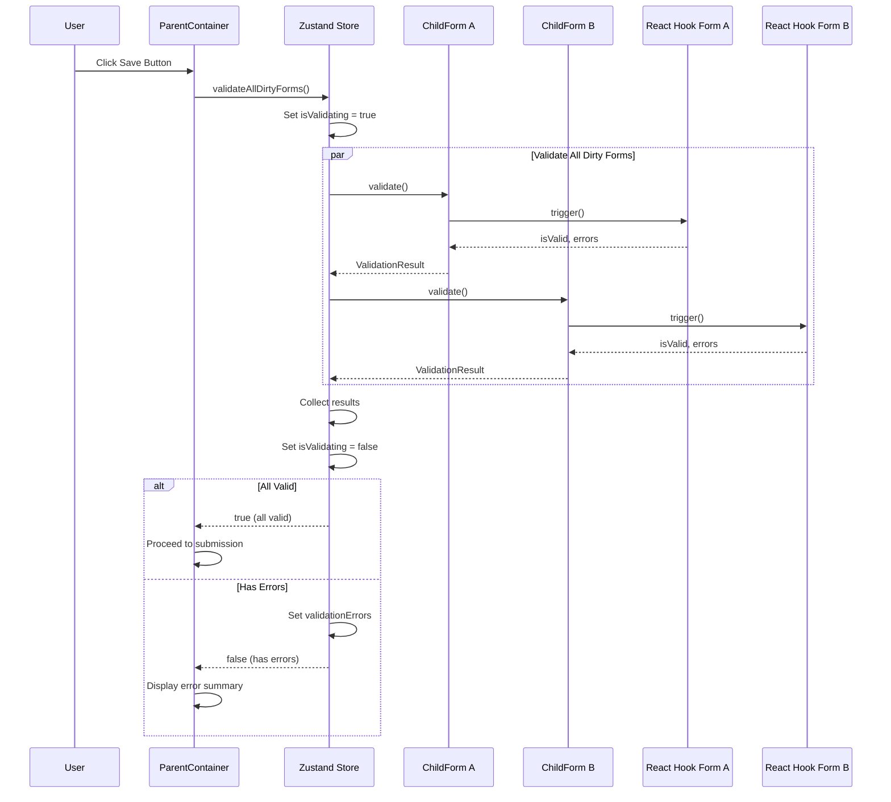

# IMPL-002: Validation Flow

## Overview

This implementation plan covers the coordinated validation system that allows the parent container to trigger validation across all dirty child forms when the global save button is clicked. Validation must pass for all forms before any submissions occur.

## Prerequisites

- IMPL-001 (Dirty State Management) completed
- Zod installed for schema validation
- @hookform/resolvers installed for Zod integration with React Hook Form

## Dependencies

- IMPL-001: Dirty State Management

## Implementation Steps

### Step 1: Define Validation Types

Extend the type definitions to include validation-related types.

**File: `src/types/form-coordination.ts`** (additions)

```typescript
/**
 * Represents a single field-level validation error
 */
export interface ValidationError {
  field: string;
  message: string;
}

/**
 * Result of validating a single form
 */
export interface ValidationResult {
  valid: boolean;
  errors: ValidationError[];
}

/**
 * Summary of validation results for display in error summary
 */
export interface FormValidationSummary {
  formId: FormId;
  formName: string;
  errors: ValidationError[];
}

/**
 * Interface that child forms must implement for validation coordination
 */
export interface ValidatableForm {
  validate: () => Promise<ValidationResult>;
}

/**
 * Registry entry for a validatable form
 */
export interface FormRegistryEntry {
  formId: FormId;
  displayName: string;
  validate: () => Promise<ValidationResult>;
}
```

### Step 2: Extend Zustand Store for Validation Registry

Add form registration capabilities to the coordination store.

**File: `src/stores/formCoordinationStore.ts`** (extend existing)

```typescript
import { create } from 'zustand';
import type {
  FormId,
  FormCoordinationState,
  FormRegistryEntry,
  ValidationResult,
  FormValidationSummary,
} from '../types/form-coordination';

interface ExtendedFormCoordinationState extends FormCoordinationState {
  // Form registry
  formRegistry: Map<FormId, FormRegistryEntry>;
  registerForm: (entry: FormRegistryEntry) => void;
  unregisterForm: (formId: FormId) => void;

  // Validation state
  isValidating: boolean;
  validationErrors: FormValidationSummary[];
  validateAllDirtyForms: () => Promise<boolean>;
  clearValidationErrors: () => void;
}

export const useFormCoordinationStore = create<ExtendedFormCoordinationState>((set, get) => ({
  // Dirty state (from IMPL-001)
  dirtyForms: new Set<FormId>(),

  get isDirty() {
    return get().dirtyForms.size > 0;
  },

  markFormDirty: (formId: FormId) => {
    set((state) => {
      const next = new Set(state.dirtyForms);
      next.add(formId);
      return { dirtyForms: next };
    });
  },

  markFormClean: (formId: FormId) => {
    set((state) => {
      const next = new Set(state.dirtyForms);
      next.delete(formId);
      return { dirtyForms: next };
    });
  },

  resetAllDirtyState: () => {
    set({ dirtyForms: new Set() });
  },

  // Form registry
  formRegistry: new Map<FormId, FormRegistryEntry>(),

  registerForm: (entry: FormRegistryEntry) => {
    set((state) => {
      const next = new Map(state.formRegistry);
      next.set(entry.formId, entry);
      return { formRegistry: next };
    });
  },

  unregisterForm: (formId: FormId) => {
    set((state) => {
      const next = new Map(state.formRegistry);
      next.delete(formId);
      return { formRegistry: next };
    });
  },

  // Validation state
  isValidating: false,
  validationErrors: [],

  validateAllDirtyForms: async () => {
    const { dirtyForms, formRegistry } = get();

    set({ isValidating: true, validationErrors: [] });

    const validationPromises: Promise<FormValidationSummary | null>[] = [];

    for (const formId of dirtyForms) {
      const entry = formRegistry.get(formId);
      if (entry) {
        validationPromises.push(
          entry.validate().then((result) => {
            if (!result.valid) {
              return {
                formId: entry.formId,
                formName: entry.displayName,
                errors: result.errors,
              };
            }
            return null;
          })
        );
      }
    }

    const results = await Promise.all(validationPromises);
    const errors = results.filter((r): r is FormValidationSummary => r !== null);

    set({ isValidating: false, validationErrors: errors });

    return errors.length === 0;
  },

  clearValidationErrors: () => {
    set({ validationErrors: [] });
  },
}));
```

### Step 3: Create useFormRegistration Hook

Create a hook that child forms use to register themselves for validation.

**File: `src/hooks/useFormRegistration.ts`**

```typescript
import { useEffect, useCallback, useRef } from 'react';
import { useFormCoordinationStore } from '../stores/formCoordinationStore';
import type { FormId, ValidationResult } from '../types/form-coordination';

interface UseFormRegistrationOptions {
  formId: FormId;
  displayName: string;
}

interface UseFormRegistrationReturn {
  setValidateFunction: (validateFn: () => Promise<ValidationResult>) => void;
}

/**
 * Hook for child forms to register themselves with the coordination store.
 * This allows the parent to trigger validation on all registered forms.
 */
export function useFormRegistration({
  formId,
  displayName,
}: UseFormRegistrationOptions): UseFormRegistrationReturn {
  const registerForm = useFormCoordinationStore((state) => state.registerForm);
  const unregisterForm = useFormCoordinationStore((state) => state.unregisterForm);

  // Use ref to store the validate function to avoid re-registering on every render
  const validateFnRef = useRef<() => Promise<ValidationResult>>(() =>
    Promise.resolve({ valid: true, errors: [] })
  );

  const setValidateFunction = useCallback((validateFn: () => Promise<ValidationResult>) => {
    validateFnRef.current = validateFn;
  }, []);

  useEffect(() => {
    registerForm({
      formId,
      displayName,
      validate: () => validateFnRef.current(),
    });

    return () => {
      unregisterForm(formId);
    };
  }, [formId, displayName, registerForm, unregisterForm]);

  return { setValidateFunction };
}
```

### Step 4: Create useValidatedForm Hook

Create a comprehensive hook that combines form tracking, registration, and validation.

**File: `src/hooks/useValidatedForm.ts`**

```typescript
import { useEffect, useCallback } from 'react';
import { useForm, UseFormProps, UseFormReturn, FieldValues, FieldErrors } from 'react-hook-form';
import { useDirtyTracking } from './useDirtyTracking';
import { useFormRegistration } from './useFormRegistration';
import type { FormId, ValidationResult, ValidationError } from '../types/form-coordination';

interface UseValidatedFormOptions<T extends FieldValues> extends UseFormProps<T> {
  formId: FormId;
  displayName: string;
}

interface UseValidatedFormReturn<T extends FieldValues> extends UseFormReturn<T> {
  formId: FormId;
}

/**
 * Converts React Hook Form errors to our ValidationError format
 */
function convertErrors<T extends FieldValues>(errors: FieldErrors<T>): ValidationError[] {
  const result: ValidationError[] = [];

  function processErrors(obj: FieldErrors<T>, prefix = '') {
    for (const [key, value] of Object.entries(obj)) {
      const fieldPath = prefix ? `${prefix}.${key}` : key;

      if (value && typeof value === 'object') {
        if ('message' in value && typeof value.message === 'string') {
          result.push({
            field: fieldPath,
            message: value.message,
          });
        } else {
          processErrors(value as FieldErrors<T>, fieldPath);
        }
      }
    }
  }

  processErrors(errors);
  return result;
}

/**
 * Comprehensive hook that combines React Hook Form with dirty tracking
 * and validation registration for coordinated form management.
 */
export function useValidatedForm<T extends FieldValues>({
  formId,
  displayName,
  ...formOptions
}: UseValidatedFormOptions<T>): UseValidatedFormReturn<T> {
  const form = useForm<T>(formOptions);
  const { reportDirtyState } = useDirtyTracking({ formId });
  const { setValidateFunction } = useFormRegistration({ formId, displayName });

  const { isDirty } = form.formState;
  const { trigger, formState } = form;

  // Report dirty state changes
  useEffect(() => {
    reportDirtyState(isDirty);
  }, [isDirty, reportDirtyState]);

  // Create validation function that uses React Hook Form's trigger
  const validateForm = useCallback(async (): Promise<ValidationResult> => {
    const isValid = await trigger();

    if (isValid) {
      return { valid: true, errors: [] };
    }

    // Get current errors after trigger
    const errors = convertErrors(formState.errors);
    return { valid: false, errors };
  }, [trigger, formState.errors]);

  // Register the validation function
  useEffect(() => {
    setValidateFunction(validateForm);
  }, [setValidateFunction, validateForm]);

  return {
    ...form,
    formId,
  };
}
```

### Step 5: Create Zod Schema Helpers

Create utilities for defining form schemas with Zod.

**File: `src/utils/validation-schemas.ts`**

```typescript
import { z } from 'zod';

/**
 * Common validation patterns for reuse across forms
 */
export const commonValidations = {
  requiredString: (fieldName: string) => z.string().min(1, `${fieldName} is required`),

  email: z.string().email('Please enter a valid email address'),

  phone: z.string().regex(/^\+?[1-9]\d{1,14}$/, 'Please enter a valid phone number'),

  url: z.string().url('Please enter a valid URL'),

  positiveNumber: z.number().positive('Must be a positive number'),

  dateInFuture: z.date().refine((date) => date > new Date(), 'Date must be in the future'),
};

/**
 * Example schemas for the three child forms
 */
export const userInfoSchema = z.object({
  name: commonValidations.requiredString('Name'),
  email: commonValidations.email,
});

export const addressSchema = z.object({
  street: commonValidations.requiredString('Street address'),
  city: commonValidations.requiredString('City'),
  state: commonValidations.requiredString('State'),
  zipCode: z.string().regex(/^\d{5}(-\d{4})?$/, 'Please enter a valid ZIP code'),
});

export const preferencesSchema = z.object({
  newsletter: z.boolean(),
  notifications: z.enum(['all', 'important', 'none']),
  theme: z.enum(['light', 'dark', 'system']),
});

export type UserInfoFormData = z.infer<typeof userInfoSchema>;
export type AddressFormData = z.infer<typeof addressSchema>;
export type PreferencesFormData = z.infer<typeof preferencesSchema>;
```

## Validation Sequence Diagram



## File Structure

```
src/
├── types/
│   └── form-coordination.ts      # Extended with validation types
├── stores/
│   └── formCoordinationStore.ts  # Extended with validation methods
├── hooks/
│   ├── useDirtyTracking.ts       # From IMPL-001
│   ├── useFormRegistration.ts    # New: form registration
│   └── useValidatedForm.ts       # New: comprehensive form hook
└── utils/
    └── validation-schemas.ts     # Zod schemas and helpers
```

## Usage Example

### Child Form with Validation

```tsx
import { useValidatedForm } from '../hooks/useValidatedForm';
import { zodResolver } from '@hookform/resolvers/zod';
import { userInfoSchema, UserInfoFormData } from '../utils/validation-schemas';

export function UserInfoForm() {
  const {
    register,
    formState: { errors },
  } = useValidatedForm<UserInfoFormData>({
    formId: 'userInfo',
    displayName: 'User Information',
    resolver: zodResolver(userInfoSchema),
    defaultValues: { name: '', email: '' },
  });

  return (
    <div className="form-section">
      <h2>User Information</h2>

      <div className="form-field">
        <label htmlFor="name">Name</label>
        <input id="name" {...register('name')} />
        {errors.name && <span className="error">{errors.name.message}</span>}
      </div>

      <div className="form-field">
        <label htmlFor="email">Email</label>
        <input id="email" type="email" {...register('email')} />
        {errors.email && <span className="error">{errors.email.message}</span>}
      </div>
    </div>
  );
}
```

### Parent Container Triggering Validation

```tsx
import { useFormCoordinationStore } from '../stores/formCoordinationStore';

export function ParentContainer() {
  const isDirty = useFormCoordinationStore((state) => state.dirtyForms.size > 0);
  const isValidating = useFormCoordinationStore((state) => state.isValidating);
  const validationErrors = useFormCoordinationStore((state) => state.validationErrors);
  const validateAllDirtyForms = useFormCoordinationStore((state) => state.validateAllDirtyForms);

  const handleSave = async () => {
    const allValid = await validateAllDirtyForms();

    if (allValid) {
      // Proceed to submission (IMPL-003)
      console.log('All forms valid, proceeding to submit...');
    }
    // Errors are automatically stored and displayed
  };

  return (
    <div className="parent-container">
      <button onClick={handleSave} disabled={!isDirty || isValidating}>
        {isValidating ? 'Validating...' : 'Save All Changes'}
      </button>

      {validationErrors.length > 0 && <ErrorSummary errors={validationErrors} />}

      {/* Child forms */}
    </div>
  );
}
```

## Testing Strategy

### Unit Tests

1. **formCoordinationStore.test.ts** (validation extensions)
   - Test `registerForm` adds entry to registry
   - Test `unregisterForm` removes entry from registry
   - Test `validateAllDirtyForms` only validates dirty forms
   - Test `validateAllDirtyForms` collects all errors
   - Test `validateAllDirtyForms` returns true when all valid
   - Test `validateAllDirtyForms` returns false when any invalid
   - Test `clearValidationErrors` resets error state

2. **useFormRegistration.test.ts**
   - Test form is registered on mount
   - Test form is unregistered on unmount
   - Test validate function is called correctly

3. **useValidatedForm.test.ts**
   - Test validation function triggers React Hook Form validation
   - Test errors are converted to ValidationError format
   - Test dirty state is tracked correctly

### Integration Tests

1. Test complete validation flow with multiple forms
2. Test partial validation (only dirty forms validated)
3. Test error collection from multiple failed forms
4. Test validation state transitions (idle -> validating -> complete)

## Acceptance Criteria

- [ ] **AC2.1**: Clicking the save button triggers validation on all dirty forms via `validateAllDirtyForms()`
- [ ] **AC2.2**: Forms that are not dirty are skipped during validation
- [ ] **AC2.3**: Validation errors from React Hook Form are displayed within each child form
- [ ] **AC2.4**: The `validationErrors` state contains a summary of all form validation failures
- [ ] **AC2.5**: Each entry in `validationErrors` identifies which form failed by `formId` and `displayName`
- [ ] **AC2.6**: Each validation error entry includes specific field-level error messages
- [ ] **AC2.7**: The `isValidating` flag is `true` while validation is in progress
- [ ] **AC2.8**: Validation runs in parallel for all dirty forms for performance
- [ ] **AC2.9**: `validateAllDirtyForms()` returns `true` only when all forms pass validation

## Notes

- Validation runs in parallel using `Promise.all` for performance
- React Hook Form's `trigger()` method is used to programmatically validate forms
- The error conversion handles nested field errors (e.g., `address.city`)
- Forms must be registered before they can be validated
- Registration cleanup on unmount prevents stale references
