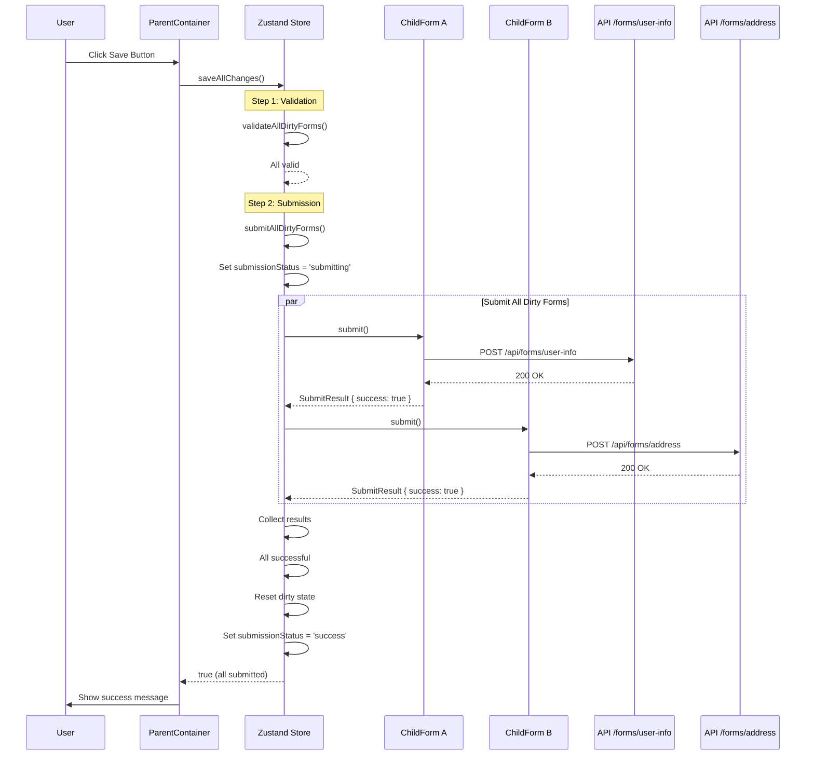
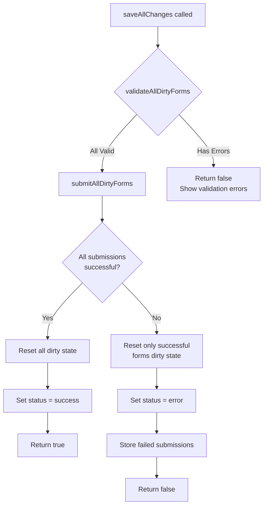

# IMPL-003: Submission Flow

## Overview

This implementation plan covers the coordinated submission system that triggers API calls for all dirty forms after validation passes. Each form submits to its own endpoint, submissions run in parallel, and the system handles both success and failure scenarios.

## Prerequisites

- IMPL-001 (Dirty State Management) completed
- IMPL-002 (Validation Flow) completed
- Mock Service Worker (msw) installed for API mocking

## Dependencies

- IMPL-001: Dirty State Management
- IMPL-002: Validation Flow

## Implementation Steps

### Step 1: Define Submission Types

Extend the type definitions to include submission-related types.

**File: `src/types/form-coordination.ts`** (additions)

```typescript
/**
 * Result of submitting a single form
 */
export interface SubmitResult {
  success: boolean;
  formId: FormId;
  error?: string;
  data?: unknown;
}

/**
 * Interface that child forms must implement for submission coordination
 */
export interface SubmittableForm {
  submit: () => Promise<SubmitResult>;
  getFormData: () => unknown;
}

/**
 * Extended registry entry with submission capability
 */
export interface FormRegistryEntry {
  formId: FormId;
  displayName: string;
  validate: () => Promise<ValidationResult>;
  submit: () => Promise<SubmitResult>;
}

/**
 * Overall submission status
 */
export type SubmissionStatus = 'idle' | 'submitting' | 'success' | 'error';

/**
 * Summary of submission results
 */
export interface SubmissionSummary {
  status: SubmissionStatus;
  successfulForms: FormId[];
  failedForms: SubmitResult[];
}
```

### Step 2: Extend Zustand Store for Submission

Add submission capabilities to the coordination store.

**File: `src/stores/formCoordinationStore.ts`** (extend existing)

```typescript
import { create } from 'zustand';
import type {
  FormId,
  FormRegistryEntry,
  ValidationResult,
  FormValidationSummary,
  SubmitResult,
  SubmissionStatus,
  SubmissionSummary,
} from '../types/form-coordination';

interface FormCoordinationState {
  // Dirty state (from IMPL-001)
  dirtyForms: Set<FormId>;
  markFormDirty: (formId: FormId) => void;
  markFormClean: (formId: FormId) => void;
  resetAllDirtyState: () => void;

  // Form registry (from IMPL-002)
  formRegistry: Map<FormId, FormRegistryEntry>;
  registerForm: (entry: FormRegistryEntry) => void;
  unregisterForm: (formId: FormId) => void;

  // Validation state (from IMPL-002)
  isValidating: boolean;
  validationErrors: FormValidationSummary[];
  validateAllDirtyForms: () => Promise<boolean>;
  clearValidationErrors: () => void;

  // Submission state (new)
  submissionStatus: SubmissionStatus;
  submissionSummary: SubmissionSummary | null;
  submitAllDirtyForms: () => Promise<boolean>;
  resetSubmissionState: () => void;

  // Combined save operation
  saveAllChanges: () => Promise<boolean>;
}

export const useFormCoordinationStore = create<FormCoordinationState>((set, get) => ({
  // ... existing dirty state and validation code ...

  // Submission state
  submissionStatus: 'idle',
  submissionSummary: null,

  submitAllDirtyForms: async () => {
    const { dirtyForms, formRegistry } = get();

    set({ submissionStatus: 'submitting' });

    const submissionPromises: Promise<SubmitResult>[] = [];

    for (const formId of dirtyForms) {
      const entry = formRegistry.get(formId);
      if (entry) {
        submissionPromises.push(
          entry.submit().catch((error) => ({
            success: false,
            formId,
            error: error instanceof Error ? error.message : 'Unknown error',
          }))
        );
      }
    }

    const results = await Promise.all(submissionPromises);

    const successfulForms = results.filter((r) => r.success).map((r) => r.formId);

    const failedForms = results.filter((r) => !r.success);

    const allSuccessful = failedForms.length === 0;

    const summary: SubmissionSummary = {
      status: allSuccessful ? 'success' : 'error',
      successfulForms,
      failedForms,
    };

    set({
      submissionStatus: allSuccessful ? 'success' : 'error',
      submissionSummary: summary,
    });

    // Reset dirty state only for successful submissions
    if (allSuccessful) {
      set({ dirtyForms: new Set() });
    } else {
      // Remove only successful forms from dirty set
      set((state) => {
        const next = new Set(state.dirtyForms);
        successfulForms.forEach((id) => next.delete(id));
        return { dirtyForms: next };
      });
    }

    return allSuccessful;
  },

  resetSubmissionState: () => {
    set({
      submissionStatus: 'idle',
      submissionSummary: null,
    });
  },

  // Combined save operation
  saveAllChanges: async () => {
    const { validateAllDirtyForms, submitAllDirtyForms, clearValidationErrors } = get();

    clearValidationErrors();

    // Step 1: Validate all dirty forms
    const allValid = await validateAllDirtyForms();

    if (!allValid) {
      return false;
    }

    // Step 2: Submit all dirty forms
    const allSubmitted = await submitAllDirtyForms();

    return allSubmitted;
  },
}));
```

### Step 3: Create MSW Handlers for Mock API

Set up Mock Service Worker handlers for the form endpoints.

**File: `src/mocks/handlers.ts`**

```typescript
import { http, HttpResponse, delay } from 'msw';

interface FormSubmission {
  formId: string;
  data: unknown;
}

// Simulated database
const submissions: Map<string, FormSubmission[]> = new Map();

export const handlers = [
  // User Info Form endpoint
  http.post('/api/forms/user-info', async ({ request }) => {
    await delay(500); // Simulate network latency

    const data = await request.json();

    const existing = submissions.get('user-info') ?? [];
    submissions.set('user-info', [...existing, { formId: 'userInfo', data }]);

    return HttpResponse.json({
      success: true,
      id: crypto.randomUUID(),
      message: 'User info saved successfully',
    });
  }),

  // Address Form endpoint
  http.post('/api/forms/address', async ({ request }) => {
    await delay(600);

    const data = await request.json();

    const existing = submissions.get('address') ?? [];
    submissions.set('address', [...existing, { formId: 'address', data }]);

    return HttpResponse.json({
      success: true,
      id: crypto.randomUUID(),
      message: 'Address saved successfully',
    });
  }),

  // Preferences Form endpoint
  http.post('/api/forms/preferences', async ({ request }) => {
    await delay(400);

    const data = await request.json();

    const existing = submissions.get('preferences') ?? [];
    submissions.set('preferences', [...existing, { formId: 'preferences', data }]);

    return HttpResponse.json({
      success: true,
      id: crypto.randomUUID(),
      message: 'Preferences saved successfully',
    });
  }),

  // Endpoint that simulates failure (for testing)
  http.post('/api/forms/failing', async () => {
    await delay(300);

    return HttpResponse.json({ success: false, error: 'Simulated server error' }, { status: 500 });
  }),
];
```

### Step 4: Set Up MSW Browser Integration

Configure MSW for browser environment.

**File: `src/mocks/browser.ts`**

```typescript
import { setupWorker } from 'msw/browser';
import { handlers } from './handlers';

export const worker = setupWorker(...handlers);
```

**File: `src/mocks/setup.ts`**

```typescript
export async function setupMocks() {
  if (import.meta.env.DEV) {
    const { worker } = await import('./browser');
    await worker.start({
      onUnhandledRequest: 'bypass',
    });
    console.log('[MSW] Mock Service Worker started');
  }
}
```

**Update: `src/main.tsx`**

```tsx
import React from 'react';
import ReactDOM from 'react-dom/client';
import App from './App';
import { setupMocks } from './mocks/setup';

async function bootstrap() {
  await setupMocks();

  ReactDOM.createRoot(document.getElementById('root')!).render(
    <React.StrictMode>
      <App />
    </React.StrictMode>
  );
}

bootstrap();
```

### Step 5: Create Form Submission Service

Create a typed API service for form submissions.

**File: `src/services/formSubmissionService.ts`**

```typescript
import type { SubmitResult, FormId } from '../types/form-coordination';

interface ApiResponse {
  success: boolean;
  id?: string;
  message?: string;
  error?: string;
}

const FORM_ENDPOINTS: Record<FormId, string> = {
  userInfo: '/api/forms/user-info',
  address: '/api/forms/address',
  preferences: '/api/forms/preferences',
};

/**
 * Submits form data to the appropriate API endpoint
 */
export async function submitForm<T>(formId: FormId, data: T): Promise<SubmitResult> {
  const endpoint = FORM_ENDPOINTS[formId];

  if (!endpoint) {
    return {
      success: false,
      formId,
      error: `Unknown form ID: ${formId}`,
    };
  }

  try {
    const response = await fetch(endpoint, {
      method: 'POST',
      headers: {
        'Content-Type': 'application/json',
      },
      body: JSON.stringify(data),
    });

    const result: ApiResponse = await response.json();

    if (!response.ok || !result.success) {
      return {
        success: false,
        formId,
        error: result.error ?? `Server returned ${response.status}`,
      };
    }

    return {
      success: true,
      formId,
      data: result,
    };
  } catch (error) {
    return {
      success: false,
      formId,
      error: error instanceof Error ? error.message : 'Network error',
    };
  }
}
```

### Step 6: Extend useValidatedForm with Submission

Update the form hook to include submission capability.

**File: `src/hooks/useSubmittableForm.ts`**

```typescript
import { useEffect, useCallback, useRef } from 'react';
import { useForm, UseFormProps, UseFormReturn, FieldValues } from 'react-hook-form';
import { useDirtyTracking } from './useDirtyTracking';
import { useFormCoordinationStore } from '../stores/formCoordinationStore';
import { submitForm } from '../services/formSubmissionService';
import type {
  FormId,
  ValidationResult,
  SubmitResult,
  ValidationError,
} from '../types/form-coordination';

interface UseSubmittableFormOptions<T extends FieldValues> extends UseFormProps<T> {
  formId: FormId;
  displayName: string;
}

interface UseSubmittableFormReturn<T extends FieldValues> extends UseFormReturn<T> {
  formId: FormId;
}

function convertErrors<T extends FieldValues>(errors: Record<string, unknown>): ValidationError[] {
  const result: ValidationError[] = [];

  function processErrors(obj: Record<string, unknown>, prefix = '') {
    for (const [key, value] of Object.entries(obj)) {
      const fieldPath = prefix ? `${prefix}.${key}` : key;

      if (value && typeof value === 'object') {
        if ('message' in value && typeof value.message === 'string') {
          result.push({ field: fieldPath, message: value.message });
        } else {
          processErrors(value as Record<string, unknown>, fieldPath);
        }
      }
    }
  }

  processErrors(errors);
  return result;
}

/**
 * Comprehensive hook that combines form tracking, validation, and submission.
 */
export function useSubmittableForm<T extends FieldValues>({
  formId,
  displayName,
  ...formOptions
}: UseSubmittableFormOptions<T>): UseSubmittableFormReturn<T> {
  const form = useForm<T>(formOptions);
  const { reportDirtyState } = useDirtyTracking({ formId });

  const registerForm = useFormCoordinationStore((state) => state.registerForm);
  const unregisterForm = useFormCoordinationStore((state) => state.unregisterForm);

  const { isDirty } = form.formState;
  const { trigger, getValues, reset, formState } = form;

  // Store refs to avoid stale closures
  const formRef = useRef(form);
  formRef.current = form;

  // Report dirty state changes
  useEffect(() => {
    reportDirtyState(isDirty);
  }, [isDirty, reportDirtyState]);

  // Validation function
  const validateForm = useCallback(async (): Promise<ValidationResult> => {
    const isValid = await trigger();

    if (isValid) {
      return { valid: true, errors: [] };
    }

    const errors = convertErrors(formRef.current.formState.errors);
    return { valid: false, errors };
  }, [trigger]);

  // Submission function
  const submitFormData = useCallback(async (): Promise<SubmitResult> => {
    const data = getValues();
    const result = await submitForm(formId, data);

    if (result.success) {
      // Reset form to current values as new defaults
      reset(data, { keepValues: true, keepDirty: false });
    }

    return result;
  }, [formId, getValues, reset]);

  // Register form with coordination store
  useEffect(() => {
    registerForm({
      formId,
      displayName,
      validate: validateForm,
      submit: submitFormData,
    });

    return () => {
      unregisterForm(formId);
    };
  }, [formId, displayName, validateForm, submitFormData, registerForm, unregisterForm]);

  return {
    ...form,
    formId,
  };
}
```

## Submission Flow Diagram



## Error Handling Flow



## File Structure

```
src/
├── types/
│   └── form-coordination.ts       # Extended with submission types
├── stores/
│   └── formCoordinationStore.ts   # Extended with submission methods
├── hooks/
│   ├── useDirtyTracking.ts        # From IMPL-001
│   ├── useFormRegistration.ts     # From IMPL-002
│   └── useSubmittableForm.ts      # New: complete form hook
├── services/
│   └── formSubmissionService.ts   # API submission service
└── mocks/
    ├── handlers.ts                # MSW request handlers
    ├── browser.ts                 # MSW browser setup
    └── setup.ts                   # MSW initialization
```

## Usage Example

### Child Form with Submission

```tsx
import { useSubmittableForm } from '../hooks/useSubmittableForm';
import { zodResolver } from '@hookform/resolvers/zod';
import { userInfoSchema, UserInfoFormData } from '../utils/validation-schemas';

export function UserInfoForm() {
  const {
    register,
    formState: { errors, isSubmitting },
  } = useSubmittableForm<UserInfoFormData>({
    formId: 'userInfo',
    displayName: 'User Information',
    resolver: zodResolver(userInfoSchema),
    defaultValues: { name: '', email: '' },
  });

  return (
    <fieldset disabled={isSubmitting}>
      <h2>User Information</h2>

      <div className="form-field">
        <label htmlFor="name">Name</label>
        <input id="name" {...register('name')} />
        {errors.name && <span className="error">{errors.name.message}</span>}
      </div>

      <div className="form-field">
        <label htmlFor="email">Email</label>
        <input id="email" type="email" {...register('email')} />
        {errors.email && <span className="error">{errors.email.message}</span>}
      </div>
    </fieldset>
  );
}
```

### Parent Container with Save

```tsx
import { useFormCoordinationStore } from '../stores/formCoordinationStore';

export function ParentContainer() {
  const isDirty = useFormCoordinationStore((state) => state.dirtyForms.size > 0);
  const isValidating = useFormCoordinationStore((state) => state.isValidating);
  const submissionStatus = useFormCoordinationStore((state) => state.submissionStatus);
  const submissionSummary = useFormCoordinationStore((state) => state.submissionSummary);
  const saveAllChanges = useFormCoordinationStore((state) => state.saveAllChanges);

  const isProcessing = isValidating || submissionStatus === 'submitting';

  const handleSave = async () => {
    const success = await saveAllChanges();

    if (success) {
      console.log('All forms saved successfully!');
    }
  };

  return (
    <div className="parent-container">
      <button onClick={handleSave} disabled={!isDirty || isProcessing}>
        {isValidating && 'Validating...'}
        {submissionStatus === 'submitting' && 'Saving...'}
        {!isProcessing && 'Save All Changes'}
      </button>

      {submissionStatus === 'success' && (
        <div className="success-message">All changes saved successfully!</div>
      )}

      {submissionStatus === 'error' && submissionSummary && (
        <div className="error-message">
          <p>Some forms failed to save:</p>
          <ul>
            {submissionSummary.failedForms.map((f) => (
              <li key={f.formId}>{f.error}</li>
            ))}
          </ul>
        </div>
      )}

      {/* Child forms */}
    </div>
  );
}
```

## Testing Strategy

### Unit Tests

1. **formCoordinationStore.test.ts** (submission extensions)
   - Test `submitAllDirtyForms` submits only dirty forms
   - Test `submitAllDirtyForms` runs submissions in parallel
   - Test successful submissions reset dirty state
   - Test partial failure keeps failed forms dirty
   - Test `submissionStatus` transitions correctly
   - Test `submissionSummary` contains correct data

2. **formSubmissionService.test.ts**
   - Test successful submission returns success result
   - Test failed submission returns error result
   - Test network error is handled gracefully
   - Test unknown form ID returns error

3. **useSubmittableForm.test.ts**
   - Test form is registered with submit function
   - Test submit function calls API with form data
   - Test successful submit resets form dirty state

### Integration Tests (with MSW)

1. Test complete save flow from button click to success
2. Test validation failure prevents submission
3. Test partial submission failure
4. Test concurrent submissions complete correctly
5. Test retry after failure

### MSW Test Setup

**File: `src/mocks/server.ts`** (for Vitest)

```typescript
import { setupServer } from 'msw/node';
import { handlers } from './handlers';

export const server = setupServer(...handlers);
```

**File: `src/setupTests.ts`**

```typescript
import { beforeAll, afterEach, afterAll } from 'vitest';
import { server } from './mocks/server';

beforeAll(() => server.listen({ onUnhandledRequest: 'error' }));
afterEach(() => server.resetHandlers());
afterAll(() => server.close());
```

## Acceptance Criteria

- [ ] **AC3.1**: If any validation fails, no API calls are made
- [ ] **AC3.2**: Only when all validations pass do submissions occur (verified via `saveAllChanges`)
- [ ] **AC3.3**: Each dirty form submits to its respective mock endpoint via MSW
- [ ] **AC3.4**: Forms that are not dirty are not submitted
- [ ] **AC3.5**: Submissions occur in parallel using `Promise.all` for performance
- [ ] **AC3.6**: The `submissionStatus` is 'submitting' during API calls
- [ ] **AC3.7**: The `submissionStatus` is 'success' when all submissions complete successfully
- [ ] **AC3.8**: The `submissionStatus` is 'error' when any submission fails
- [ ] **AC3.9**: Successfully submitted forms are removed from the dirty set
- [ ] **AC3.10**: Failed forms remain in the dirty set for retry

## Notes

- MSW provides consistent mock responses during development and testing
- Submissions run in parallel for performance but results are collected together
- Partial success is handled by only resetting dirty state for successful forms
- The `saveAllChanges` method orchestrates the full validation-then-submit flow
- Form data is reset to current values after successful submission to clear dirty state
