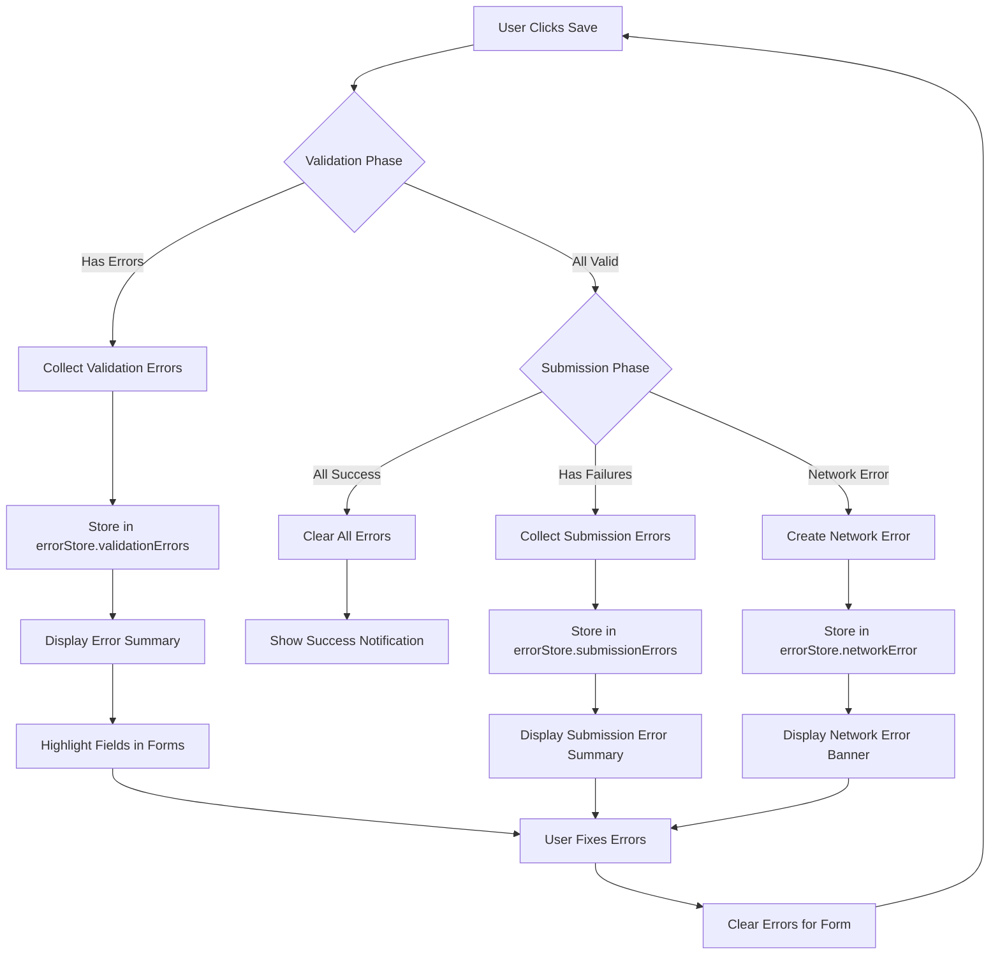
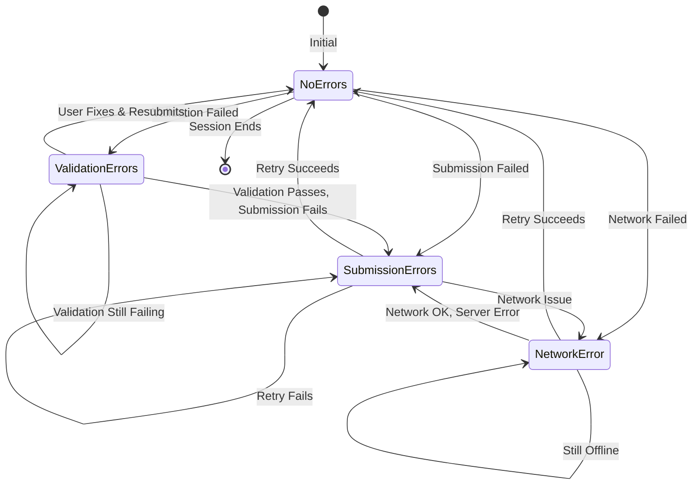

# IMPL-004: Error Handling

## Overview

This implementation plan covers the comprehensive error handling strategy for the multi-form save feature. It includes validation error display, submission error handling, error summary components, and recovery mechanisms.

## Prerequisites

- IMPL-001 (Dirty State Management) completed
- IMPL-002 (Validation Flow) completed
- IMPL-003 (Submission Flow) completed

## Dependencies

- IMPL-001: Dirty State Management
- IMPL-002: Validation Flow
- IMPL-003: Submission Flow

## Implementation Steps

### Step 1: Define Error Types

Create comprehensive error type definitions.

**File: `src/types/errors.ts`**

```typescript
import type { FormId } from './form-coordination';

/**
 * Base error interface for all form-related errors
 */
export interface FormError {
  type: 'validation' | 'submission' | 'network' | 'unknown';
  message: string;
  timestamp: Date;
}

/**
 * Field-level validation error
 */
export interface FieldValidationError {
  field: string;
  message: string;
  code?: string;
}

/**
 * Form-level validation error summary
 */
export interface FormValidationError extends FormError {
  type: 'validation';
  formId: FormId;
  formName: string;
  fieldErrors: FieldValidationError[];
}

/**
 * Submission error for a single form
 */
export interface FormSubmissionError extends FormError {
  type: 'submission';
  formId: FormId;
  formName: string;
  statusCode?: number;
  retryable: boolean;
}

/**
 * Network-level error
 */
export interface NetworkError extends FormError {
  type: 'network';
  originalError?: Error;
  retryable: boolean;
}

/**
 * Aggregated error state for the entire form system
 */
export interface ErrorState {
  hasErrors: boolean;
  validationErrors: FormValidationError[];
  submissionErrors: FormSubmissionError[];
  networkError: NetworkError | null;
  lastErrorTimestamp: Date | null;
}

/**
 * Error severity levels for UI display
 */
export type ErrorSeverity = 'error' | 'warning' | 'info';

/**
 * Dismissible error notification
 */
export interface ErrorNotification {
  id: string;
  severity: ErrorSeverity;
  title: string;
  message: string;
  formId?: FormId;
  dismissible: boolean;
  autoDismiss?: number; // milliseconds
}
```

### Step 2: Create Error State Store

Create a dedicated store for managing error state.

**File: `src/stores/errorStore.ts`**

```typescript
import { create } from 'zustand';
import type {
  ErrorState,
  FormValidationError,
  FormSubmissionError,
  NetworkError,
  ErrorNotification,
} from '../types/errors';
import type { FormId } from '../types/form-coordination';

interface ErrorStoreState extends ErrorState {
  // Notifications
  notifications: ErrorNotification[];

  // Actions for validation errors
  setValidationErrors: (errors: FormValidationError[]) => void;
  clearValidationErrors: () => void;
  clearValidationErrorsForForm: (formId: FormId) => void;

  // Actions for submission errors
  setSubmissionErrors: (errors: FormSubmissionError[]) => void;
  addSubmissionError: (error: FormSubmissionError) => void;
  clearSubmissionErrors: () => void;
  clearSubmissionErrorForForm: (formId: FormId) => void;

  // Actions for network errors
  setNetworkError: (error: NetworkError | null) => void;
  clearNetworkError: () => void;

  // Notification actions
  addNotification: (notification: Omit<ErrorNotification, 'id'>) => string;
  dismissNotification: (id: string) => void;
  clearAllNotifications: () => void;

  // Global actions
  clearAllErrors: () => void;
}

function generateId(): string {
  return `${Date.now()}-${Math.random().toString(36).substr(2, 9)}`;
}

export const useErrorStore = create<ErrorStoreState>((set, get) => ({
  // Initial state
  hasErrors: false,
  validationErrors: [],
  submissionErrors: [],
  networkError: null,
  lastErrorTimestamp: null,
  notifications: [],

  // Validation error actions
  setValidationErrors: (errors) => {
    set({
      validationErrors: errors,
      hasErrors: errors.length > 0 || get().submissionErrors.length > 0,
      lastErrorTimestamp: errors.length > 0 ? new Date() : get().lastErrorTimestamp,
    });
  },

  clearValidationErrors: () => {
    set((state) => ({
      validationErrors: [],
      hasErrors: state.submissionErrors.length > 0,
    }));
  },

  clearValidationErrorsForForm: (formId) => {
    set((state) => {
      const filtered = state.validationErrors.filter((e) => e.formId !== formId);
      return {
        validationErrors: filtered,
        hasErrors: filtered.length > 0 || state.submissionErrors.length > 0,
      };
    });
  },

  // Submission error actions
  setSubmissionErrors: (errors) => {
    set({
      submissionErrors: errors,
      hasErrors: errors.length > 0 || get().validationErrors.length > 0,
      lastErrorTimestamp: errors.length > 0 ? new Date() : get().lastErrorTimestamp,
    });
  },

  addSubmissionError: (error) => {
    set((state) => ({
      submissionErrors: [...state.submissionErrors, error],
      hasErrors: true,
      lastErrorTimestamp: new Date(),
    }));
  },

  clearSubmissionErrors: () => {
    set((state) => ({
      submissionErrors: [],
      hasErrors: state.validationErrors.length > 0,
    }));
  },

  clearSubmissionErrorForForm: (formId) => {
    set((state) => {
      const filtered = state.submissionErrors.filter((e) => e.formId !== formId);
      return {
        submissionErrors: filtered,
        hasErrors: filtered.length > 0 || state.validationErrors.length > 0,
      };
    });
  },

  // Network error actions
  setNetworkError: (error) => {
    set({
      networkError: error,
      hasErrors:
        error !== null || get().validationErrors.length > 0 || get().submissionErrors.length > 0,
      lastErrorTimestamp: error ? new Date() : get().lastErrorTimestamp,
    });
  },

  clearNetworkError: () => {
    set((state) => ({
      networkError: null,
      hasErrors: state.validationErrors.length > 0 || state.submissionErrors.length > 0,
    }));
  },

  // Notification actions
  addNotification: (notification) => {
    const id = generateId();
    const fullNotification: ErrorNotification = { ...notification, id };

    set((state) => ({
      notifications: [...state.notifications, fullNotification],
    }));

    // Auto-dismiss if configured
    if (notification.autoDismiss) {
      setTimeout(() => {
        get().dismissNotification(id);
      }, notification.autoDismiss);
    }

    return id;
  },

  dismissNotification: (id) => {
    set((state) => ({
      notifications: state.notifications.filter((n) => n.id !== id),
    }));
  },

  clearAllNotifications: () => {
    set({ notifications: [] });
  },

  // Global clear
  clearAllErrors: () => {
    set({
      hasErrors: false,
      validationErrors: [],
      submissionErrors: [],
      networkError: null,
      notifications: [],
    });
  },
}));
```

### Step 3: Create Error Handling Utilities

Create utility functions for error processing and formatting.

**File: `src/utils/error-utils.ts`**

```typescript
import type {
  FormValidationError,
  FormSubmissionError,
  NetworkError,
  FieldValidationError,
} from '../types/errors';
import type { FormId, FormValidationSummary, SubmitResult } from '../types/form-coordination';

/**
 * Converts validation summary to FormValidationError
 */
export function toValidationError(summary: FormValidationSummary): FormValidationError {
  return {
    type: 'validation',
    formId: summary.formId,
    formName: summary.formName,
    message: `${summary.formName} has validation errors`,
    fieldErrors: summary.errors.map((e) => ({
      field: e.field,
      message: e.message,
    })),
    timestamp: new Date(),
  };
}

/**
 * Converts failed submit result to FormSubmissionError
 */
export function toSubmissionError(result: SubmitResult, formName: string): FormSubmissionError {
  return {
    type: 'submission',
    formId: result.formId,
    formName,
    message: result.error ?? 'Submission failed',
    retryable: true,
    timestamp: new Date(),
  };
}

/**
 * Creates a network error from a caught exception
 */
export function createNetworkError(error: unknown): NetworkError {
  const originalError = error instanceof Error ? error : new Error(String(error));

  return {
    type: 'network',
    message: 'Network error occurred. Please check your connection.',
    originalError,
    retryable: true,
    timestamp: new Date(),
  };
}

/**
 * Formats field errors for display
 */
export function formatFieldErrors(errors: FieldValidationError[]): string {
  return errors.map((e) => `${e.field}: ${e.message}`).join('; ');
}

/**
 * Groups errors by form for summary display
 */
export function groupErrorsByForm(
  validationErrors: FormValidationError[],
  submissionErrors: FormSubmissionError[]
): Map<FormId, { validation: FieldValidationError[]; submission: string | null }> {
  const grouped = new Map<
    FormId,
    { validation: FieldValidationError[]; submission: string | null }
  >();

  for (const error of validationErrors) {
    const existing = grouped.get(error.formId) ?? { validation: [], submission: null };
    existing.validation = error.fieldErrors;
    grouped.set(error.formId, existing);
  }

  for (const error of submissionErrors) {
    const existing = grouped.get(error.formId) ?? { validation: [], submission: null };
    existing.submission = error.message;
    grouped.set(error.formId, existing);
  }

  return grouped;
}

/**
 * Determines if an error is retryable
 */
export function isRetryableError(error: FormSubmissionError | NetworkError): boolean {
  if (error.type === 'network') {
    return error.retryable;
  }

  // Check for specific non-retryable status codes
  if (error.statusCode) {
    const nonRetryable = [400, 401, 403, 404, 422];
    return !nonRetryable.includes(error.statusCode);
  }

  return error.retryable;
}

/**
 * Gets user-friendly error message
 */
export function getErrorMessage(
  error: FormValidationError | FormSubmissionError | NetworkError
): string {
  switch (error.type) {
    case 'validation':
      return `Please fix the errors in ${error.formName}`;
    case 'submission':
      return `Failed to save ${error.formName}: ${error.message}`;
    case 'network':
      return error.message;
    default:
      return 'An unexpected error occurred';
  }
}
```

### Step 4: Create useErrorHandling Hook

Create a hook for components to interact with error state.

**File: `src/hooks/useErrorHandling.ts`**

```typescript
import { useCallback } from 'react';
import { useErrorStore } from '../stores/errorStore';
import { toValidationError, toSubmissionError, createNetworkError } from '../utils/error-utils';
import type { FormId, FormValidationSummary, SubmitResult } from '../types/form-coordination';

interface UseErrorHandlingReturn {
  // State
  hasErrors: boolean;
  validationErrors: ReturnType<typeof useErrorStore.getState>['validationErrors'];
  submissionErrors: ReturnType<typeof useErrorStore.getState>['submissionErrors'];
  networkError: ReturnType<typeof useErrorStore.getState>['networkError'];
  notifications: ReturnType<typeof useErrorStore.getState>['notifications'];

  // Actions
  handleValidationFailures: (summaries: FormValidationSummary[]) => void;
  handleSubmissionFailures: (results: SubmitResult[], formNames: Map<FormId, string>) => void;
  handleNetworkError: (error: unknown) => void;
  clearErrorsForForm: (formId: FormId) => void;
  clearAllErrors: () => void;
  dismissNotification: (id: string) => void;
  showSuccessNotification: (message: string) => void;
  showErrorNotification: (title: string, message: string) => void;
}

/**
 * Hook for managing error state in form components
 */
export function useErrorHandling(): UseErrorHandlingReturn {
  const hasErrors = useErrorStore((state) => state.hasErrors);
  const validationErrors = useErrorStore((state) => state.validationErrors);
  const submissionErrors = useErrorStore((state) => state.submissionErrors);
  const networkError = useErrorStore((state) => state.networkError);
  const notifications = useErrorStore((state) => state.notifications);

  const setValidationErrors = useErrorStore((state) => state.setValidationErrors);
  const setSubmissionErrors = useErrorStore((state) => state.setSubmissionErrors);
  const setNetworkError = useErrorStore((state) => state.setNetworkError);
  const clearValidationErrorsForForm = useErrorStore((state) => state.clearValidationErrorsForForm);
  const clearSubmissionErrorForForm = useErrorStore((state) => state.clearSubmissionErrorForForm);
  const clearAllErrorsFn = useErrorStore((state) => state.clearAllErrors);
  const addNotification = useErrorStore((state) => state.addNotification);
  const dismissNotificationFn = useErrorStore((state) => state.dismissNotification);

  const handleValidationFailures = useCallback(
    (summaries: FormValidationSummary[]) => {
      const errors = summaries.map(toValidationError);
      setValidationErrors(errors);
    },
    [setValidationErrors]
  );

  const handleSubmissionFailures = useCallback(
    (results: SubmitResult[], formNames: Map<FormId, string>) => {
      const failedResults = results.filter((r) => !r.success);
      const errors = failedResults.map((r) =>
        toSubmissionError(r, formNames.get(r.formId) ?? r.formId)
      );
      setSubmissionErrors(errors);
    },
    [setSubmissionErrors]
  );

  const handleNetworkError = useCallback(
    (error: unknown) => {
      const networkErr = createNetworkError(error);
      setNetworkError(networkErr);
    },
    [setNetworkError]
  );

  const clearErrorsForForm = useCallback(
    (formId: FormId) => {
      clearValidationErrorsForForm(formId);
      clearSubmissionErrorForForm(formId);
    },
    [clearValidationErrorsForForm, clearSubmissionErrorForForm]
  );

  const showSuccessNotification = useCallback(
    (message: string) => {
      addNotification({
        severity: 'info',
        title: 'Success',
        message,
        dismissible: true,
        autoDismiss: 5000,
      });
    },
    [addNotification]
  );

  const showErrorNotification = useCallback(
    (title: string, message: string) => {
      addNotification({
        severity: 'error',
        title,
        message,
        dismissible: true,
      });
    },
    [addNotification]
  );

  return {
    hasErrors,
    validationErrors,
    submissionErrors,
    networkError,
    notifications,
    handleValidationFailures,
    handleSubmissionFailures,
    handleNetworkError,
    clearErrorsForForm,
    clearAllErrors: clearAllErrorsFn,
    dismissNotification: dismissNotificationFn,
    showSuccessNotification,
    showErrorNotification,
  };
}
```

### Step 5: Create Error Boundary Component

Create an error boundary for catching unexpected errors.

**File: `src/components/FormErrorBoundary.tsx`**

```tsx
import { Component, ReactNode } from 'react';

interface Props {
  children: ReactNode;
  fallback?: ReactNode;
  onError?: (error: Error, errorInfo: React.ErrorInfo) => void;
}

interface State {
  hasError: boolean;
  error: Error | null;
}

/**
 * Error boundary specifically for form-related errors.
 * Catches rendering errors and displays a fallback UI.
 */
export class FormErrorBoundary extends Component<Props, State> {
  constructor(props: Props) {
    super(props);
    this.state = { hasError: false, error: null };
  }

  static getDerivedStateFromError(error: Error): State {
    return { hasError: true, error };
  }

  componentDidCatch(error: Error, errorInfo: React.ErrorInfo) {
    console.error('Form error boundary caught error:', error, errorInfo);
    this.props.onError?.(error, errorInfo);
  }

  handleRetry = () => {
    this.setState({ hasError: false, error: null });
  };

  render() {
    if (this.state.hasError) {
      if (this.props.fallback) {
        return this.props.fallback;
      }

      return (
        <div className="form-error-boundary" role="alert">
          <h3>Something went wrong</h3>
          <p>An error occurred while rendering this form section.</p>
          <details>
            <summary>Error details</summary>
            <pre>{this.state.error?.message}</pre>
          </details>
          <button onClick={this.handleRetry} type="button">
            Try Again
          </button>
        </div>
      );
    }

    return this.props.children;
  }
}
```

### Step 6: Integrate Error Handling with Form Coordination Store

Update the form coordination store to use error handling.

**File: `src/stores/formCoordinationStore.ts`** (integration additions)

```typescript
import { useErrorStore } from './errorStore';
import { toValidationError, toSubmissionError } from '../utils/error-utils';

// In the saveAllChanges method:
saveAllChanges: async () => {
  const { validateAllDirtyForms, submitAllDirtyForms, formRegistry } = get();
  const errorStore = useErrorStore.getState();

  // Clear previous errors
  errorStore.clearAllErrors();

  try {
    // Step 1: Validate all dirty forms
    const allValid = await validateAllDirtyForms();

    if (!allValid) {
      const validationSummaries = get().validationErrors;
      const validationErrors = validationSummaries.map(toValidationError);
      errorStore.setValidationErrors(validationErrors);
      return false;
    }

    // Step 2: Submit all dirty forms
    const allSubmitted = await submitAllDirtyForms();

    if (!allSubmitted) {
      const summary = get().submissionSummary;
      if (summary) {
        const formNames = new Map<string, string>();
        formRegistry.forEach((entry) => {
          formNames.set(entry.formId, entry.displayName);
        });

        const submissionErrors = summary.failedForms.map((result) =>
          toSubmissionError(result, formNames.get(result.formId) ?? result.formId)
        );
        errorStore.setSubmissionErrors(submissionErrors);
      }
      return false;
    }

    // Success notification
    errorStore.addNotification({
      severity: 'info',
      title: 'Saved',
      message: 'All changes have been saved successfully.',
      dismissible: true,
      autoDismiss: 3000,
    });

    return true;
  } catch (error) {
    // Handle unexpected errors
    const networkError = createNetworkError(error);
    errorStore.setNetworkError(networkError);
    return false;
  }
};
```

## Error Flow Diagram



## Error State Diagram



## File Structure

```
src/
├── types/
│   └── errors.ts                  # Error type definitions
├── stores/
│   ├── formCoordinationStore.ts   # Extended with error integration
│   └── errorStore.ts              # Dedicated error state store
├── hooks/
│   └── useErrorHandling.ts        # Error handling hook
├── utils/
│   └── error-utils.ts             # Error utility functions
└── components/
    └── FormErrorBoundary.tsx      # React error boundary
```

## Usage Examples

### Parent Container with Error Display

```tsx
import { useErrorHandling } from '../hooks/useErrorHandling';
import { ErrorSummary } from './ErrorSummary';
import { NotificationList } from './NotificationList';

export function ParentContainer() {
  const {
    hasErrors,
    validationErrors,
    submissionErrors,
    networkError,
    notifications,
    dismissNotification,
    clearAllErrors,
  } = useErrorHandling();

  return (
    <div className="parent-container">
      <NotificationList notifications={notifications} onDismiss={dismissNotification} />

      {networkError && (
        <div className="network-error-banner" role="alert">
          <span>{networkError.message}</span>
          <button onClick={() => window.location.reload()}>Retry</button>
        </div>
      )}

      {hasErrors && (
        <ErrorSummary
          validationErrors={validationErrors}
          submissionErrors={submissionErrors}
          onDismiss={clearAllErrors}
        />
      )}

      {/* Forms */}
    </div>
  );
}
```

### Child Form with Field Errors

```tsx
import { useErrorStore } from '../stores/errorStore';

export function UserInfoForm() {
  const validationErrors = useErrorStore((state) =>
    state.validationErrors.find((e) => e.formId === 'userInfo')
  );

  const getFieldError = (field: string) =>
    validationErrors?.fieldErrors.find((e) => e.field === field)?.message;

  return (
    <div className="form-section">
      <div className={`form-field ${getFieldError('name') ? 'has-error' : ''}`}>
        <label htmlFor="name">Name</label>
        <input id="name" {...register('name')} aria-invalid={!!getFieldError('name')} />
        {getFieldError('name') && (
          <span className="field-error" role="alert">
            {getFieldError('name')}
          </span>
        )}
      </div>
    </div>
  );
}
```

## Testing Strategy

### Unit Tests

1. **errorStore.test.ts**
   - Test `setValidationErrors` updates state correctly
   - Test `clearValidationErrors` removes all validation errors
   - Test `clearValidationErrorsForForm` removes only specific form errors
   - Test `hasErrors` computed correctly from all error types
   - Test notification auto-dismiss works correctly

2. **error-utils.test.ts**
   - Test `toValidationError` converts correctly
   - Test `toSubmissionError` converts correctly
   - Test `createNetworkError` handles various input types
   - Test `isRetryableError` returns correct values

3. **useErrorHandling.test.ts**
   - Test hook returns correct state
   - Test `handleValidationFailures` updates store
   - Test `handleSubmissionFailures` updates store
   - Test `clearErrorsForForm` clears only specific form

4. **FormErrorBoundary.test.tsx**
   - Test renders children when no error
   - Test renders fallback on error
   - Test retry resets error state
   - Test `onError` callback is called

### Integration Tests

1. Test validation errors display in summary and forms
2. Test submission errors display with retry option
3. Test network error banner and recovery
4. Test clearing errors when user fixes issues
5. Test notification lifecycle (show, auto-dismiss, manual dismiss)

## Acceptance Criteria

- [ ] **AC4.1**: If any validation fails, no submissions occur (verified)
- [ ] **AC4.2**: Parent container displays an error summary when validation fails
- [ ] **AC4.3**: Error summary identifies which form(s) failed by name
- [ ] **AC4.4**: Error summary lists specific field-level errors for each form
- [ ] **AC4.5**: Field-level errors are displayed inline within each child form
- [ ] **AC4.6**: Invalid fields are visually highlighted (aria-invalid, CSS class)
- [ ] **AC4.7**: Submission errors are displayed with the failed form name
- [ ] **AC4.8**: Network errors are displayed in a dismissible banner
- [ ] **AC4.9**: Errors can be cleared when user corrects issues
- [ ] **AC4.10**: Error summary can be dismissed or auto-clears on next save attempt
- [ ] **AC4.11**: Success notification appears after successful save
- [ ] **AC4.12**: Error boundary catches and displays unexpected rendering errors

## Accessibility Requirements

- All error messages must be associated with form fields using `aria-describedby`
- Error summary must use `role="alert"` for screen reader announcement
- Invalid fields must have `aria-invalid="true"`
- Focus should move to first error field after failed validation
- Color alone should not be the only indicator of errors

## Notes

- The error store is separate from the form coordination store for cleaner separation of concerns
- Error state persists until explicitly cleared or a successful save occurs
- Notifications support auto-dismiss for transient messages
- The error boundary catches React rendering errors specifically
- All errors are timestamped for debugging and potential retry logic
