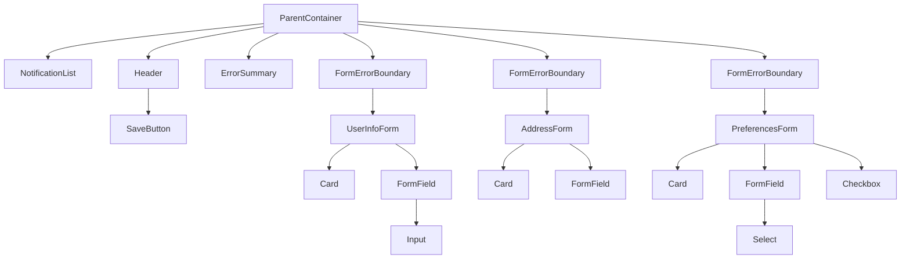

# IMPL-005: UI Components

## Overview

This implementation plan covers the user interface components for the multi-form save feature. It includes the parent container layout, child form components, save button, error summary, notifications, and loading states.

## Prerequisites

- IMPL-001 (Dirty State Management) completed
- IMPL-002 (Validation Flow) completed
- IMPL-003 (Submission Flow) completed
- IMPL-004 (Error Handling) completed
- Tailwind CSS v4 configured

## Dependencies

- IMPL-001: Dirty State Management
- IMPL-002: Validation Flow
- IMPL-003: Submission Flow
- IMPL-004: Error Handling

## Implementation Steps

### Step 1: Create Base Layout Components

Create the foundational layout components.

**File: `src/components/layout/Container.tsx`**

```tsx
import { ReactNode } from 'react';

interface ContainerProps {
  children: ReactNode;
  className?: string;
}

export function Container({ children, className = '' }: ContainerProps) {
  return <div className={`mx-auto max-w-4xl px-4 sm:px-6 lg:px-8 ${className}`}>{children}</div>;
}
```

**File: `src/components/layout/Card.tsx`**

```tsx
import { ReactNode } from 'react';

interface CardProps {
  children: ReactNode;
  className?: string;
  as?: 'div' | 'section' | 'article';
}

export function Card({ children, className = '', as: Component = 'div' }: CardProps) {
  return (
    <Component className={`rounded-lg border border-gray-200 bg-white p-6 shadow-sm ${className}`}>
      {children}
    </Component>
  );
}

interface CardHeaderProps {
  title: string;
  description?: string;
  actions?: ReactNode;
}

export function CardHeader({ title, description, actions }: CardHeaderProps) {
  return (
    <div className="mb-6 flex items-start justify-between">
      <div>
        <h2 className="text-lg font-semibold text-gray-900">{title}</h2>
        {description && <p className="mt-1 text-sm text-gray-500">{description}</p>}
      </div>
      {actions && <div className="ml-4">{actions}</div>}
    </div>
  );
}
```

### Step 2: Create Form Field Components

Create reusable form field components.

**File: `src/components/forms/FormField.tsx`**

```tsx
import { ReactNode, forwardRef, InputHTMLAttributes } from 'react';
import { FieldError } from 'react-hook-form';

interface FormFieldProps {
  label: string;
  htmlFor: string;
  error?: FieldError;
  required?: boolean;
  hint?: string;
  children: ReactNode;
}

export function FormField({ label, htmlFor, error, required, hint, children }: FormFieldProps) {
  return (
    <div className="mb-4">
      <label htmlFor={htmlFor} className="mb-1 block text-sm font-medium text-gray-700">
        {label}
        {required && <span className="ml-1 text-red-500">*</span>}
      </label>
      {hint && (
        <p className="mb-1 text-sm text-gray-500" id={`${htmlFor}-hint`}>
          {hint}
        </p>
      )}
      {children}
      {error && (
        <p className="mt-1 text-sm text-red-600" id={`${htmlFor}-error`} role="alert">
          {error.message}
        </p>
      )}
    </div>
  );
}

interface InputProps extends InputHTMLAttributes<HTMLInputElement> {
  hasError?: boolean;
}

export const Input = forwardRef<HTMLInputElement, InputProps>(function Input(
  { hasError, className = '', ...props },
  ref
) {
  const baseClasses =
    'block w-full rounded-md border px-3 py-2 text-sm shadow-sm transition-colors focus:outline-none focus:ring-2 focus:ring-offset-0';
  const stateClasses = hasError
    ? 'border-red-300 text-red-900 placeholder-red-300 focus:border-red-500 focus:ring-red-500'
    : 'border-gray-300 focus:border-blue-500 focus:ring-blue-500';

  return (
    <input
      ref={ref}
      className={`${baseClasses} ${stateClasses} ${className}`}
      aria-invalid={hasError}
      {...props}
    />
  );
});

interface SelectProps extends React.SelectHTMLAttributes<HTMLSelectElement> {
  hasError?: boolean;
  options: Array<{ value: string; label: string }>;
}

export const Select = forwardRef<HTMLSelectElement, SelectProps>(function Select(
  { hasError, options, className = '', ...props },
  ref
) {
  const baseClasses =
    'block w-full rounded-md border px-3 py-2 text-sm shadow-sm transition-colors focus:outline-none focus:ring-2 focus:ring-offset-0';
  const stateClasses = hasError
    ? 'border-red-300 focus:border-red-500 focus:ring-red-500'
    : 'border-gray-300 focus:border-blue-500 focus:ring-blue-500';

  return (
    <select
      ref={ref}
      className={`${baseClasses} ${stateClasses} ${className}`}
      aria-invalid={hasError}
      {...props}
    >
      {options.map((opt) => (
        <option key={opt.value} value={opt.value}>
          {opt.label}
        </option>
      ))}
    </select>
  );
});

interface CheckboxProps extends InputHTMLAttributes<HTMLInputElement> {
  label: string;
}

export const Checkbox = forwardRef<HTMLInputElement, CheckboxProps>(function Checkbox(
  { label, className = '', ...props },
  ref
) {
  return (
    <label className={`inline-flex items-center ${className}`}>
      <input
        ref={ref}
        type="checkbox"
        className="h-4 w-4 rounded border-gray-300 text-blue-600 focus:ring-blue-500"
        {...props}
      />
      <span className="ml-2 text-sm text-gray-700">{label}</span>
    </label>
  );
});
```

### Step 3: Create Save Button Component

Create the global save button with loading states.

**File: `src/components/SaveButton.tsx`**

```tsx
import { useFormCoordinationStore } from '../stores/formCoordinationStore';

interface SaveButtonProps {
  onSave: () => Promise<void>;
}

export function SaveButton({ onSave }: SaveButtonProps) {
  const isDirty = useFormCoordinationStore((state) => state.dirtyForms.size > 0);
  const isValidating = useFormCoordinationStore((state) => state.isValidating);
  const submissionStatus = useFormCoordinationStore((state) => state.submissionStatus);

  const isProcessing = isValidating || submissionStatus === 'submitting';
  const isDisabled = !isDirty || isProcessing;

  const getButtonText = () => {
    if (isValidating) return 'Validating...';
    if (submissionStatus === 'submitting') return 'Saving...';
    return 'Save All Changes';
  };

  return (
    <button
      type="button"
      onClick={onSave}
      disabled={isDisabled}
      className={`
        inline-flex items-center rounded-md px-4 py-2 text-sm font-medium
        shadow-sm transition-all focus:outline-none focus:ring-2
        focus:ring-blue-500 focus:ring-offset-2
        ${
          isDisabled
            ? 'cursor-not-allowed bg-gray-300 text-gray-500'
            : 'bg-blue-600 text-white hover:bg-blue-700'
        }
      `}
      aria-busy={isProcessing}
    >
      {isProcessing && (
        <svg
          className="-ml-1 mr-2 h-4 w-4 animate-spin text-current"
          xmlns="http://www.w3.org/2000/svg"
          fill="none"
          viewBox="0 0 24 24"
          aria-hidden="true"
        >
          <circle
            className="opacity-25"
            cx="12"
            cy="12"
            r="10"
            stroke="currentColor"
            strokeWidth="4"
          />
          <path
            className="opacity-75"
            fill="currentColor"
            d="M4 12a8 8 0 018-8V0C5.373 0 0 5.373 0 12h4z"
          />
        </svg>
      )}
      {getButtonText()}
    </button>
  );
}
```

### Step 4: Create Error Summary Component

Create the error summary display component.

**File: `src/components/ErrorSummary.tsx`**

```tsx
import type { FormValidationError, FormSubmissionError } from '../types/errors';

interface ErrorSummaryProps {
  validationErrors: FormValidationError[];
  submissionErrors: FormSubmissionError[];
  onDismiss?: () => void;
}

export function ErrorSummary({ validationErrors, submissionErrors, onDismiss }: ErrorSummaryProps) {
  const hasValidation = validationErrors.length > 0;
  const hasSubmission = submissionErrors.length > 0;

  if (!hasValidation && !hasSubmission) {
    return null;
  }

  return (
    <div
      className="mb-6 rounded-md border border-red-200 bg-red-50 p-4"
      role="alert"
      aria-labelledby="error-summary-title"
    >
      <div className="flex items-start">
        <div className="flex-shrink-0">
          <svg
            className="h-5 w-5 text-red-400"
            viewBox="0 0 20 20"
            fill="currentColor"
            aria-hidden="true"
          >
            <path
              fillRule="evenodd"
              d="M10 18a8 8 0 100-16 8 8 0 000 16zM8.28 7.22a.75.75 0 00-1.06 1.06L8.94 10l-1.72 1.72a.75.75 0 101.06 1.06L10 11.06l1.72 1.72a.75.75 0 101.06-1.06L11.06 10l1.72-1.72a.75.75 0 00-1.06-1.06L10 8.94 8.28 7.22z"
              clipRule="evenodd"
            />
          </svg>
        </div>
        <div className="ml-3 flex-1">
          <h3 id="error-summary-title" className="text-sm font-medium text-red-800">
            Please fix the following errors before saving:
          </h3>

          {hasValidation && (
            <div className="mt-3">
              <h4 className="text-sm font-medium text-red-700">Validation Errors</h4>
              <ul className="mt-2 list-inside list-disc space-y-1 text-sm text-red-700">
                {validationErrors.map((error) => (
                  <li key={error.formId}>
                    <span className="font-medium">{error.formName}:</span>
                    <ul className="ml-4 mt-1 list-inside list-disc">
                      {error.fieldErrors.map((fieldError, idx) => (
                        <li key={idx}>{fieldError.message}</li>
                      ))}
                    </ul>
                  </li>
                ))}
              </ul>
            </div>
          )}

          {hasSubmission && (
            <div className="mt-3">
              <h4 className="text-sm font-medium text-red-700">Submission Errors</h4>
              <ul className="mt-2 list-inside list-disc space-y-1 text-sm text-red-700">
                {submissionErrors.map((error) => (
                  <li key={error.formId}>
                    <span className="font-medium">{error.formName}:</span> {error.message}
                  </li>
                ))}
              </ul>
            </div>
          )}
        </div>

        {onDismiss && (
          <div className="ml-auto pl-3">
            <button
              type="button"
              onClick={onDismiss}
              className="inline-flex rounded-md bg-red-50 p-1.5 text-red-500 hover:bg-red-100 focus:outline-none focus:ring-2 focus:ring-red-600 focus:ring-offset-2"
              aria-label="Dismiss errors"
            >
              <svg className="h-5 w-5" viewBox="0 0 20 20" fill="currentColor" aria-hidden="true">
                <path d="M6.28 5.22a.75.75 0 00-1.06 1.06L8.94 10l-3.72 3.72a.75.75 0 101.06 1.06L10 11.06l3.72 3.72a.75.75 0 101.06-1.06L11.06 10l3.72-3.72a.75.75 0 00-1.06-1.06L10 8.94 6.28 5.22z" />
              </svg>
            </button>
          </div>
        )}
      </div>
    </div>
  );
}
```

### Step 5: Create Notification Components

Create toast notification components.

**File: `src/components/NotificationList.tsx`**

```tsx
import type { ErrorNotification } from '../types/errors';

interface NotificationListProps {
  notifications: ErrorNotification[];
  onDismiss: (id: string) => void;
}

export function NotificationList({ notifications, onDismiss }: NotificationListProps) {
  if (notifications.length === 0) {
    return null;
  }

  return (
    <div
      aria-live="polite"
      aria-label="Notifications"
      className="fixed right-4 top-4 z-50 flex flex-col gap-2"
    >
      {notifications.map((notification) => (
        <Notification
          key={notification.id}
          notification={notification}
          onDismiss={() => onDismiss(notification.id)}
        />
      ))}
    </div>
  );
}

interface NotificationProps {
  notification: ErrorNotification;
  onDismiss: () => void;
}

function Notification({ notification, onDismiss }: NotificationProps) {
  const { severity, title, message, dismissible } = notification;

  const severityStyles = {
    error: 'bg-red-50 border-red-200 text-red-800',
    warning: 'bg-yellow-50 border-yellow-200 text-yellow-800',
    info: 'bg-green-50 border-green-200 text-green-800',
  };

  const iconPaths = {
    error:
      'M10 18a8 8 0 100-16 8 8 0 000 16zM8.28 7.22a.75.75 0 00-1.06 1.06L8.94 10l-1.72 1.72a.75.75 0 101.06 1.06L10 11.06l1.72 1.72a.75.75 0 101.06-1.06L11.06 10l1.72-1.72a.75.75 0 00-1.06-1.06L10 8.94 8.28 7.22z',
    warning:
      'M8.485 2.495c.673-1.167 2.357-1.167 3.03 0l6.28 10.875c.673 1.167-.17 2.625-1.516 2.625H3.72c-1.347 0-2.189-1.458-1.515-2.625L8.485 2.495zM10 5a.75.75 0 01.75.75v3.5a.75.75 0 01-1.5 0v-3.5A.75.75 0 0110 5zm0 9a1 1 0 100-2 1 1 0 000 2z',
    info: 'M10 18a8 8 0 100-16 8 8 0 000 16zm3.857-9.809a.75.75 0 00-1.214-.882l-3.483 4.79-1.88-1.88a.75.75 0 10-1.06 1.061l2.5 2.5a.75.75 0 001.137-.089l4-5.5z',
  };

  return (
    <div
      className={`flex w-80 items-start gap-3 rounded-lg border p-4 shadow-lg ${severityStyles[severity]}`}
      role="alert"
    >
      <svg
        className="h-5 w-5 flex-shrink-0"
        viewBox="0 0 20 20"
        fill="currentColor"
        aria-hidden="true"
      >
        <path fillRule="evenodd" d={iconPaths[severity]} clipRule="evenodd" />
      </svg>

      <div className="flex-1">
        <p className="text-sm font-medium">{title}</p>
        <p className="mt-1 text-sm opacity-90">{message}</p>
      </div>

      {dismissible && (
        <button
          type="button"
          onClick={onDismiss}
          className="flex-shrink-0 rounded p-1 opacity-70 hover:opacity-100 focus:outline-none focus:ring-2"
          aria-label="Dismiss notification"
        >
          <svg className="h-4 w-4" viewBox="0 0 20 20" fill="currentColor" aria-hidden="true">
            <path d="M6.28 5.22a.75.75 0 00-1.06 1.06L8.94 10l-3.72 3.72a.75.75 0 101.06 1.06L10 11.06l3.72 3.72a.75.75 0 101.06-1.06L11.06 10l3.72-3.72a.75.75 0 00-1.06-1.06L10 8.94 6.28 5.22z" />
          </svg>
        </button>
      )}
    </div>
  );
}
```

### Step 6: Create Child Form Components

Create the three child form components.

**File: `src/components/forms/UserInfoForm.tsx`**

```tsx
import { useSubmittableForm } from '../../hooks/useSubmittableForm';
import { zodResolver } from '@hookform/resolvers/zod';
import { userInfoSchema, UserInfoFormData } from '../../utils/validation-schemas';
import { Card, CardHeader } from '../layout/Card';
import { FormField, Input } from './FormField';

export function UserInfoForm() {
  const {
    register,
    formState: { errors, isSubmitting },
  } = useSubmittableForm<UserInfoFormData>({
    formId: 'userInfo',
    displayName: 'User Information',
    resolver: zodResolver(userInfoSchema),
    defaultValues: { name: '', email: '' },
  });

  return (
    <Card as="section" aria-labelledby="user-info-title">
      <CardHeader title="User Information" description="Enter your personal details" />

      <fieldset disabled={isSubmitting}>
        <FormField label="Name" htmlFor="user-name" error={errors.name} required>
          <Input
            id="user-name"
            {...register('name')}
            hasError={!!errors.name}
            placeholder="John Doe"
            aria-describedby={errors.name ? 'user-name-error' : undefined}
          />
        </FormField>

        <FormField label="Email" htmlFor="user-email" error={errors.email} required>
          <Input
            id="user-email"
            type="email"
            {...register('email')}
            hasError={!!errors.email}
            placeholder="john@example.com"
            aria-describedby={errors.email ? 'user-email-error' : undefined}
          />
        </FormField>
      </fieldset>
    </Card>
  );
}
```

**File: `src/components/forms/AddressForm.tsx`**

```tsx
import { useSubmittableForm } from '../../hooks/useSubmittableForm';
import { zodResolver } from '@hookform/resolvers/zod';
import { addressSchema, AddressFormData } from '../../utils/validation-schemas';
import { Card, CardHeader } from '../layout/Card';
import { FormField, Input } from './FormField';

export function AddressForm() {
  const {
    register,
    formState: { errors, isSubmitting },
  } = useSubmittableForm<AddressFormData>({
    formId: 'address',
    displayName: 'Address',
    resolver: zodResolver(addressSchema),
    defaultValues: { street: '', city: '', state: '', zipCode: '' },
  });

  return (
    <Card as="section" aria-labelledby="address-title">
      <CardHeader title="Address" description="Enter your mailing address" />

      <fieldset disabled={isSubmitting}>
        <FormField label="Street Address" htmlFor="address-street" error={errors.street} required>
          <Input
            id="address-street"
            {...register('street')}
            hasError={!!errors.street}
            placeholder="123 Main St"
          />
        </FormField>

        <div className="grid grid-cols-2 gap-4">
          <FormField label="City" htmlFor="address-city" error={errors.city} required>
            <Input
              id="address-city"
              {...register('city')}
              hasError={!!errors.city}
              placeholder="New York"
            />
          </FormField>

          <FormField label="State" htmlFor="address-state" error={errors.state} required>
            <Input
              id="address-state"
              {...register('state')}
              hasError={!!errors.state}
              placeholder="NY"
            />
          </FormField>
        </div>

        <FormField label="ZIP Code" htmlFor="address-zip" error={errors.zipCode} required>
          <Input
            id="address-zip"
            {...register('zipCode')}
            hasError={!!errors.zipCode}
            placeholder="10001"
          />
        </FormField>
      </fieldset>
    </Card>
  );
}
```

**File: `src/components/forms/PreferencesForm.tsx`**

```tsx
import { useSubmittableForm } from '../../hooks/useSubmittableForm';
import { zodResolver } from '@hookform/resolvers/zod';
import { preferencesSchema, PreferencesFormData } from '../../utils/validation-schemas';
import { Card, CardHeader } from '../layout/Card';
import { FormField, Select, Checkbox } from './FormField';

const notificationOptions = [
  { value: 'all', label: 'All notifications' },
  { value: 'important', label: 'Important only' },
  { value: 'none', label: 'None' },
];

const themeOptions = [
  { value: 'light', label: 'Light' },
  { value: 'dark', label: 'Dark' },
  { value: 'system', label: 'System default' },
];

export function PreferencesForm() {
  const {
    register,
    formState: { errors, isSubmitting },
  } = useSubmittableForm<PreferencesFormData>({
    formId: 'preferences',
    displayName: 'Preferences',
    resolver: zodResolver(preferencesSchema),
    defaultValues: {
      newsletter: false,
      notifications: 'all',
      theme: 'system',
    },
  });

  return (
    <Card as="section" aria-labelledby="preferences-title">
      <CardHeader title="Preferences" description="Customize your experience" />

      <fieldset disabled={isSubmitting}>
        <FormField
          label="Email Notifications"
          htmlFor="pref-notifications"
          error={errors.notifications}
        >
          <Select
            id="pref-notifications"
            {...register('notifications')}
            options={notificationOptions}
            hasError={!!errors.notifications}
          />
        </FormField>

        <FormField label="Theme" htmlFor="pref-theme" error={errors.theme}>
          <Select
            id="pref-theme"
            {...register('theme')}
            options={themeOptions}
            hasError={!!errors.theme}
          />
        </FormField>

        <div className="mt-4">
          <Checkbox {...register('newsletter')} label="Subscribe to newsletter" />
        </div>
      </fieldset>
    </Card>
  );
}
```

### Step 7: Create Parent Container Component

Create the main parent container that orchestrates everything.

**File: `src/components/ParentContainer.tsx`**

```tsx
import { useCallback } from 'react';
import { useFormCoordinationStore } from '../stores/formCoordinationStore';
import { useErrorHandling } from '../hooks/useErrorHandling';
import { Container } from './layout/Container';
import { SaveButton } from './SaveButton';
import { ErrorSummary } from './ErrorSummary';
import { NotificationList } from './NotificationList';
import { UserInfoForm } from './forms/UserInfoForm';
import { AddressForm } from './forms/AddressForm';
import { PreferencesForm } from './forms/PreferencesForm';
import { FormErrorBoundary } from './FormErrorBoundary';

export function ParentContainer() {
  const saveAllChanges = useFormCoordinationStore((state) => state.saveAllChanges);
  const dirtyFormIds = useFormCoordinationStore((state) => Array.from(state.dirtyForms));

  const { validationErrors, submissionErrors, notifications, dismissNotification, clearAllErrors } =
    useErrorHandling();

  const handleSave = useCallback(async () => {
    await saveAllChanges();
  }, [saveAllChanges]);

  return (
    <Container className="py-8">
      <NotificationList notifications={notifications} onDismiss={dismissNotification} />

      <header className="mb-8 flex items-center justify-between">
        <div>
          <h1 className="text-2xl font-bold text-gray-900">Multi-Form Editor</h1>
          {dirtyFormIds.length > 0 && (
            <p className="mt-1 text-sm text-gray-500">
              Unsaved changes in {dirtyFormIds.length} form(s)
            </p>
          )}
        </div>
        <SaveButton onSave={handleSave} />
      </header>

      <ErrorSummary
        validationErrors={validationErrors}
        submissionErrors={submissionErrors}
        onDismiss={clearAllErrors}
      />

      <div className="space-y-6">
        <FormErrorBoundary>
          <UserInfoForm />
        </FormErrorBoundary>

        <FormErrorBoundary>
          <AddressForm />
        </FormErrorBoundary>

        <FormErrorBoundary>
          <PreferencesForm />
        </FormErrorBoundary>
      </div>
    </Container>
  );
}
```

## Component Hierarchy Diagram



## File Structure

```
src/
└── components/
    ├── layout/
    │   ├── Container.tsx
    │   └── Card.tsx
    ├── forms/
    │   ├── FormField.tsx
    │   ├── UserInfoForm.tsx
    │   ├── AddressForm.tsx
    │   └── PreferencesForm.tsx
    ├── SaveButton.tsx
    ├── ErrorSummary.tsx
    ├── NotificationList.tsx
    ├── FormErrorBoundary.tsx
    └── ParentContainer.tsx
```

## Styling Guidelines

### Tailwind CSS Classes

The components use Tailwind CSS v4 with the following design tokens:

- **Colors**: Use semantic color names (gray, blue, red, green, yellow)
- **Spacing**: Follow the default spacing scale (4, 6, 8)
- **Typography**: Use text-sm for form labels, text-lg for headings
- **Borders**: Use rounded-md for inputs, rounded-lg for cards
- **Shadows**: Use shadow-sm for subtle elevation

### Accessibility

All components follow WCAG 2.1 AA guidelines:

- Proper label associations with `htmlFor`
- Error messages linked via `aria-describedby`
- Invalid fields marked with `aria-invalid`
- Loading states announced with `aria-busy`
- Focus management and visible focus indicators
- Color contrast ratios meet minimum requirements

## Testing Strategy

### Unit Tests

1. **FormField.test.tsx**
   - Test renders label correctly
   - Test shows required indicator
   - Test displays error message
   - Test error message has correct role

2. **SaveButton.test.tsx**
   - Test disabled when not dirty
   - Test enabled when dirty
   - Test shows loading state when validating
   - Test shows loading state when submitting

3. **ErrorSummary.test.tsx**
   - Test renders nothing when no errors
   - Test shows validation errors grouped by form
   - Test shows submission errors
   - Test dismiss button works

4. **NotificationList.test.tsx**
   - Test renders notifications
   - Test dismiss callback called correctly
   - Test auto-dismiss works

### Integration Tests

1. Test complete user flow: fill forms, save, see success
2. Test validation error flow: invalid input, save, see errors
3. Test submission error flow: mock API failure, see error
4. Test error clearing when user fixes issues
5. Test multiple forms dirty simultaneously

### Visual Regression Tests

1. Capture form states: empty, filled, error, disabled
2. Capture error summary with various error counts
3. Capture notification positions and animations
4. Test responsive layouts at various breakpoints

## Acceptance Criteria

- [ ] **AC5.1**: The save button shows a loading state during validation and submission
- [ ] **AC5.2**: Forms are disabled during submission (fieldset disabled)
- [ ] **AC5.3**: Validation error messages are clear and actionable
- [ ] **AC5.4**: Error summary can be dismissed with the X button
- [ ] **AC5.5**: Error summary auto-clears when user initiates a new save
- [ ] **AC5.6**: Success notification appears after successful save
- [ ] **AC5.7**: Success notification auto-dismisses after 3 seconds
- [ ] **AC5.8**: Invalid form fields have visible error styling
- [ ] **AC5.9**: Parent container shows count of dirty forms
- [ ] **AC5.10**: Each form section has clear visual boundaries (cards)
- [ ] **AC5.11**: All interactive elements have visible focus states
- [ ] **AC5.12**: Components are responsive on mobile devices

## Notes

- Components use Tailwind CSS utility classes for styling
- All form inputs are properly labeled for accessibility
- Error boundaries prevent individual form crashes from breaking the entire UI
- Notifications use a fixed position overlay for visibility
- Forms use fieldset disabled to prevent input during submission
- The design is mobile-first and responsive
